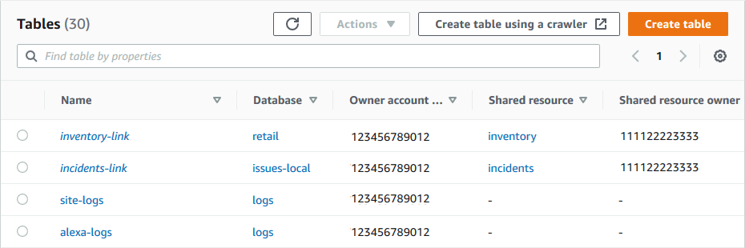

# How resource links work in Lake Formation

A _resource link_ is a Data Catalog object that is a link to a local or
shared database or table. After you create a resource link to a database or table, you can use
the resource link name wherever you would use the database or table name. Along with tables
that you own or tables that are shared with you, table resource links are returned by
`glue:GetTables()` and appear as entries on the **Tables** page
of the Lake Formation console. Resource links to databases act in a similar manner.

Creating a resource link to a database or table enables you to do the following:

- Assign a different name to a database or table in your Data Catalog. This is especially
  useful if different AWS accounts share databases or tables with the same name, or if
  multiple databases in your account have tables with the same name.
- Access the Data Catalog databases and tables from any AWS Region by creating resource
  links in those regions pointing to the database and tables in another region. You can run
  queries in any region with these resource links using Athena, Amazon EMR and run AWS Glue
  ETL Spark jobs, without copying source data nor the metadata in Glue Data Catalog.
- Use integrated AWS services such as Amazon Athena and Amazon Redshift Spectrum to run
  queries that access shared databases or tables. Some integrated services can't directly
  access databases or tables across accounts. However, they can access resource links in
  your account to databases and tables in other accounts.

###### Note

You don't need to create a resource link to reference a shared database or table in
AWS Glue extract, transform, and load (ETL) scripts. However, to avoid ambiguity when multiple
AWS accounts share a database or table with the same name, you can either create and use a
resource link or specify the catalog ID when invoking ETL operations.

The following example shows the Lake Formation console **Tables** page, which lists
two resource links. Resource link names are always displayed in italics. Each resource link is
displayed along with the name and owner of its linked shared resource. In this example, a data
lake administrator in AWS account 1111-2222-3333 shared the `inventory`
and `incidents` tables with account 1234-5678-9012. A user in that account
then created resource links to those shared tables.

The following are notes and restrictions on resource links:

- Resource links are required to enable integrated services such as Athena and Redshift Spectrum to
  query the underlying data of shared tables. Queries in these integrated services are
  constructed against the resource link names.
- Assuming that the setting **Use only IAM access control for new tables in this
  database** is turned off for the containing database, only the principal who
  created a resource link can view and access it. To enable other principals in your account
  to access a resource link, grant the `DESCRIBE` permission on it. To enable
  others to drop a resource link, grant the `DROP` permission on it. Data lake
  administrators can access all resource links in the account. To drop a resource link
  created by another principal, the data lake administrator must first grant themselves the
  `DROP` permission on the resource link. For more information, see [Lake Formation permissions reference](lf-permissions-reference.md "lf-permissions-reference.md").

###### Important

Granting permissions on a resource link doesn't grant permissions on the target
(linked) database or table. You must grant permissions on the target separately.

- To create a resource link, you need the Lake Formation `CREATE_TABLE` or
  `CREATE_DATABASE` permission, as well as the `glue:CreateTable` or
  `glue:CreateDatabase` AWS Identity and Access Management (IAM) permission.
- You can create resource links to local (owned) Data Catalog resources, as well as to
  resources shared with your AWS account.
- When you create a resource link, no check is performed to see if the target shared
  resource exists or whether you have cross-account permissions on the resource. This
  enables you to create the resource link and shared resource in any order.
- If you delete a resource link, the linked shared resource is not dropped. If you drop
  a shared resource, resource links to that resource are not deleted.
- It's possible to create resource link chains. However, there is no value in doing so,
  because the APIs follow only the first resource link.

###### See also:

- [Granting permissions on Data Catalog resources](granting-catalog-permissions.md "granting-catalog-permissions.md")
