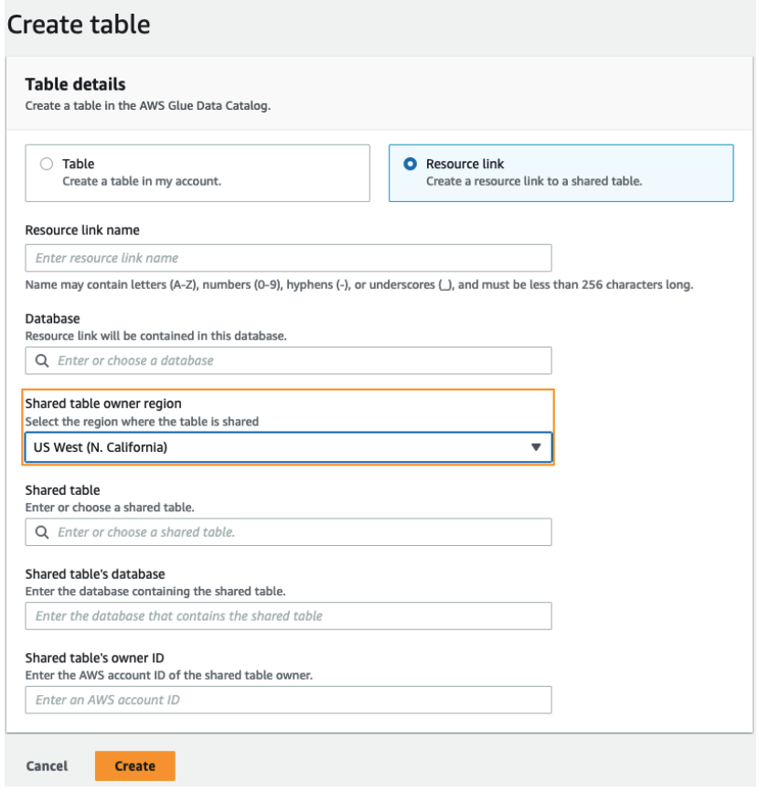

# Setting up cross-Region table access

To access data from a different Region, you need to first set up the Data Catalog databases and
tables in the Region where you register your Amazon S3 data location. You can share the Data Catalog
databases and tables with principals in your account or in another account. Then, you need
to create data lake administrators who can create resource links pointing to the target
shared data location in the Regions where users query the data.

###### To query data shared within the same account from a different Region

In this section, the target shared table Region is referred to as Region A and users run queries from Region B.

1. ###### Account setup in Region A (where you create and share the data)

A data lake administrator needs to complete the following actions:

    1. Register an Amazon S3 data location.

    For more information, see [Adding an Amazon S3 location to your data lake](register-data-lake.md "register-data-lake.md").
    2. Create databases and tables in the account. This can also be done by a non-administrative user who has permissions to create databases and tables.
    3. Grant data permissions on a table to the principals with `Grantable
     permissions`.

    For more information see, [Granting permissions on Data Catalog resources](granting-catalog-permissions.md "granting-catalog-permissions.md").

2. ######
   Account setup in Region B (where you access the data)

A data lake administrator needs to complete the following actions:

    1. Create a resource link in Region B pointing to the target shared table in Region A. Specify
     the **Shared table owner Region** on the **Create
     table** screen.

    

    For instructions on creating resource links to databases and tables, see [Creating resource links](creating-resource-links.md "creating-resource-links.md").
    2. Grant `Describe` permission to IAM principals on the resource link in Region B.

    For more information on granting permissions on resource links, see [Granting resource link permissions](granting-link-permissions.md "granting-link-permissions.md").

    IAM principals in Region B can query the target table through the link using Athena.

###### To access cross-account data from a different Region

1. ###### Producer/grantor account setup

A data lake administrator needs to complete the following actions:

    1. Set up the producer/grantor account in Region A.
    2. Register an Amazon S3 data location in Region A.
    3. Create databases and tables. This can be done by a non-administrative user who has
     permissions to create tables.
    4. Grant data permissions to the consumer/grantee account on a table in Region A with
     `Grantable permissions`.

    For more information, see [Sharing Data Catalog tables and databases across
     AWS accounts or IAM principals from external accounts](cross-account-data-share-steps.md "cross-account-data-share-steps.md").

2. ######
   Consumer/grantee account setup

A data lake administrator needs to complete the following actions:

    1. Accept the resource share invitation from AWS RAM in Region A.
    2. Create a resource link in Region B pointing to the shared table. Region B is where users will want to query the table.
    3. Grant data permissions on the shared table to IAM principals in Region A.

    ###### Note

    You must grant permissions to the shared table in the the same Region where the table was shared.
    4. Grant permissions to principals on the resource link in Region B.

    Principals in the consumer account in Region B then query the shared table from Region B using Athena.
