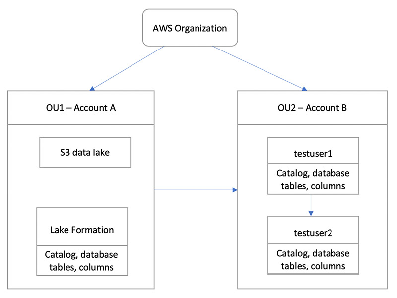

# Sharing a data lake using Lake Formation fine-grained access control

This tutorial provides step-by-step instructions on how you can quickly and easily share
datasets using Lake Formation when managing multiple AWS accounts with AWS Organizations. You
define granular permissions to control access to sensitive data.

The following procedures also show how a data lake administrator of Account A can provide fine-grained access for Account B,
and how a user in Account B, acting as a data steward, can grant fine-grained access to the shared table for other users in their account. Data stewards within each account can
independently delegate access to their own users, giving each team or lines of business (LOB) autonomy.

The use case assumes you are using AWS Organizations to manage your AWS accounts. The user of Account A in one
organizational unit (OU1) grants access to users of Account B in OU2. You can use the same approach when not using Organizations, such as when you only have a few accounts. The following
diagram illustrates the fine-grained access control of datasets in a data lake. The data lake is
available in the Account A. The data lake administrator of Account A provides fine-grained
access for Account B. The diagram also shows that a user of Account B provides column-level
access of the Account A data lake table to another user in Account B.

###### Topics

- [Intended audience](#tut-share-fine-grained-roles "#tut-share-fine-grained-roles")
- [Prerequisites](#tut-share-fine-grained-prereqs "#tut-share-fine-grained-prereqs")
- [Step 1: Provide fine-grained access to another account](#tut-fgac-another-account "#tut-fgac-another-account")
- [Step 2: Provide fine-grained access to a user in the same account](#tut-fgac-same-account "#tut-fgac-same-account")

## Intended audience

This tutorial is intended for data stewards, data engineers, and data analysts. The following table lists the roles that are used in this tutorial:

| Role                    | Description                                                                               |
| ----------------------- | ----------------------------------------------------------------------------------------- |
| IAM administrator       | User who has the AWS managed policy: `AdministratorAccess`.                               |
| Data lake administrator | User who has the AWS managed policy: `AWSLakeFormationDataAdmin` attached to the role. |
| Data analyst            | User who has the AWS managed policy: `AmazonAthenaFullAccess` attached.                |

## Prerequisites

Before you start this tutorial, you must have an AWS account that you can use to sign in as an administrative user with correct permissions. For more information, see [Complete initial AWS configuration tasks](getting-started-setup.md#initial-aws-signup "getting-started-setup.md#initial-aws-signup").

The tutorial assumes that you are familiar with IAM. For information about IAM, see the [IAM User Guide](../../../IAM/latest/UserGuide/introduction.md "../../../IAM/latest/UserGuide/introduction.md").

###### You need the following resources for this tutorial:

- Two organizational units:
  - OU1 – Contains Account A
  - OU2 – Contains Account B

- An Amazon S3 data lake location (bucket) in Account A.
- A data lake administrator user in Account A. You can create a data lake administrator using
  the Lake Formation console ([https://console.aws.amazon.com/lakeformation/](https://console.aws.amazon.com/lakeformation/ "https://console.aws.amazon.com/lakeformation/")) or the `PutDataLakeSettings` operation of
  the Lake Formation API.
- Lake Formation configured in Account A, and the Amazon S3 data lake location registered with Lake Formation in Account A.
- Two users in Account B with the following IAM managed policies:
  - testuser1 – has the AWS managed policies `AWSLakeFormationDataAdmin` attached.
  - testuser2 – Has the AWS managed policy `AmazonAthenaFullAccess` attached.

- A database testdb in the Lake Formation database for Account B.

## Step 1: Provide fine-grained access to another account

Learn how a data lake administrator of Account A provides fine-grained access for Account B.

###### Grant fine-grained access to another account

1. Sign into AWS Management Console at [https://console.aws.amazon.com/connect/](https://console.aws.amazon.com/connect/ "https://console.aws.amazon.com/connect/") in Account A as a data lake administrator.
2. Open the Lake Formation console ([https://console.aws.amazon.com/lakeformation/](https://console.aws.amazon.com/lakeformation/ "https://console.aws.amazon.com/lakeformation/")), and choose **Get started**.
3. in the navigation pane, choose **Databases**.
4. Choose **Create database**.
5. In the **Database** details section, select **Database**.
6. For **Name**, enter a name (for this tutorial, we use `sampledb01`).
7. Make sure that **Use only IAM access control for new tables in this database** is not selected. Leaving this unselected allows us to control access from Lake Formation.
8. Choose **Create database**.
9. On the **Databases** page, choose your database `sampledb01`.
10. On the **Actions** menu, choose **Grant**.
11. In the **Grant permissions** section, select **External account**.
12. For AWS account ID or AWS organization ID, enter the account ID for Account B in OU2.
13. For **Table**, choose the table you want Account B to have access to (for this post, we use table `acc_a_area`).
    Optionally, you can grant access to columns within the table, which we do in this post.
14. For **Include columns**¸ choose the columns you want Account B to have access to (for this post, we grant permissions to type, name, and identifiers).
15. For **Columns**, choose **Include columns**.
16. For **Table permissions**, select **Select**.
17. For **Grantable permissions**, select **Select**. Grantable permissions are required so admin users in Account B can grant permissions to other users in Account B.
18. Choose **Grant**.
19. In the navigation pane, choose **Tables**.
20. You could see one active connection in the AWS accounts and AWS organizations with access section.

###### Create a resource link

Integrated services like Amazon Athena can not directly access databases or tables across accounts.
Hence, you need to create a resource link so that Athena can access resource links in your account to databases and tables in other accounts.
Create a resource link to the table (`acc_a_area`) so Account B users can query its data with Athena.

1. Sign into the AWS console at [https://console.aws.amazon.com/connect/](https://console.aws.amazon.com/connect/ "https://console.aws.amazon.com/connect/") in Account B as `testuser1`.
2. On the Lake Formation console ([https://console.aws.amazon.com/lakeformation/](https://console.aws.amazon.com/lakeformation/ "https://console.aws.amazon.com/lakeformation/")), in the navigation pane, choose **Tables**. You should see the tables that Account A has provided access.
3. Choose the table `acc_a_area`.
4. On the **Actions** menu, choose **Create resource link**.
5. For **Resource link name**, enter a name (for this tutorial, `acc_a_area_rl`).
6. For **Database**, choose your database (`testdb`).
7. Choose **Create**.
8. In the navigation pane, choose **Tables**.
9. Choose the table `acc_b_area_rl`.
10. On the **Actions** menu, choose **View data**.

You are redirected to the Athena console, where you should see the database and table.

You can now run a query on the table to see the column value for which access was provided to testuser1 from Account B.

## Step 2: Provide fine-grained access to a user in the same account

This section shows how a user in Account B (`testuser1`), acting as a data steward, provides fine-grained access to another user in the same account (`testuser2`) to the column name in the shared table `aac_b_area_rl`.

###### Grant fine-grained access to a user in the same account

1. Sign into the AWS console at [https://console.aws.amazon.com/connect/](https://console.aws.amazon.com/connect/ "https://console.aws.amazon.com/connect/") in Account B as `testuser1`.
2. On the Lake Formation console, in the navigation pane, choose **Tables**.

You can grant permissions on a table through its resource link. To do so, on the **Tables** page, select the resource link `acc_b_area_rl`, and on the **Actions**
menu, choose **Grant on target**. 3. In the **Grant permissions** section, select **My account**. 4. For **IAM users and roles**¸ choose the user `testuser2`. 5. For **Column**, choose the column name. 6. For **Table permissions**, select **Select**. 7. Choose **Grant**.

When you create a resource link, only you can view and access it. To permit other users in your account to access the resource link, you need to grant permissions on the resource link itself.
You need to grant **DESCRIBE** or **DROP** permissions. On the **Tables page**, select your table again and on the **Actions** menu, choose **Grant**. 8. In the **Grant permissions** section, select **My account**. 9. For **IAM users and roles**, select the user `testuser2`. 10. For **Resource link permissions**¸ select **Describe**. 11. Choose **Grant**. 12. Sign into the AWS console in Account B as `testuser2`.

On the Athena console ([https://console.aws.amazon.com/athena/](https://console.aws.amazon.com/athena/home "https://console.aws.amazon.com/athena/home")), you should see the database and table `acc_b_area_rl`.
You can now run a query on the table to see the column value that `testuser2` has access to.
