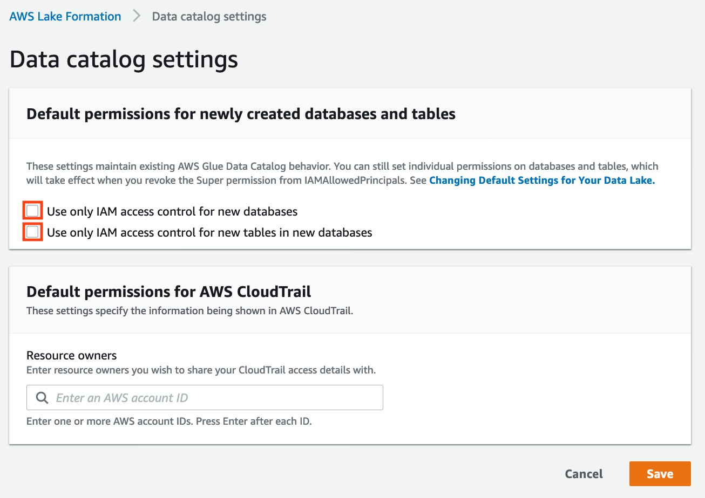

# Sharing a data lake using Lake Formation tag-based

access control and named resources

This tutorial demonstrates how you can configure AWS Lake Formation to securely share data stored within a data lake with multiple companies, organizations, or business units,
without having to copy the entire database. There are two options to share your databases and tables with another AWS account by using Lake Formation cross-account access control:

- **Lake Formation tag-based access control (recommended)**

Lake Formation tag-based access control is an authorization strategy that defines permissions
based on attributes. In Lake Formation, these attributes are called _LF-Tags_. For more details, refer to [Managing a data lake using Lake Formation tag-based
access control](managing-dl-tutorial.md "managing-dl-tutorial.md").

- **Lake Formation named resources**

The Lake Formation named resource method is an authorization strategy that defines permissions for resources. Resources include databases, tables, and columns.
Data lake administrators can assign and revoke permissions on Lake Formation resources. For more details, refer to [Cross-account data sharing in Lake Formation](cross-account-permissions.md "cross-account-permissions.md").

We recommend using named resources if the data lake administrator prefers granting permissions explicitly to individual resources.
When you use the named resource method to grant Lake Formation permissions on a Data Catalog resource to an external account, Lake Formation uses AWS Resource Access Manager (AWS RAM) to share the resource.

###### Topics

- [Intended audience](#tut-share-tbac-roles "#tut-share-tbac-roles")
- [Configure Lake Formation Data Catalog settings in the producer account](#tut-share-tbac-LF-settings "#tut-share-tbac-LF-settings")
- [Step 1: Provision your resources using AWS CloudFormation templates](#tut-tbac-share-provision-resources "#tut-tbac-share-provision-resources")
- [Step 2: Lake Formation cross-account sharing prerequisites](#cross-account-share-prerequisistes "#cross-account-share-prerequisistes")
- [Step 3: Implement cross-account sharing using the tag-based access control method](#tut-share-tbac-method "#tut-share-tbac-method")
- [Step 4: Implement the named resource method](#tut-named-resource-method "#tut-named-resource-method")
- [Step 5: Clean up AWS resources](#share-tbac-clean-up-db "#share-tbac-clean-up-db")

## Intended audience

This tutorial is intended for data stewards, data engineers, and data analysts. When it
comes to sharing Data Catalog tables from AWS Glue and administering permission in Lake Formation, data stewards within the producing
accounts have functional ownership based on the functions they support, and can grant access
to various consumers, external organizations, and accounts. The following table lists the roles that are used in this tutorial:

| Role                  | Description                                                                                                                                                                                                                                                                                                                                                         |
| --------------------- | ------------------------------------------------------------------------------------------------------------------------------------------------------------------------------------------------------------------------------------------------------------------------------------------------------------------------------------------------------------------- |
| DataLakeAdminProducer | The data lake admin IAM user has the following access:<br>• Full read, write, and update access to all resources in the Data Catalog<br>• Ability to grant permissions to resources<br>• Can create resource links for the shared table<br>• Can attach LF-Tags to resources, which provides access to principals based<br>on any policies created by data stewards |
| DataLakeAdminConsumer | The data lake admin IAM user has the following access:<br>• Full read, write, and update access to all resources in the Data Catalog<br>• Ability to grant permissions to resources<br>• Can create resource links for the shared table<br>• Can attach LF-Tags to resources, which provides access to principals based on any policies<br>created by data stewards |
| DataAnalyst           | The DataAnalyst user has the following access:<br>• Fine-grained access to resources shared by Lake Formation tag-based access policies or<br>using named resources method                                                                                                                                                                                          |

## Configure Lake Formation Data Catalog settings in the producer account

Before you start this tutorial, you must have an AWS account that you can use to sign in as an administrative user with correct permissions. For more information, see [Complete initial AWS configuration tasks](getting-started-setup.md#initial-aws-signup "getting-started-setup.md#initial-aws-signup").

The tutorial assumes that you are familiar with IAM. For information about IAM, see the [IAM User Guide](../../../IAM/latest/UserGuide/introduction.md "../../../IAM/latest/UserGuide/introduction.md").

###### Configure Lake Formation Data Catalog settings in the producer account

###### Note

In this tutorial, the account that has the source table is called the producer account, and the account that needs access to the source table is called a consumer account.

Lake Formation provides its own permission management model. To maintain backward compatibility
with the IAM permission model, the `Super` permission is granted to the group
`IAMAllowedPrincipals` on all existing AWS Glue Data Catalog resources by default. Also,
**Use only IAM access control settings** are enabled for new Data Catalog
resources. This tutorial uses fine grained access control using Lake Formation permissions and use
IAM policies for coarse grained access control. See [Methods for fine-grained access control](access-control-fine-grained.md "access-control-fine-grained.md") for
details. Therefore, before you use an AWS CloudFormation template for a quick setup, you need to
change Lake Formation Data Catalog settings in the producer account.

###### Important

This setting affects all newly created databases and tables, so we strongly recommend completing this tutorial in a non-production account or in a new account. Also, if you are
using a shared account (such as your company’s development account), make sure it does not affect others resources. If you prefer to keep the default security settings, you must
complete an extra step when sharing resources to other accounts, in which you revoke the default **Super** permission from `IAMAllowedPrincipals` on
the database or table. We discuss the details later in this tutorial.

To configure Lake Formation Data Catalog settings in the producer account, complete the following steps:

1. Sign into the AWS Management Console using the producer account as an admin user, or as a user with
   Lake Formation `PutDataLakeSettings` API permission.
2. On the Lake Formation console, in the navigation pane, under **Data Catalog**, choose **Settings**.
3. Deselect **Use only IAM access control for new
   databases** and **Use only IAM access control for new
   tables in new databases**

Choose **Save**.



Additionally, you can remove `CREATE_DATABASE` permissions for `IAMAllowedPrincipals` under **Administrative roles and tasks**, **Database creators**.
Only then, you can govern who can create a new database through Lake Formation permissions.

## Step 1: Provision your resources using AWS CloudFormation templates

The CloudFormation template for the producer account generates the following
resources:

- An Amazon S3 bucket to serve as the data lake.
- A Lambda function (for Lambda-backed AWS CloudFormation custom resources). We use the function to copy sample data files from the public Amazon S3 bucket to your Amazon S3 bucket.
- IAM users and policies: DataLakeAdminProducer.
- The appropriate Lake Formation settings and permissions including:
  - Defining the Lake Formation data lake administrator in the producer account
  - Registering an Amazon S3 bucket as the Lake Formation data lake location (producer account)

- An AWS Glue Data Catalog database, table, and partition. Since there are two options for sharing resources across AWS accounts, this template creates two separate sets of database and table.

The AWS CloudFormation template for the consumer account generates the following
resources:

- IAM users and policies:
  - DataLakeAdminConsumer
  - DataAnalyst

- An AWS Glue Data Catalog database. This database is for creating resource links to shared
  resources.

###### Create your resources in the producer account

1. Sign into the AWS CloudFormation console at [https://console.aws.amazon.com/cloudformation](https://console.aws.amazon.com/cloudformation/ "https://console.aws.amazon.com/cloudformation/") in the US East (N. Virginia) region.
2. Choose [Launch Stack](https://aws-bigdata-blog.s3.amazonaws.com/artifacts/Securely_sharing_data_across_AWS_accounts_using_AWS_Lake_Formation/lakeformation_tutorial_cross_account_producer.yaml "https://aws-bigdata-blog.s3.amazonaws.com/artifacts/Securely_sharing_data_across_AWS_accounts_using_AWS_Lake_Formation/lakeformation_tutorial_cross_account_producer.yaml").
3. Choose **Next**.
4. For **Stack name**, enter a stack name, such as `stack-producer`.
5. In the **User Configuration** section, enter user name and password for `ProducerDatalakeAdminUserName` and `ProducerDatalakeAdminUserPassword`.
6. For **DataLakeBucketName**, enter the name of your data lake bucket. This name needs to be globally unique.
7. For **DatabaseName** and **TableName**, leave the default values.
8. Choose **Next**.
9. On the next page, choose **Next**.
10. Review the details on the final page and select **I acknowledge that AWS CloudFormation might create IAM resources**.
11. Choose **Create**.

The stack creation can take up to one minute.

###### Create your resources in the consumer account

1. Sign into the AWS CloudFormation console at [https://console.aws.amazon.com/cloudformation](https://console.aws.amazon.com/cloudformation/ "https://console.aws.amazon.com/cloudformation/") in the US East (N. Virginia) region.
2. Choose [Launch Stack](https://aws-bigdata-blog.s3.amazonaws.com/artifacts/Securely_sharing_data_across_AWS_accounts_using_AWS_Lake_Formation/lakeformation_tutorial_cross_account_consumer.yaml "https://aws-bigdata-blog.s3.amazonaws.com/artifacts/Securely_sharing_data_across_AWS_accounts_using_AWS_Lake_Formation/lakeformation_tutorial_cross_account_consumer.yaml").
3. Choose **Next**.
4. For **Stack name**, enter a stack name, such as `stack-consumer`.
5. In the **User Configuration** section, enter user name and password for `ConsumerDatalakeAdminUserName` and `ConsumerDatalakeAdminUserPassword`.
6. For `DataAnalystUserName` and `DataAnalystUserPassword`, enter the user name and password you want for the data analyst IAM user.
7. For **DataLakeBucketName**, enter the name of your data lake bucket. This name needs to be globally unique.
8. For **DatabaseName**, leave the default values.
9. For `AthenaQueryResultS3BucketName`, enter the name of the Amazon S3 bucket that stores Amazon Athena query results. If you don’t have one, [create an Amazon S3 bucket](../../../AmazonS3/latest/userguide/create-bucket-overview.md "../../../AmazonS3/latest/userguide/create-bucket-overview.md").
10. Choose **Next**.
11. On the next page, choose **Next**.
12. Review the details on the final page and select **I acknowledge that AWS CloudFormation might create IAM resources**.
13. Choose **Create**.

The stack creation can take up to one minutes.

###### Note

After completing the tutorial, delete the stack in AWS CloudFormation to avoid incurring charges. Verify that the resources are successfully deleted in the event status for the stack.

## Step 2: Lake Formation cross-account sharing prerequisites

Before sharing resources with Lake Formation, there are prerequisites for both the tag-based access control method and named resource method.

###### Complete tag-based access control cross-account data sharing

prerequisites

- For more information on cross-account data sharing requirements, see the [Prerequisites](cross-account-prereqs.md "cross-account-prereqs.md") section in the
  Cross-account data sharing chapter.

To share Data Catalog resources with version 3 or above of the **Cross account
version settings**, the grantor requires to have the IAM permissions defined
in the AWS managed policy `AWSLakeFormationCrossAccountManager` in your
account.

If you are using version 1 or version 2 of the **Cross account version settings**, before you can use the tag-based access control method to grant cross-account access to resources, you must add the following `JSON`
permissions object to the Data Catalog resource policy in the producer account. This gives the consumer account permission to access the Data Catalog
when `glue:EvaluatedByLakeFormationTags` is true. Also, this condition becomes true for resources on which you granted permission using Lake Formation
permission tags to the consumer’s account. This policy is required for every AWS account to which you are granting permissions.

The following policy must be within a `Statement` element. We discuss the full IAM policy in the next section.

```
{
    "Effect": "Allow",
    "Action": [
        "glue:*"
    ],
    "Principal": {
        "AWS": [
            "`consumer-account-id`"
        ]
    },
    "Resource": [
        "arn:aws:glue:`region:account-id`:table/*",
        "arn:aws:glue:`region:account-id`:database/*",
        "arn:aws:glue:`region:account-id`:catalog"
    ],
    "Condition": {
        "Bool": {
            "glue:EvaluatedByLakeFormationTags": true
        }
    }
}

```

###### Complete named resource method cross-account sharing prerequisites

1. If there is no Data Catalog resource policy in your account, the Lake Formation cross-account grants that you make proceed as usual.
   However, if a Data Catalog resource policy exists, you must add the following statement to it to permit your cross-account grants to succeed if they’re made with the named resource method.
   If you plan to use only the named resource method, or only the tag-based access control method, you can skip this step.
   In this tutorial, we evaluate both methods, and we need to add the following policy.

The following policy must be within a `Statement` element. We discuss the full IAM policy in the next section.

```
{
          "Effect": "Allow",
          "Action": [
          "glue:ShareResource"
          ],
          "Principal": {
            "Service":"ram.amazonaws.com"
          },
          "Resource": [
              "arn:aws:glue:`region:account-id`:table/*/*",
              "arn:aws:glue:`region:account-id`:database/*",
              "arn:aws:glue:`region:account-id`:catalog"
          ]
}

```

2. Next, add the AWS Glue Data Catalog resource policy using the AWS Command Line Interface (AWS CLI).

If you grant cross-account permissions by using both the tag-based access control method and named resource method, you must set the `EnableHybrid` argument to ‘true’ when adding the preceding policies. Because this option is not currently supported on the console, and you must use the `glue:PutResourcePolicy` API and AWS CLI.

First, create a policy document (such as policy.json) and add the preceding two policies. Replace `consumer-account-id`
with the `account ID` of the AWS account receiving the grant, `region` with the Region of the Data Catalog containing the databases and tables that you are granting permissions on, and `account-id`
with the producer AWS account ID.

Enter the following AWS CLI command. Replace `glue-resource-policy` with the correct values (such as file://policy.json).

```
aws glue put-resource-policy --policy-in-json `glue-resource-policy` --enable-hybrid TRUE
```

For more information, see [put-resource-policy.](../../../cli/latest/reference/glue/put-resource-policy.md "../../../cli/latest/reference/glue/put-resource-policy.md")

## Step 3: Implement cross-account sharing using the tag-based access control method

In this section, we walk you through the following high-level steps:

1. Define an LF-Tag.
2. Assign the LF-Tag to the target resource.
3. Grant LF-Tag permissions to the consumer account.
4. Grant data permissions to the consumer account.
5. Optionally, revoke permissions for `IAMAllowedPrincipals` on the database, tables, and columns.
6. Create a resource link to the shared table.
7. Create an LF-Tag and assign it to the target database.
8. Grant LF-Tag data permissions to the consumer account.

###### Define an LF-Tag

###### Note

If you are signed in to your producer account, sign out before completing the
following steps.

1. Sign into the producer account as the data lake administrator at [https://console.aws.amazon.com/lakeformation/](https://console.aws.amazon.com/lakeformation/ "https://console.aws.amazon.com/lakeformation/"). Use the
   producer account number, IAM user name (the default is
   `DatalakeAdminProducer`), and password that you specified during AWS CloudFormation
   stack creation.
2. On the Lake Formation console ([https://console.aws.amazon.com/lakeformation/](https://console.aws.amazon.com/lakeformation/ "https://console.aws.amazon.com/lakeformation/")), in the navigation pane, under
   **Permissions**, choose **LF-Tags and
   Permissions**.
3. Choose **Add LF-Tag**.

###### Assign the LF-Tag to the target resource

Assign the LF-Tag to the target resource and grant data permissions to another
account

As a data lake administrator, you can attach tags to resources. If you plan to use a separate role, you may have to grant describe and attach permissions to the separate role.

1. In the navigation pane, under **Data Catalog**, select **Databases**.
2. Select the target database `(lakeformation_tutorial_cross_account_database_tbac)`
   and on the **Actions** menu, choose **Edit
   LF-Tags**.

For this tutorial, you assign an LF-Tag to a database, but you can also assign
LF-Tags to tables and columns. 3. Choose **Assign new LF-Tag**. 4. Add the key `Confidentiality` and value `public`. 5. Choose **Save**.

###### Grant **LF-Tag** permission to the consumer account

Still in the producer account, grant permissions to the consumer account to access the
LF-Tag.

1. In the navigation pane, under **Permissions**, choose **LF-Tags and
   permissions**.
2. Choose the **LF-Tags** tab, and choose the **key** and
   **values** of the LF-Tag that is being shared with the consumer account
   (**key**
   `Confidentiality`
   and **value**
   `public`).
3. Choose **Grant permissions**.
4. For **Permission type**, choose **LF-Tag key-value pair permissions.**
5. For **Principals**, choose **External accounts**.
6. Enter the target **AWS account ID**.

AWS accounts within the same organization appear automatically. Otherwise, you have to manually enter the AWS account ID. 7. Under **Permissions**, select **Describe**.

This is the permissions given to the consumer account. Grantable permissions are permissions that the consumer account can grant to other principals. 8. Choose **Grant**.

At this point, the consumer data lake administrator should be able to find the
policy tag being shared via the consumer account Lake Formation console, under
**Permissions**, **LF-Tags and permissions**.

###### Grant data permission to the consumer account

We will now provide data access to the consumer account by specifying an LF-Tag expression and granting the consumer account access to any table or database that matches the expression..

1. In the navigation pane, under **Permissions**,**Data lake permissions**, choose **Grant**.
2. For **Principals**, choose **External accounts**, and enter the target AWS account ID.
3. For **LF-Tags or catalog resources**, choose the **key** and
   **values** of the **LF-Tag** that is being shared with
   the consumer account (**key**
   `Confidentiality` and **value**
   `public`).
4. For **Permissions**, under **Resources matched by LF-Tags
   (recommended)** choose **Add LF-Tag**.
5. Select the **key** and **value** of the tag that is being shared with the consumer account (key `Confidentiality` and value `public`).
6. For **Database permissions**, select **Describe** under **Database permissions** to grant access permissions at the database level.
7. The consumer data lake administrator should be able to find the policy tag being shared via
   the consumer account on the Lake Formation console at [https://console.aws.amazon.com/lakeformation/](https://console.aws.amazon.com/lakeformation/ "https://console.aws.amazon.com/lakeformation/"), under
   **Permissions**, **Administrative roles and tasks**,
   **LF-Tags**.
8. Select **Describe** under **Grantable permissions** so the consumer account can grant database-level permissions to its users.
9. For **Table and column permissions**, select **Select** and **Describe** under **Table permissions**.
10. Select **Select** and **Describe** under **Grantable permissions**.
11. Choose **Grant**.

###### Revoke permission for `IAMAllowedPrincipals` on the database, tables, and columns (Optional).

At the very beginning of this tutorial, you changed the Lake Formation Data Catalog settings. If you skipped that part, this step is required. If you changed your Lake Formation Data Catalog settings, you can skip this step.

In this step, we need to revoke the default **Super** permission
from `IAMAllowedPrincipals` on the database or table. See [Step 4: Switch your data stores to the
Lake Formation permissions model](upgrade-glue-lake-formation.md#upgrade-glue-lake-formation-step4 "upgrade-glue-lake-formation.md#upgrade-glue-lake-formation-step4") for details.

Before revoking permission for `IAMAllowedPrincipals`, make sure that you
granted existing IAM principals with necessary permission through Lake Formation. This includes three
steps:

1. Add IAM permission to the target IAM user or role with the Lake Formation `GetDataAccess` action (with IAM policy).
2. Grant the target IAM user or role with Lake Formation data permissions (alter, select, and so on).
3. Then, revoke permissions for `IAMAllowedPrincipals`. Otherwise, after revoking permissions for `IAMAllowedPrincipals`,
   existing IAM principals may no longer be able to access the target database or Data Catalog.

Revoking **Super** permission for `IAMAllowedPrincipals`
is required when you want to apply the Lake Formation permission model (instead of the IAM policy model) to manage user access within a single account or among multiple accounts using the Lake Formation permission model.
You do not have to revoke permission of `IAMAllowedPrincipals` for other tables where you want to keep the traditional IAM policy model.

At this point, the consumer account data lake administrator should be able to find the database and table being shared via the consumer account on the Lake Formation console at [https://console.aws.amazon.com/lakeformation/](https://console.aws.amazon.com/lakeformation/ "https://console.aws.amazon.com/lakeformation/"),
under **Data Catalog, databases**. If not, confirm if the following are properly configured:

    1. The correct policy tag and values are assigned to the target databases and tables.
    2. The correct tag permission and data permission are assigned to the consumer account.
    3. Revoke the default super permission from `IAMAllowedPrincipals` on the database or
     table.

###### Create a resource link to the shared table

When a resource is shared between accounts, and the shared resources are not put in the consumer accounts’ Data Catalog. To make them available, and query the underlying data of a shared table using services like Athena, we need to create a resource link to the shared table.
A resource link is a Data Catalog object that is a link to a local or shared database or table. For details, see [Creating resource links](creating-resource-links.md "creating-resource-links.md"). By creating a resource link, you can:

- Assign a different name to a database or table that aligns with your Data Catalog resource naming policies.
- Use services such as Athena and Redshift Spectrum to query shared databases or tables.
  To create a resource link, complete the following steps:

1. If you are signed into your consumer account, sign out.
2. Sign in as the consumer account data lake administrator. Use the consumer account ID, IAM user name (default DatalakeAdminConsumer) and password that you specified during AWS CloudFormation stack creation.
3. On the Lake Formation console ([https://console.aws.amazon.com/lakeformation/](https://console.aws.amazon.com/lakeformation/ "https://console.aws.amazon.com/lakeformation/")), in the navigation pane, under **Data Catalog, Databases**, choose the shared database `lakeformation_tutorial_cross_account_database_tbac`.

If you don’t see the database, revisit the previous steps to see if everything is properly configured. 4. Choose **View Tables**. 5. Choose the shared table `amazon_reviews_table_tbac`. 6. On the **Actions** menu, choose **Create resource link**. 7. For **Resource link name**, enter a name (for this tutorial, `amazon_reviews_table_tbac_resource_link`). 8. Under **Database**, select the database that the resource link is created in (for this post, the AWS CloudFormationn stack created the database `lakeformation_tutorial_cross_account_database_consumer`). 9. Choose **Create**.

The resource link appears under **Data catalog**, **Tables**.

###### Create an LF-tag and assign it to the target database

Lake Formation tags reside in the same Data Catalog as the resources. This means that tags created in the producer account are not available to use when granting access to the resource links
in the consumer account. You need to create a separate set of LF-tags in the consumer account to use LF tag-based access control when sharing the resource links in the consumer account.

1. Define the LF-tag in the consumer account. For this tutorial, we use key `Division` and values `sales`, `marketing`, and `analyst`.
2. Assign the LF-tag key `Division` and value `analyst` to the database `lakeformation_tutorial_cross_account_database_consumer`, where the resource link is created.

###### Grant LF-tag data permission to the consumer

As a final step, grant LF-tag data permission to the consumer.

1. In the navigation pane, under **Permissions**, **Data lake permissions**, choose **Grant**.
2. For **Principals**, choose **IAM users and roles**, and choose the user `DataAnalyst`.
3. For **LF-tags or catalog resources**, choose **Resources matched by
   LF-Tags** (recommended).
4. Choose **key** Division and **value** analyst.
5. For **Database permissions**, select **Describe** under **Database permissions**.
6. For **Table and column permissions**, select **Select** and **Describe** under **Table permissions**.
7. Choose **Grant**.
8. Repeat these steps for user `DataAnalyst`, where the LF-Tag key is
   `Confidentiality` and value is `public`.

At this point, the data analyst user in the consumer account should be able to find the database and resource link, and query the shared table via the Athena console at [https://console.aws.amazon.com/athena/](https://console.aws.amazon.com/athena/home "https://console.aws.amazon.com/athena/home"). If not, confirm if the following are properly configured:

    * The resource link is created for the shared table
    * You granted the user access to the LF-Tag shared by the producer account
    * You granted the user access to the LF-Tag associated to the resource link and database that
     the resource link is created in
    * Check if you assigned the correct LF-Tag to the resource link, and to the database that the
     resource link is created in

## Step 4: Implement the named resource method

To use the named resource method, we walk you through the following high-level steps:

1. Optionally, revoke permission for `IAMAllowedPrincipals` on the database, tables, and columns.
2. Grant data permission to the consumer account.
3. Accept a resource share from AWS Resource Access Manager.
4. Create a resource link for the shared table.
5. Grant data permission for the shared table to the consumer.
6. Grant data permission for the resource link to the consumer.

###### Revoke permission for `IAMAllowedPrincipals` on the database, tables, and columns (Optional)

- At the very beginning of this tutorial, we changed Lake Formation Data Catalog settings. If you skipped that part, this step is required. For instructions, see the optional step in the previous section.

###### Grant data permission to the consumer account

1. ###### Note

If you’re signed in to producer account as another user, sign out first.

Sign into the Lake Formation console at [https://console.aws.amazon.com/lakeformation/](https://console.aws.amazon.com/lakeformation/ "https://console.aws.amazon.com/lakeformation/") using the producer account data lake administrator using the AWS account ID, IAM user name
(default is `DatalakeAdminProducer`), and password specified during AWS CloudFormation stack creation. 2. On the **Permissions** page, under **Data lake Permissions** choose **Grant**. 3. Under **Principals**, choose **External accounts**, and enter one or more AWS account IDs or AWS organizations IDs.
For more information see: [AWS Organizations](https://aws.amazon.com/organizations/ "https://aws.amazon.com/organizations/").

Organizations that the producer account belongs to and AWS accounts within the same organization appear automatically. Otherwise, manually enter the account ID or organization ID. 4. For **LF-Tags or catalog resources**, choose `Named data catalog
 resources`. 5. Under **Databases**, choose the database `lakeformation_tutorial_cross_account_database_named_resource`. 6. Choose **Add LF-Tag**. 7. Under **Tables**, choose **All tables**. 8. For **Table column permissions**¸ choose **Select**, and **Describe** under **Table permissions**. 9. Select**Select** and **Describe**, under **Grantable Permissions**. 10. Optionally, for **Data permissions**, choose **Simple column-based access** if column-level permission management is required. 11. Choose **Grant**.

If you have not revoked permission for `IAMAllowedPrincipals`, you get a **Grant permissions** failed error.
At this point, you should see the target table being shared via AWS RAM with the consumer account under **Permissions, Data permissions**.

###### Accept a resource share from AWS RAM

###### Note

This step is required only for AWS account-based sharing, not for organization-based sharing.

1. Sign into the AWS console at [https://console.aws.amazon.com/connect/](https://console.aws.amazon.com/connect/ "https://console.aws.amazon.com/connect/") using the consumer account data lake administrator using the IAM user name (default is DatalakeAdminConsumer) and password specified during AWS CloudFormation stack creation.
2. On the AWS RAM console, in the navigation pane, under **Shared with me, Resource shares**, choose the shared Lake Formation resource. The **Status** should be **Pending**.
3. Choose **Action** and **Grant**.
4. Confirm the resource details, and choose **Accept resource share**.

At this point, the consumer account data lake administrator should be able to find the shared resource on the Lake Formation console ([https://console.aws.amazon.com/lakeformation/](https://console.aws.amazon.com/lakeformation/ "https://console.aws.amazon.com/lakeformation/")) under **Data Catalog**, **Databases**.

###### Create a resource link for the shared table

- Follow the instructions in [Step 3: Implement cross-account sharing using the tag-based access control method](#tut-share-tbac-method "#tut-share-tbac-method") (step 6) to create a resource
  link for a shared table. Name the resource link `amazon_reviews_table_named_resource_resource_link`. Create the resource link in the
  database `lakeformation_tutorial_cross_account_database_consumer`.

###### Grant data permission for the shared table to the consumer

To grant data permission for the shared table to the consumer, complete the following steps:

1. On the Lake Formationconsole ([https://console.aws.amazon.com/lakeformation/](https://console.aws.amazon.com/lakeformation/ "https://console.aws.amazon.com/lakeformation/")), under **Permissions**, **Data lake permissions**,
   choose **Grant**.
2. For **Principals**, choose **IAM users and roles**, and choose the user `DataAnalyst`.
3. For **LF-Tags or catalog resources**, choose **Named data catalog
   resources**.
4. Under **Databases**, choose the database `lakeformation_tutorial_cross_account_database_named_resource`.
   If you don’t see the database on the drop-down list, choose **Load more**.
5. Under **Tables**, choose the table `amazon_reviews_table_named_resource`.
6. For **Table and column permissions**, select **Select** and **Describe** under **Table permissions**.
7. Choose **Grant**.

###### Grant data permission for the resource link to the consumer

In addition to granting the data lake user permission to access the shared table, you also need to grant the data lake user permission to access the resource link.

1. On the Lake Formation console ([https://console.aws.amazon.com/lakeformation/](https://console.aws.amazon.com/lakeformation/ "https://console.aws.amazon.com/lakeformation/")), under **Permissions**, **Data lake permissions**,
   choose **Grant**.
2. For **Principals**, choose **IAM users and roles**, and choose the user `DataAnalyst`.
3. For **LF-Tags or catalog resources**, choose **Named data catalog
   resources**.
4. Under **Databases**, choose the database `lakeformation_tutorial_cross_account_database_consumer`.
   If you don’t see the database on the drop-down list, choose **Load more**.
5. Under **Tables**, choose the table `amazon_reviews_table_named_resource_resource_link`.
6. For **Resource link permissions**, select **Describe** under **Resource link permissions**.
7. Choose **Grant**.

At this point, the data analyst user in the consumer account should be able to find the database and resource link, and query the shared table via the Athena console.

If not, confirm if the following are properly configured:

    * The resource link is created for the shared table
    * You granted the user access to the table shared by the producer account
    * You granted the user access to the resource link and database for which the resource link is created

## Step 5: Clean up AWS resources

To prevent unwanted charges to your AWS account, you can delete the AWS resources that you used for this tutorial.

1. Sign into Lake Formation console at [https://console.aws.amazon.com/lakeformation/](https://console.aws.amazon.com/lakeformation/ "https://console.aws.amazon.com/lakeformation/") using the producer account and delete or change the following:
   - AWS Resource Access Manager resource share
   - Lake Formation tags
   - AWS CloudFormation stack
   - Lake Formation settings
   - AWS Glue Data Catalog

2. Sign into Lake Formation console at [https://console.aws.amazon.com/lakeformation/](https://console.aws.amazon.com/lakeformation/ "https://console.aws.amazon.com/lakeformation/") using the consumer account and delete or change the following:
   - Lake Formation tags
   - AWS CloudFormation stack
