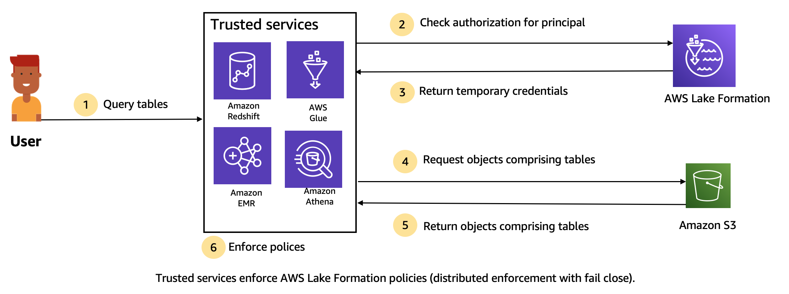

# Storage access management

Lake Formation uses [credential vending](using-cred-vending.md "using-cred-vending.md") functionality to
provide temporary access to Amazon S3 data. Credential vending, or token vending is a common
pattern that provides temporary credentials to users, services, or some other entity for
the purposes of granting short term access to a resource.

Lake Formation leverages this pattern to provide short term access to AWS analytics services such as Athena to access data on behalf of the calling principal.
When granting permissions, users don’t need to update their Amazon S3 bucket policies or IAM policies, and they don’t need direct access to Amazon S3.

The following diagram shows how Lake Formation provides temporary access to registered locations:

1. A principal (user) enters a query or request for data for a table through a
   trusted integrated service like Athena, Amazon EMR, Redshift Spectrum, or AWS Glue.
2. The integrated service checks for authorization from Lake Formation for the table and
   requested columns and makes an authorization determination. If the user is not
   authorized, Lake Formation denies access to data and the query fails.
3. After authorization succeeds and storage authorization is turned on for the table and user,
   the integrated service retrieves temporary credentials from Lake Formation to access the
   data.
4. The integrated service uses the temporary credentials from Lake Formation to request objects from
   Amazon S3.
5. Amazon S3 provides the Amazon S3 objects to the integrated service. The Amazon S3 objects contains all the
   data from the table.
6. The integrated service performs the necessary enforcement of Lake Formation policies, such as column
   level, row level and/or cell level filtering. The integrated service processes
   the queries and returns the results back to the user.

###### Enable storage-level permissions enforcement for Data Catalog tables

By default, storage-level enforcement is not enabled for tables within the Data Catalog. To
enable storage-level enforcement, you must register the Amazon S3 location of your source
data with Lake Formation and provide an IAM role. Storage-level permissions will be enabled
for all tables with the same table location path or prefix of the Amazon S3
location.

When an integrated service requests access to the data location on behalf of a user, the
Lake Formation service assumes this role and returns the credentials to requested service with
scoped-down permissions to the resource so that data access can be made. The registered
IAM role must have all required access to the Amazon S3 location including AWS KMS keys.

For more information, see [Registering an Amazon S3 location](register-location.md "register-location.md").

###### Supported AWS services

AWS analytic services such as Athena, Redshift Spectrum, Amazon EMR, AWS Glue, Amazon Quick Suite,
and Amazon SageMaker AI integrate with AWS Lake Formation using the Lake Formation credential
vending API operations. To see a full list of AWS services that integrate with
Lake Formation, and the level of granularity and table formats that they support, see [Working with other AWS services](working-with-services.md "working-with-services.md").
