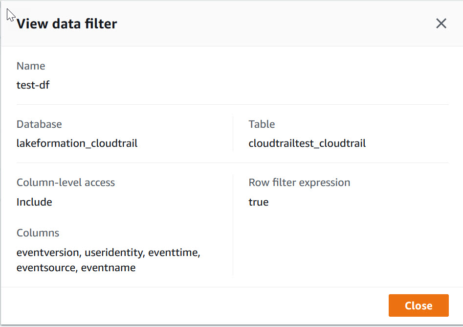

# Viewing data filters

You can use the Lake Formation console, AWS CLI, or the Lake Formation API to view data filters.

To view data filters, you must be a Data Lake administrator or have the required
permissions on the data filters.

Console

1. Sign in to the AWS Management Console and open the Lake Formation console at
   [https://console.aws.amazon.com/lakeformation/](https://console.aws.amazon.com/lakeformation/ "https://console.aws.amazon.com/lakeformation/").
2. In the navigation pane, under **Data catalog**, choose
   **Data filters**.

The page displays the data filters you have access to.

 3. To view the data filter details, choose the data filter, and then choose View. A
new window appears with the data filter detailed information.



AWS CLI
Enter a `list-data-cells-filter` command and specify a table
resource.

The following example lists the data filters for the
`cloudtrailtest_cloudtrail` table.

```
aws lakeformation list-data-cells-filter --table '{ "CatalogId":"123456789012",
"DatabaseName":"lakeformation_cloudtrail", "Name":"cloudtrailtest_cloudtrail"}'
```

API/SDK
Use the `ListDataCellsFilter` API and specify a table resource.

The following example uses Python to list the first 20 data filters for the
`myTable` table.

```
response = client.list_data_cells_filter(
    Table = {
        'CatalogId': '111122223333',
        'DatabaseName': 'mydb',
        'Name': 'myTable'
    },
    MaxResults=20
)

```
