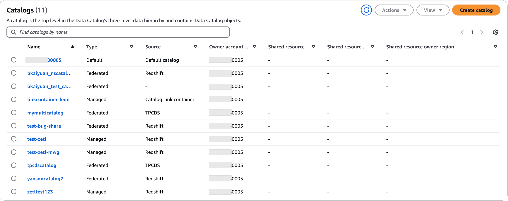
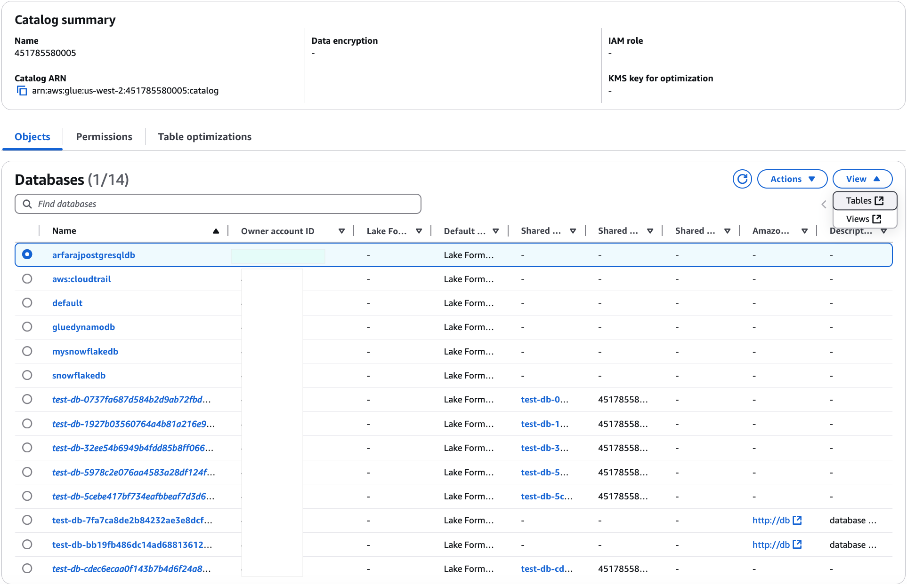

# Viewing catalog objects

For each available data source, AWS Glue creates a corresponding catalog in the AWS Glue Data Catalog.
After you create a catalog, you can view the databases and tables in the catalog using the
Lake Formation console or AWS CLI. For

1. Open the Lake Formation console at [https://console.aws.amazon.com/lakeformation/](https://console.aws.amazon.com/lakeformation/ "https://console.aws.amazon.com/lakeformation/").
2. Choose **Catalogs** under Data Catalog. The catalogs page shows the catalogs that you've permissions on.

 3. Choose a catalog from the list to view the databases and tables contained in the
catalog. The list contains the databases in your account and resource links, which are links to shared databases and tables in external accounts, and are used for cross-account access to data in the data lake.

 4. Choose **Tables** option under **View** to view and manage the tables in the database.

###### \*\*AWS CLI examples for viewing catalogs and

databases\*\*

The following example shows how to view a catalog using AWS CLI

```
aws glue get-catalog \
--catalog-id `123456789012`:`dynamodbcatalog`
```

The following example shows how to request all catalogs in the account.

```
aws glue get-catalogs \
 --recursive
```

The following example request shows how to get the databases in the catalog.

```
aws glue get-database \
--catalog-id 123456789012:`dynamodbcatalog`
--database-name `database name`
```
