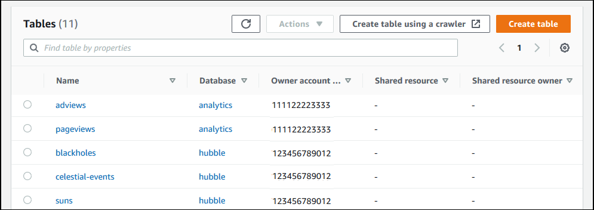
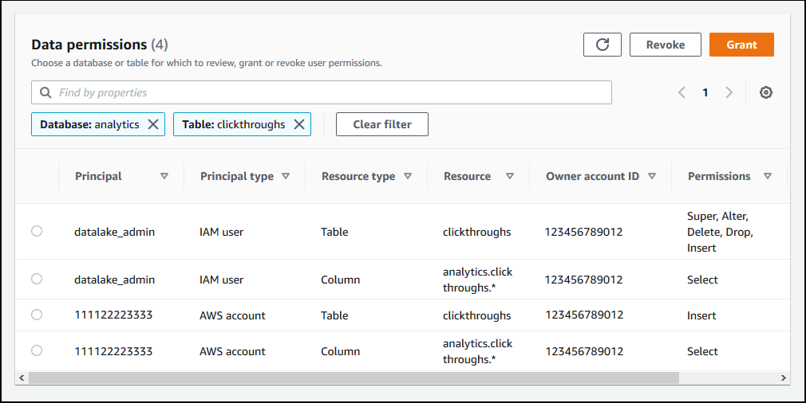

# Viewing shared Data Catalog tables and

databases

You can view resources that are shared with your account by using the Lake Formation console or AWS
CLI. You can also use the AWS Resource Access Manager (AWS RAM) console or CLI to view both resources that are shared
with your account and resources that you've shared with other AWS accounts.

###### To view shared resources using the Lake Formation console

1. Open the Lake Formation console at
   [https://console.aws.amazon.com/lakeformation/](https://console.aws.amazon.com/lakeformation/ "https://console.aws.amazon.com/lakeformation/").

Sign in as a data lake administrator or a user who has been granted permissions on a
shared table. 2. To view resources that are shared with your AWS account, do one of the following:

    * To view tables that are shared with your account, in the navigation pane, choose
     **Tables**.
    * To view databases that are shared with your account, in the navigation pane, choose
     **Databases**.

The console displays a list of databases or tables both in your account and shared with
your account. For resources that are shared with your account, the console displays the owner's
AWS account ID under the **Owner account ID** column (the third column in
the following screenshot).

 3. To view resources that you shared with other AWS accounts or organizations, in the
navigation pane, choose **Data permissions**.

Resources that you shared are listed on the **Data permissions** page
with the external account number shown in the **Principal** column, as shown
in the following image.

###### To view shared resources using the AWS RAM console

1. Ensure that you have the required AWS Identity and Access Management (IAM) permissions to view shared resources
   using AWS RAM.

At a minimum, you must have the `ram:ListResources` permission.This permission
is included in the AWS managed policy `AWSLakeFormationCrossAccountManager`. 2. Sign in to the AWS Management Console and open the AWS RAM console at [https://console.aws.amazon.com/ram/home](https://console.aws.amazon.com/ram/home "https://console.aws.amazon.com/ram/home"). 3. Do one of the following:

    * To see resources that you shared, in the navigation pane, under **Shared by
     me**, choose **Shared resources**.
    * To see resources that are shared with you, in the navigation pane, under
     **Shared with me**, choose **Shared resources**.
