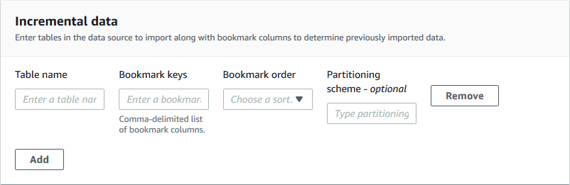

# Creating a workflow

Before you start, ensure that you have granted the required data permissions and data
location permissions to the role `LakeFormationWorkflowRole`. This is so the
workflow can create metadata tables in the Data Catalog and write data to target locations in Amazon S3.
For more information, see [(Optional) Create an IAM role for workflows](initial-lf-config.md#iam-create-blueprint-role "initial-lf-config.md#iam-create-blueprint-role") and [Overview of Lake Formation permissions](lf-permissions-overview.md "lf-permissions-overview.md") .

###### Note

Lake Formation uses `GetTemplateInstance`, `GetTemplateInstances`, and
`InstantiateTemplate` operations to create workflows from blueprints. These
operations are not publicly available, and are used only internally for creating resources
on your behalf. You receive CloudTrail events for creating workflows.

###### To create a workflow from a blueprint

1. Open the AWS Lake Formation console at [https://console.aws.amazon.com/lakeformation/](https://console.aws.amazon.com/lakeformation/ "https://console.aws.amazon.com/lakeformation/"). Sign in as the data lake
   administrator or as a user who has data engineer permissions. For more information, see
   [Lake Formation personas and IAM permissions reference](permissions-reference.md "permissions-reference.md").
2. In the navigation pane, choose **Blueprints**, and then choose
   **Use blueprint**.
3. On the **Use a blueprint** page, choose a tile to select the
   blueprint type.
4. Under **Import source**, specify the data source.

If you are importing from a JDBC source, specify the following:

    * **Database
     connection**–Choose a connection from the list. Create
     additional connections using the AWS Glue console. The JDBC user name and password in the
     connection determine the database objects that the workflow has access to.
    * **Source data
     path**–Enter
     `<database>`/`<schema>`/`<table>`
     or `<database>`/`<table>`,
     depending on the database product. Oracle Database and MySQL don’t support schema in
     the path. You can substitute the percent (%) character for
     `<schema>` or `<table>`. For
     example, for an Oracle database with a system identifier (SID) of `orcl`,
     enter `orcl/%` to import all tables that the user named in the connection
     has access to.

    ###### Important

    This field is case sensitive. The workflow will fail if there is a case mismatch
     for any of the components.

    If you specify a MySQL database, AWS Glue ETL uses the Mysql5 JDBC driver by default,
     so MySQL8 is not natively supported. You can edit the ETL job script to use a
     `customJdbcDriverS3Path` parameter as described in [JDBC connectionType Values](../../../glue/latest/dg/aws-glue-programming-etl-connect.md#aws-glue-programming-etl-connect-jdbc "../../../glue/latest/dg/aws-glue-programming-etl-connect.md#aws-glue-programming-etl-connect-jdbc") in the
     *AWS Glue Developer Guide* to use a different JDBC driver that supports
     MySQL8.

If you are importing from a log file, ensure that the role that you specify for the
workflow (the "workflow role") has the required IAM permissions to access the data
source. For example, to import AWS CloudTrail logs, the user must have the
`cloudtrail:DescribeTrails` and `cloudtrail:LookupEvents`
permissions to see the list of CloudTrail logs while creating the workflow, and the workflow
role must have permissions on the CloudTrail location in Amazon S3. 5. Do one of the following:

    * For the **Database snapshot** blueprint type, optionally identify
     a subset of data to import by specifying one or more exclude patterns. These exclude
     patterns are Unix-style `glob` patterns. They are stored as a property of
     the tables that are created by the workflow.

    For details on the available exclude patterns, see [Include and Exclude Patterns](../../../glue/latest/dg/define-crawler.md#crawler-data-stores-exclude "../../../glue/latest/dg/define-crawler.md#crawler-data-stores-exclude") in the *AWS Glue Developer Guide*.
    * For the **Incremental database** blueprint type, specify the
     following fields. Add a row for each table to import.

    **Table name**

    Table to import. Must be all lower case.

    **Bookmark keys**

    Comma-delimited list of column names that define the bookmark keys. If
     blank, the primary key is used to determine new data. Case for each column must
     match the case as defined in the data source.

    ###### Note

    The primary key qualifies as the default bookmark key only if it is
     sequentially increasing or decreasing (with no gaps). If you want to use the
     primary key as the bookmark key and it has gaps, you must name the primary key
     column as a bookmark key.

    **Bookmark order**

    When you choose **Ascending**, rows with values greater
     than bookmarked values are identified as new rows. When you choose
     **Descending**, rows with values less than bookmarked values
     are identified as new rows.

    **Partitioning scheme**

    (Optional) List of partitioning key columns, delimited by slashes (/).
     Example: `year/month/day`.

    

    For more information, see [Tracking Processed Data Using Job Bookmarks](../../../glue/latest/dg/monitor-continuations.md "../../../glue/latest/dg/monitor-continuations.md") in the
     *AWS Glue Developer Guide*.

6. Under **Import target**, specify the target database, target Amazon S3
   location, and data format.

Ensure that the workflow role has the required Lake Formation permissions on the database and
Amazon S3 target location.

###### Note

Currently, blueprints do not support encrypting data at the target. 7. Choose an import frequency.

You can specify a `cron` expression with the **Custom**
option. 8. Under **Import options**:

    1. Enter a workflow name.
    2. For role, choose the role `LakeFormationWorkflowRole`, which you
     created in [(Optional) Create an IAM role for workflows](initial-lf-config.md#iam-create-blueprint-role "initial-lf-config.md#iam-create-blueprint-role").
    3. Optionally specify a table prefix. The prefix is prepended to the names of Data Catalog
     tables that the workflow creates.

9. Choose **Create**, and wait for the console to report that the
   workflow was successfully created.

###### Tip

Did you get the following error message?

`User:
 arn:aws:iam::`<account-id>`:user/`<username>`
 is not authorized to perform: iam:PassRole on
 resource:arn:aws:iam::`<account-id>`:role/`<rolename>`...`

If so, check that you replaced `<account-id>` with a
valid AWS account number in all policies.

###### See also:

- [Blueprints and workflows in Lake Formation](workflows-about.md "workflows-about.md")
