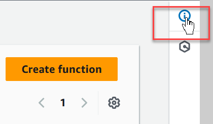

# Select a method to invoke your Lambda function using an HTTP request

Many common use cases for Lambda involve invoking your function using an HTTP request. For example, you might want a web application to invoke your function
through a browser request. Lambda functions can also be used to create full REST APIs, handle user interactions from mobile apps, process data from external services via HTTP calls, or create custom webhooks.

The following sections explain what your choices are for invoking Lambda through HTTP and provide information to help you make the right decision for your particular use case.

## What are your choices when selecting an HTTP invoke method?

Lambda offers two main methods to invoke a function using an HTTP request - [function URLs](urls-configuration.md "urls-configuration.md") and
[API Gateway](services-apigateway.md "services-apigateway.md"). The key differences between these two options are as follows:

- **Lambda function URLs** provide a simple, direct HTTP endpoint for a Lambda function. They are optimized for
  simplicity and cost-effectiveness and provide the fastest path to expose a Lambda function via HTTP.
- **API Gateway** is a more advanced service for building fully-featured APIs. API Gateway is optimized for building and managing
  productions APIs at scale and provides comprehensive tools for security, monitoring, and traffic management.

## Recommendations if you already know your requirements

If you're already clear on your requirements, here are our basic recommendations:

We recommend **[function URLs](urls-configuration.md "urls-configuration.md")** for simple applications or prototyping where
you only need basic authentication methods and request/response handling and where you want to keep costs and complexity to a minimum.

**[API Gateway](services-apigateway.md "services-apigateway.md")** is a better choice for production applications at scale or for cases where you need more advanced features
like [OpenAPI Description](https://www.openapis.org/ "https://www.openapis.org/") support, a choice of authentication options, custom domain names, or rich request/response
handling including throttling, caching, and request/response transformation.

## What to consider when selecting a method to invoke your Lambda function

When selecting between function URLs and API Gateway, you need to consider the following factors:

- Your authentication needs, such as whether you require OAuth or Amazon Cognito to authenticate users
- Your scaling requirements and the complexity of the API you want to implement
- Whether you need advanced features such as request validation and request/response formatting
- Your monitoring requirements
- Your cost goals

By understanding these factors, you can select the option that best balances your security, complexity, and cost requirements.

The following information summarizes the main differences between the two options.

- **Function URLs** provide basic authentication options through AWS Identity and Access Management (IAM). You can configure your endpoints to be
  either public (no authentication) or to require IAM authentication. With IAM authentication, you can use standard AWS credentials or IAM roles to
  control access. While straightforward to set up, this approach provides limited options compared with other authenticaton methods.
- **API Gateway** provides access to a more comprehensive range of authentication options. As well as IAM authentication,
  you can use [Lambda authorizers](../../../apigateway/latest/developerguide/apigateway-use-lambda-authorizer.md "../../../apigateway/latest/developerguide/apigateway-use-lambda-authorizer.md")
  (custom authentication logic), [Amazon Cognito](../../../cognito/latest/developerguide/what-is-amazon-cognito.md "../../../cognito/latest/developerguide/what-is-amazon-cognito.md") user pools, and OAuth2.0
  flows. This flexibility allows you to implement complex authentication schemes, including third-party authentication providers, token-based authentication, and multi-factor
  authentication.

- **Function URLs** provide basic HTTP request and response handling. They support standard HTTP methods and
  include built-in cross-origin resource sharing (CORS) support. While they can handle JSON payloads and query parameters naturally, they don't offer request
  transformation or validation capabilities. Response handling is similarly straightforward – the client receives the response from your Lambda function exactly as
  Lambda returns it.
- **API Gateway** provides sophisticated request and response handling capabilities. You can define request validators, transform
  requests and responses using mapping templates, set up request/response headers, and implement response caching. API Gateway also supports binary payloads and custom domain
  names and can modify responses before they reach the client. You can set up models for request/response validation and transformation using JSON Schema.

- **Function URLs** scale directly with your Lambda function's concurrency limits and handle traffic spikes by scaling your function
  up to its maximum configured concurrency limit. Once that limit is reached, Lambda responds to additional requests with HTTP 429 responses. There's no built-in queuing
  mechanism, so handling scaling is entirely dependent on your Lambda function's configuration. By default, Lambda functions have a limit of 1,000 concurrent executions
  per AWS Region.
- **API Gateway** provides additional scaling capabilities on top of Lambda's own scaling. It includes built-in request queuing and throttling
  controls, allowing you to manage traffic spikes more gracefully. API Gateway can handle up to 10,000 requests per second per region by default, with a burst capacity of
  5,000 requests per second. It also provides tools to throttle requests at different levels (API, stage, or method) to protect your backend.

- **Function URLs** offer basic monitoring through Amazon CloudWatch metrics, including request count, latency, and error rates. You get
  access to standard Lambda metrics and logs, which show the raw requests coming into your function. While this provides essential operational visibility, the metrics
  are focused mainly on function execution.
- **API Gateway** provides comprehensive monitoring capabilities including detailed metrics, logging, and tracing options. You can
  monitor API calls, latency, error rates, and cache hit/miss rates through CloudWatch. API Gateway also integrates with AWS X-Ray for distributed tracing and provides
  customizable logging formats.

- **Function URLs** follow the standard Lambda pricing model – you only pay for function invocations and compute time. There are
  no additional charges for the URL endpoint itself. This makes it a cost-effective choice for simple APIs or low-traffic applications if you don't need the additional
  features of API Gateway.
- **API Gateway** offers a [free tier](https://aws.amazon.com/api-gateway/pricing/#Free_Tier "https://aws.amazon.com/api-gateway/pricing/#Free_Tier") that includes one million API calls
  received for REST APIs and one million API calls received for HTTP APIs. After this, API Gateway charges for API calls, data transfer, and caching (if enabled). Refer to the API Gateway
  [pricing page](https://aws.amazon.com/api-gateway/pricing/ "https://aws.amazon.com/api-gateway/pricing/") to understand the costs for your own use case.

- **Function URLs** are designed for simplicity and direct Lambda integration. They support both HTTP and HTTPS endpoints, offer
  built-in CORS support, and provide dual-stack (IPv4 and IPv6) endpoints. While they lack advanced features, they excel in scenarios where you need a quick,
  straightforward way to expose Lambda functions via HTTP.
- **API Gateway** includes numerous additional features such as API versioning, stage management, API keys for usage plans, API documentation
  through Swagger/OpenAPI, WebSocket APIs, private APIs within a VPC, and WAF integration for additional security. It also supports canary deployments, mock integrations
  for testing, and integration with other AWS services beyond Lambda.

## Select a method to invoke your Lambda function

Now that you've read about the criteria for selecting between Lambda function URLs and API Gateway and the key differences between them, you can select the option
that best meets your needs and use the following resources to help you get started using it.

Function URLs

###### Get started with function URLs with the following resources

- Follow the tutorial [Creating a Lambda function with a function URL](urls-webhook-tutorial.md "urls-webhook-tutorial.md")
- Learn more about function URLs in the [Creating and managing Lambda function URLs](urls-configuration.md "urls-configuration.md") chapter of this guide
- Try the in-console guided tutorial **Create a simple web app** by doing the following:

1. Open the [functions page](https://console.aws.amazon.com/lambda/home#/functions "https://console.aws.amazon.com/lambda/home#/functions") of the Lambda console.
2. Open the help panel by choosing the icon in the top right corner of the screen.

 3. Select **Tutorials**. 4. In **Create a simple web app**, choose **Start tutorial**.

API Gateway

###### Get started with Lambda and API Gateway with the following resources

- Follow the tutorial [Using Lambda with API Gateway](services-apigateway-tutorial.md "services-apigateway-tutorial.md") to create a REST API integrated with a backend
  Lambda function.
- Learn more about the different kinds of API offered by API Gateway in the following sections of the _Amazon API Gateway Developer Guide_:
  - [API Gateway REST APIs](../../../apigateway/latest/developerguide/apigateway-rest-api.md "../../../apigateway/latest/developerguide/apigateway-rest-api.md")
  - [API Gateway HTTP APIs](../../../apigateway/latest/developerguide/http-api.md "../../../apigateway/latest/developerguide/http-api.md")
  - [API Gateway WebSocket APIs](../../../apigateway/latest/developerguide/apigateway-websocket-api.md "../../../apigateway/latest/developerguide/apigateway-websocket-api.md")

- Try one or more of the examples in the [Tutorials and workshops](../../../apigateway/latest/developerguide/api-gateway-tutorials.md "../../../apigateway/latest/developerguide/api-gateway-tutorials.md")
  section of the _Amazon API Gateway Developer Guide_.
