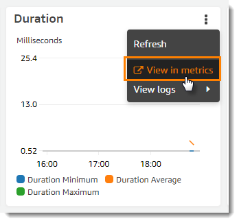

# Monitoring Lambda applications

The **Applications** section of the Lambda console includes a **Monitoring** tab where you can review an Amazon CloudWatch dashboard with aggregate metrics for the resources in your application.

###### To monitor a Lambda application

1. Open the Lambda console [Applications page](https://console.aws.amazon.com/lambda/home#/applications "https://console.aws.amazon.com/lambda/home#/applications").
2. Choose **Monitoring**.
3. To see more details about the metrics in any graph, choose **View in metrics** from the drop-down menu.



The graph appears in a new tab, with the relevant metrics listed below the graph. You can customize your view of this graph, changing the metrics and resources shown, the statistic, the period, and other factors to get a better understanding of the current situation.
By default, the Lambda console shows a basic dashboard. You can customize this page by adding one or more Amazon CloudWatch dashboards to your application
template with the [AWS::CloudWatch::Dashboard](../../../AWSCloudFormation/latest/UserGuide/aws-properties-cw-dashboard.md "../../../AWSCloudFormation/latest/UserGuide/aws-properties-cw-dashboard.md")
resource type. When your template includes one or more dashboards, the page shows your
dashboards instead of the default dashboard. You can switch between dashboards with the drop-down menu on the top
right of the page. The following example creates a dashboard with a single widget that graphs the number of
invocations of a function named `my-function`.

###### Example function dashboard template

```
Resources:
  MyDashboard:
    Type: AWS::CloudWatch::Dashboard
    Properties:
      DashboardName: my-dashboard
      DashboardBody: |
        {
            "widgets": [
                {
                    "type": "metric",
                    "width": 12,
                    "height": 6,
                    "properties": {
                        "metrics": [
                            [
                                "AWS/Lambda",
                                "Invocations",
                                "FunctionName",
                                "my-function",
                                {
                                    "stat": "Sum",
                                    "label": "MyFunction"
                                }
                            ],
                            [
                                {
                                    "expression": "SUM(METRICS())",
                                    "label": "Total Invocations"
                                }
                            ]
                        ],
                        "region": "us-east-1",
                        "title": "Invocations",
                        "view": "timeSeries",
                        "stacked": false
                    }
                }
            ]
        }
```

For more information about authoring CloudWatch dashboards and widgets, see [Dashboard body structure and syntax](../../../AmazonCloudWatch/latest/APIReference/CloudWatch-Dashboard-Body-Structure.md "../../../AmazonCloudWatch/latest/APIReference/CloudWatch-Dashboard-Body-Structure.md") in the
_Amazon CloudWatch API Reference_.
