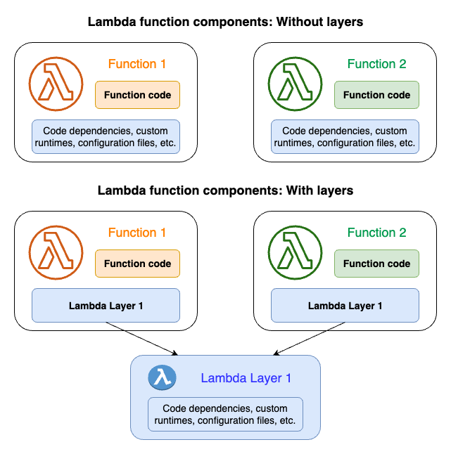

# Managing Lambda dependencies with layers

A Lambda layer is a .zip file archive that contains supplementary code or data.
Layers usually contain library dependencies, a [custom runtime](runtimes-custom.md "runtimes-custom.md"),
or configuration files.

There are multiple reasons why you might consider using layers:

- **To reduce the size of your deployment packages.**
  Instead of including all of your function dependencies along with your function code
  in your deployment package, put them in a layer. This keeps deployment packages small
  and organized.
- **To separate core function logic from dependencies.**
  With layers, you can update your function dependencies independent of your function code,
  and vice versa. This promotes separation of concerns and helps you focus on your function
  logic.
- **To share dependencies across multiple functions.**
  After you create a layer, you can apply it to any number of functions in your account.
  Without layers, you need to include the same dependencies in each individual deployment
  package.
- **To use the Lambda console code editor.** The code
  editor is a useful tool for testing minor function code updates quickly. However, you
  can’t use the editor if your deployment package size is too large. Using layers reduces
  your package size and can unlock usage of the code editor.
- **To lock an embedded SDK version.**The embedded SDKs may change without notice as AWS releases new services and features. You can lock a version
  of the SDK by creating a Lambda layer with the specific version needed. The
  function then always uses the version in the layer, even if the version embedded in the service changes.
  If you're working with Lambda functions in Go or Rust, we recommend against using layers.
  For Go and Rust functions, you provide your function code as an executable, which includes your
  compiled function code along with all of its dependencies. Putting your dependencies in a
  layer forces your function to manually load additional assemblies during the initialization
  phase, which can increase cold start times. For optimal performance for Go and Rust functions,
  include your dependencies along with your deployment package.

The following diagram illustrates the high-level architectural differences between two
functions that share dependencies. One uses Lambda layers, and the other does not.

When you add a layer to a function, Lambda extracts the layer contents into the `/opt`
directory in your function’s [execution environment](lambda-runtime-environment.md "lambda-runtime-environment.md").
All natively supported Lambda runtimes include paths to specific directories within the
`/opt` directory. This gives your function access to your layer content. For more
information about these specific paths and how to properly package your layers, see
[Packaging your layer content](packaging-layers.md "packaging-layers.md").

You can include up to five layers per function. Also, you can use layers only with Lambda functions
[deployed as a .zip file archive](configuration-function-zip.md "configuration-function-zip.md"). For functions
[defined as a container image](images-create.md "images-create.md"), package your preferred runtime
and all code dependencies when you create the container image. For more information, see
[Working with Lambda layers and extensions in container images](https://aws.amazon.com/blogs/compute/working-with-lambda-layers-and-extensions-in-container-images/ "https://aws.amazon.com/blogs/compute/working-with-lambda-layers-and-extensions-in-container-images/") on the AWS Compute Blog.

###### Topics

- [How to use layers](#lambda-layers-overview "#lambda-layers-overview")
- [Layers and layer versions](#lambda-layer-versions "#lambda-layer-versions")
- [Packaging your layer content](packaging-layers.md "packaging-layers.md")
- [Creating and deleting layers in Lambda](creating-deleting-layers.md "creating-deleting-layers.md")
- [Adding layers to functions](adding-layers.md "adding-layers.md")
- [Using AWS CloudFormation with layers](layers-cfn.md "layers-cfn.md")
- [Using AWS SAM with layers](layers-sam.md "layers-sam.md")

## How to use layers

To create a layer, package your dependencies into a .zip file, similar to how you
[create a normal deployment package](configuration-function-zip.md "configuration-function-zip.md"). More
specifically, the general process of creating and using layers involves these three steps:

- **First, package your layer content.** This means creating a
  .zip file archive. For more information, see [Packaging your layer content](packaging-layers.md "packaging-layers.md").
- **Next, create the layer in Lambda.** For more information,
  see [Creating and deleting layers in Lambda](creating-deleting-layers.md "creating-deleting-layers.md").
- **Add the layer to your function(s).** For more information,
  see [Adding layers to functions](adding-layers.md "adding-layers.md").

## Layers and layer versions

A layer version is an immutable snapshot of a specific version of a layer. When you create
a new layer, Lambda creates a new layer version with a version number of 1. Each time you publish
an update to the layer, Lambda increments the version number and creates a new layer version.

Every layer version is identified by a unique Amazon Resource Name (ARN). When adding a layer
to the function, you must specify the exact layer version you want to use (for example, `arn:aws:lambda:us-east-1:123456789012:layer:my-layer:`1``).
