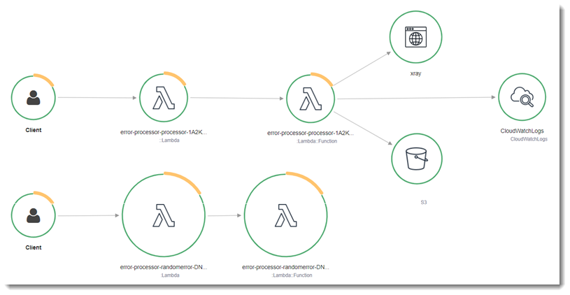
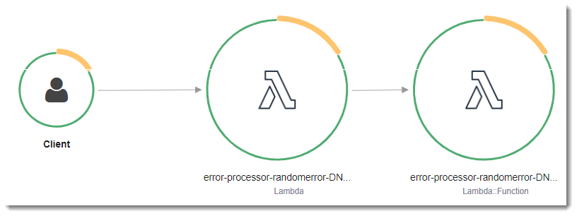
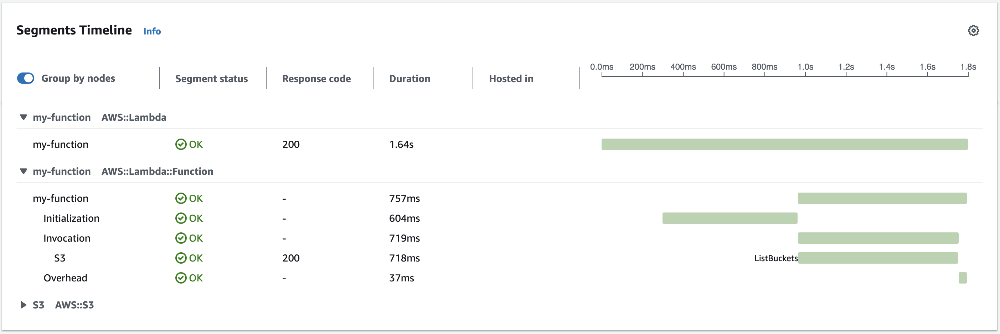

# Instrumenting C# code in AWS Lambda

Lambda integrates with AWS X-Ray to help you trace, debug, and optimize Lambda applications. You can use X-Ray
to trace a request as it traverses resources in your application, which may include Lambda functions and other AWS
services.

To send tracing data to X-Ray, you can use one of three SDK libraries:

- [AWS Distro for OpenTelemetry (ADOT)](https://aws.amazon.com/otel "https://aws.amazon.com/otel") – A secure, production-ready,
  AWS-supported distribution of the OpenTelemetry (OTel) SDK.
- [AWS X-Ray SDK for .NET](../../../xray/latest/devguide/xray-sdk-dotnet.md "../../../xray/latest/devguide/xray-sdk-dotnet.md") – An SDK
  for generating and sending trace data to X-Ray.
- [Powertools for AWS Lambda (.NET)](../../../powertools/dotnet.md "../../../powertools/dotnet.md") – A developer toolkit to implement
  Serverless best practices and increase developer velocity.
  Each of the SDKs offer ways to send your telemetry data to the X-Ray service.
  You can then use X-Ray to view, filter, and gain insights into your application's performance metrics to identify
  issues and opportunities for optimization.

###### Important

The X-Ray and Powertools for AWS Lambda SDKs are part of a tightly integrated instrumentation solution offered by AWS.
The ADOT Lambda Layers are part of an industry-wide standard for tracing instrumentation that collect more data in general, but may not be
suited for all use cases. You can implement end-to-end tracing in X-Ray using either solution. To learn more about choosing between them, see
[Choosing between the AWS
Distro for Open Telemetry and X-Ray SDKs](../../../xray/latest/devguide/xray-instrumenting-your-app.md#xray-instrumenting-choosing "../../../xray/latest/devguide/xray-instrumenting-your-app.md#xray-instrumenting-choosing").

###### Sections

- [Using Powertools for AWS Lambda (.NET) and AWS SAM for tracing](#dotnet-tracing-sam "#dotnet-tracing-sam")
- [Using the X-Ray SDK to instrument your .NET functions](#dotnet-xray-sdk "#dotnet-xray-sdk")
- [Activating tracing with the Lambda console](#dotnet-tracing-console "#dotnet-tracing-console")
- [Activating tracing with the Lambda API](#dotnet-tracing-api "#dotnet-tracing-api")
- [Activating tracing with AWS CloudFormation](#dotnet-tracing-cloudformation "#dotnet-tracing-cloudformation")
- [Interpreting an X-Ray trace](#dotnet-tracing-interpretation "#dotnet-tracing-interpretation")

## Using Powertools for AWS Lambda (.NET) and AWS SAM for tracing

Follow the steps below to download, build, and deploy a sample Hello World C# application with integrated [Powertools for AWS Lambda (.NET)](https://docs.powertools.aws.dev/lambda-dotnet "https://docs.powertools.aws.dev/lambda-dotnet") modules using the AWS SAM. This application implements a
basic API backend and uses Powertools for emitting logs, metrics, and traces. It consists of an Amazon API Gateway endpoint and a Lambda function.
When you send a GET request to the API Gateway endpoint, the Lambda function invokes, sends logs and metrics using Embedded Metric Format to CloudWatch, and
sends traces to AWS X-Ray. The function returns a hello world message.

###### Prerequisites

To complete the steps in this section, you must have the following:

- .NET 8
- [AWS CLI version 2](../../../cli/latest/userguide/getting-started-install.md "../../../cli/latest/userguide/getting-started-install.md")
- [AWS SAM CLI version 1.75 or later](../../../serverless-application-model/latest/developerguide/serverless-sam-cli-install.md "../../../serverless-application-model/latest/developerguide/serverless-sam-cli-install.md"). If you have an older version of the AWS SAM CLI, see [Upgrading the AWS SAM CLI](../../../serverless-application-model/latest/developerguide/manage-sam-cli-versions.md#manage-sam-cli-versions-upgrade "../../../serverless-application-model/latest/developerguide/manage-sam-cli-versions.md#manage-sam-cli-versions-upgrade").

###### Deploy a sample AWS SAM application

1. Initialize the application using the Hello World TypeScript template.

```
sam init --app-template hello-world-powertools-dotnet --name sam-app --package-type Zip --runtime dotnet6 --no-tracing
```

2. Build the app.

```
cd sam-app && sam build
```

3. Deploy the app.

```
sam deploy --guided
```

4. Follow the on-screen prompts. To accept the default options provided in the interactive experience, press `Enter`.

###### Note

For **HelloWorldFunction may not have authorization defined, Is this okay?**, make sure to enter `y`. 5. Get the URL of the deployed application:

```
aws cloudformation describe-stacks --stack-name sam-app --query 'Stacks[0].Outputs[?OutputKey==`HelloWorldApi`].OutputValue' --output text
```

6. Invoke the API endpoint:

```
curl `<URL_FROM_PREVIOUS_STEP>`
```

If successful, you'll see this response:

```
{"message":"hello world"}
```

7. To get the traces for the function, run [sam traces](../../../serverless-application-model/latest/developerguide/sam-cli-command-reference-sam-traces.md "../../../serverless-application-model/latest/developerguide/sam-cli-command-reference-sam-traces.md").

```
sam traces
```

The trace output looks like this:

```
New XRay Service Graph
  Start time: 2023-02-20 23:05:16+08:00
  End time: 2023-02-20 23:05:16+08:00
  Reference Id: 0 - AWS::Lambda - sam-app-HelloWorldFunction-pNjujb7mEoew - Edges: [1]
   Summary_statistics:
     - total requests: 1
     - ok count(2XX): 1
     - error count(4XX): 0
     - fault count(5XX): 0
     - total response time: 2.814
  Reference Id: 1 - AWS::Lambda::Function - sam-app-HelloWorldFunction-pNjujb7mEoew - Edges: []
   Summary_statistics:
     - total requests: 1
     - ok count(2XX): 1
     - error count(4XX): 0
     - fault count(5XX): 0
     - total response time: 2.429
  Reference Id: 2 - (Root) AWS::ApiGateway::Stage - sam-app/Prod - Edges: [0]
   Summary_statistics:
     - total requests: 1
     - ok count(2XX): 1
     - error count(4XX): 0
     - fault count(5XX): 0
     - total response time: 2.839
  Reference Id: 3 - client - sam-app/Prod - Edges: [2]
   Summary_statistics:
     - total requests: 0
     - ok count(2XX): 0
     - error count(4XX): 0
     - fault count(5XX): 0
     - total response time: 0

XRay Event [revision 3] at (2023-02-20T23:05:16.521000) with id (1-63f38c2c-270200bf1d292a442c8e8a00) and duration (2.877s)
 - 2.839s - sam-app/Prod [HTTP: 200]
   - 2.836s - Lambda [HTTP: 200]
 - 2.814s - sam-app-HelloWorldFunction-pNjujb7mEoew [HTTP: 200]
 - 2.429s - sam-app-HelloWorldFunction-pNjujb7mEoew
   - 0.230s - Initialization
   - 2.389s - Invocation
     - 0.600s - ## FunctionHandler
       - 0.517s - Get Calling IP
   - 0.039s - Overhead
```

8. This is a public API endpoint that is accessible over the internet. We recommend that you delete the endpoint after testing.

```
sam delete
```

X-Ray doesn't trace all requests to your application. X-Ray applies a sampling algorithm
to ensure that tracing is efficient, while still providing a representative sample of all requests. The sampling rate is
1 request per second and 5 percent of additional requests. You can't configure the X-Ray sampling rate for your functions.

## Using the X-Ray SDK to instrument your .NET functions

You can instrument your function code to record metadata and trace downstream calls. To record detail about calls that your function
makes to other resources and services, use the AWS X-Ray SDK for .NET. To get the SDK, add the `AWSXRayRecorder` packages to your project
file.

```
<Project Sdk="Microsoft.NET.Sdk">
  <PropertyGroup>
    <TargetFramework>net8.0</TargetFramework>
    <GenerateRuntimeConfigurationFiles>true</GenerateRuntimeConfigurationFiles>
    <AWSProjectType>Lambda</AWSProjectType>
  </PropertyGroup>
  <ItemGroup>
    <PackageReference Include="Amazon.Lambda.Core" Version="2.1.0" />
    <PackageReference Include="Amazon.Lambda.SQSEvents" Version="2.1.0" />
    <PackageReference Include="Amazon.Lambda.Serialization.Json" Version="2.1.0" />
    <PackageReference Include="AWSSDK.Core" Version="3.7.103.24" />
    <PackageReference Include="AWSSDK.Lambda" Version="3.7.104.3" />
    **<PackageReference Include="AWSXRayRecorder.Core" Version="2.13.0" />**
    **<PackageReference Include="AWSXRayRecorder.Handlers.AwsSdk" Version="2.11.0" />**
  </ItemGroup>
</Project>
```

There are a range of Nuget packages that provide auto-instrumentation for AWS SDKs, Entity Framework and HTTP requests. To see the complete
set of configuration options refer to [AWS X-Ray SDK for .NET](../../../xray/latest/devguide/xray-sdk-dotnet.md "../../../xray/latest/devguide/xray-sdk-dotnet.md")
in the _AWS X-Ray Developer Guide_.

Once you have added the desired Nuget packages, configure auto-instrumentation. Best practice is to perform this configuration outside of
your function's handler function. This allows you to take advantage of execution environment re-use to improve the performance of your function.
In the following code example, the `RegisterXRayForAllServices` method is called in the function constructor to add instrumentation for
all AWS SDK calls.

```
[assembly: LambdaSerializer(typeof(Amazon.Lambda.Serialization.SystemTextJson.DefaultLambdaJsonSerializer))]

namespace GetProductHandler;

public class Function
{
    private readonly IDatabaseRepository _repo;

    public Function()
    {
        // Add auto instrumentation for all AWS SDK calls
        // It is important to call this method before initializing any SDK clients
        AWSSDKHandler.RegisterXRayForAllServices();
        this._repo = new DatabaseRepository();
    }

    public async Task<APIGatewayProxyResponse> FunctionHandler(APIGatewayProxyRequest request)
    {
        var id = request.PathParameters["id"];

        var databaseRecord = await this._repo.GetById(id);

        return new APIGatewayProxyResponse
        {
            StatusCode = (int)HttpStatusCode.OK,
            Body = JsonSerializer.Serialize(databaseRecord)
        };
    }
}
```

## Activating tracing with the Lambda console

To toggle active tracing on your Lambda function with the console, follow these steps:

###### To turn on active tracing

1. Open the [Functions page](https://console.aws.amazon.com/lambda/home#/functions "https://console.aws.amazon.com/lambda/home#/functions") of the Lambda console.
2. Choose a function.
3. Choose **Configuration** and then choose **Monitoring and operations tools**.
4. Under **Additional monitoring tools**, choose **Edit**.
5. Under **CloudWatch Application Signals and AWS X-Ray**, choose **Enable** for **Lambda service traces**.
6. Choose **Save**.

## Activating tracing with the Lambda API

Configure tracing on your Lambda function with the AWS CLI or AWS SDK, use the following API operations:

- [UpdateFunctionConfiguration](../api/API_UpdateFunctionConfiguration.md "../api/API_UpdateFunctionConfiguration.md")
- [GetFunctionConfiguration](../api/API_GetFunctionConfiguration.md "../api/API_GetFunctionConfiguration.md")
- [CreateFunction](../api/API_CreateFunction.md "../api/API_CreateFunction.md")

The following example AWS CLI command enables active tracing on a function named
**my-function**.

```
`aws lambda update-function-configuration --function-name my-function \
--tracing-config Mode=Active`
```

Tracing mode is part of the version-specific configuration when you publish a version of your function.
You can't change the tracing mode on a published version.

## Activating tracing with AWS CloudFormation

To activate tracing on an `AWS::Lambda::Function` resource in an AWS CloudFormation template, use the
`TracingConfig` property.

###### Example [function-inline.yml](https://github.com/awsdocs/aws-lambda-developer-guide/blob/master/templates/function-inline.yml "https://github.com/awsdocs/aws-lambda-developer-guide/blob/master/templates/function-inline.yml") –

Tracing configuration

```
Resources:
  function:
    Type: AWS::Lambda::Function
    Properties:
      `TracingConfig:
 Mode: Active`
      ...
```

For an AWS Serverless Application Model (AWS SAM) `AWS::Serverless::Function` resource, use the `Tracing`
property.

###### Example [template.yml](https://github.com/awsdocs/aws-lambda-developer-guide/tree/main/sample-apps/blank-nodejs/template.yml "https://github.com/awsdocs/aws-lambda-developer-guide/tree/main/sample-apps/blank-nodejs/template.yml") – Tracing

configuration

```
Resources:
  function:
    Type: AWS::Serverless::Function
    Properties:
      `Tracing: Active`
      ...
```

## Interpreting an X-Ray trace

Your function needs permission to upload trace data to X-Ray. When you activate tracing in the Lambda
console, Lambda adds the required permissions to your function's [execution role](lambda-intro-execution-role.md "lambda-intro-execution-role.md"). Otherwise, add the [AWSXRayDaemonWriteAccess](https://console.aws.amazon.com/iam/home#/policies/arn:aws:iam::aws:policy/AWSXRayDaemonWriteAccess "https://console.aws.amazon.com/iam/home#/policies/arn:aws:iam::aws:policy/AWSXRayDaemonWriteAccess") policy to the execution role.

After you've configured active tracing, you can observe specific requests
through your application. The [X-Ray service graph](../../../xray/latest/devguide/aws-xray.md#xray-concepts-servicegraph "../../../xray/latest/devguide/aws-xray.md#xray-concepts-servicegraph") shows information about your application and all its components. The following example
shows an application with two functions.
The primary function processes events and sometimes returns errors. The second function at the top processes errors that appear
in the first's log group and uses the AWS SDK to call X-Ray, Amazon Simple Storage Service (Amazon S3), and Amazon CloudWatch Logs.



X-Ray doesn't trace all requests to your application. X-Ray applies a sampling algorithm
to ensure that tracing is efficient, while still providing a representative sample of all requests. The sampling rate is
1 request per second and 5 percent of additional requests. You can't configure the X-Ray sampling rate for your functions.

In X-Ray, a _trace_ records information about a request that is processed by one or more
_services_. Lambda records 2 segments per trace, which creates
two nodes on the service graph. The following image highlights these two nodes:



The first node on the left represents the Lambda service, which receives the invocation request. The second
node represents your specific Lambda function. The following example shows a trace with these two segments. Both
are named **my-function**, but one has an origin of `AWS::Lambda` and the other has
an origin of `AWS::Lambda::Function`. If the `AWS::Lambda` segment shows an error, the Lambda service had an issue. If the `AWS::Lambda::Function` segment shows an error, your function had an issue.



This example expands the `AWS::Lambda::Function` segment to show its three subsegments.

###### Note

AWS is currently implementing changes to the Lambda service. Due to these changes, you may see minor differences between the structure and content
of system log messages and trace segments emitted by different Lambda functions in your AWS account.

The example trace shown here illustrates the old-style function segment. The differences between the old- and new-style segments are described in the following paragraphs.

These changes will be implemented during the coming weeks, and all functions in all
AWS Regions except the China and GovCloud regions will transition to use the new-format log messages and trace segments.

The old-style function segment contains the following subsegments:

- **Initialization** – Represents time spent loading your function and
  running [initialization code](foundation-progmodel.md "foundation-progmodel.md"). This subsegment
  only appears for the first event that each instance of your function processes.
- **Invocation** – Represents the time spent running your handler code.
- **Overhead** – Represents the time the Lambda runtime spends preparing
  to handle the next event.

The new-style function segment doesn't contain an `Invocation` subsegment. Instead,
customer subsegments are attached directly to the function segment. For more information about the structure of the
old- and new-style function segments, see [Understanding X-Ray traces](services-xray.md#services-xray-traces "services-xray.md#services-xray-traces").

You can also instrument HTTP clients, record SQL queries, and create custom subsegments
with annotations and metadata. For more information, see the [AWS X-Ray SDK for .NET](../../../xray/latest/devguide/xray-sdk-dotnet.md "../../../xray/latest/devguide/xray-sdk-dotnet.md") in the
_AWS X-Ray Developer Guide_.

###### Pricing

You can use X-Ray tracing for free each month up to a certain limit as part of the AWS Free Tier. Beyond that threshold, X-Ray charges for trace storage and
retrieval. For more information, see [AWS X-Ray pricing](https://aws.amazon.com/xray/pricing/ "https://aws.amazon.com/xray/pricing/").
