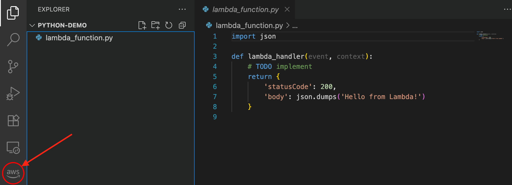
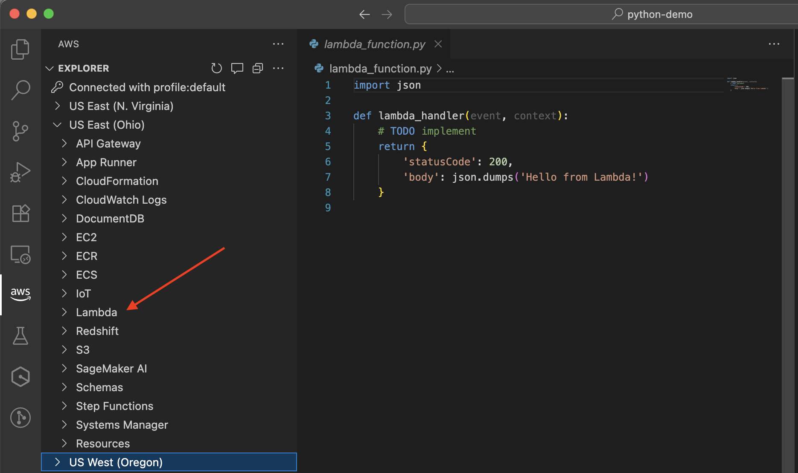
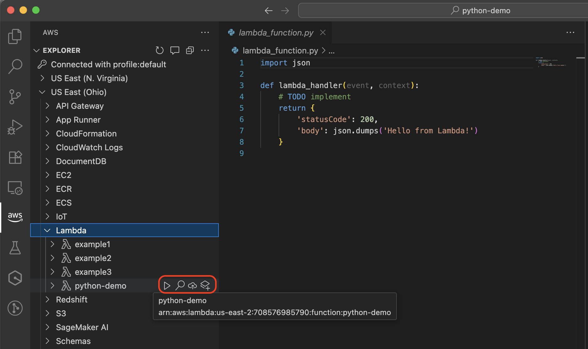

# Developing Lambda functions locally

You can move your Lambda functions from the Lambda console to your preferred integrated development environment (IDE), which provides a full development environment where you can use other local development
options like AWS SAM and AWS CDK. The Lambda console supports opening functions directly in Visual Studio Code, Kiro, or Cursor.

## Key benefits of local development

While the Lambda console provides a quick way to edit and test functions, local development offers more advanced capabilities:

- **Advanced IDE features**: Debugging, code completion, and refactoring tools
- **Offline development**: Work and test changes locally before cloud deployment
- **Infrastructure as code integration**: Seamless use with AWS SAM, AWS CDK, and Infrastructure Composer
- **Dependency management**: Full control over function dependencies

## Prerequisites

Before developing Lambda functions locally using Visual Studio Code, Kiro, and Cursor, you must install them using the instructions below:

- **Visual Studio Code**: For installation instructions, see [Download Visual Studio Code](https://code.visualstudio.com/download "https://code.visualstudio.com/download").
- **Kiro**: For installation instructions, see [Getting started with Kiro](https://kiro.dev/docs/getting-started/installation/ "https://kiro.dev/docs/getting-started/installation/").
- **Cursor**: For installation instructions, see [Download Cursor](https://cursor.com/download "https://cursor.com/download").

You also need the following:

- **AWS Toolkit for Visual Studio Code**: For Visual Studio Code installation instructions, see [Setting up the AWS Toolkit for Visual Studio Code](../../../toolkit-for-vscode/latest/userguide/setup-toolkit.md "../../../toolkit-for-vscode/latest/userguide/setup-toolkit.md"). For an overview, see
  [AWS Toolkit for Visual Studio Code](https://aws.amazon.com/visualstudiocode/ "https://aws.amazon.com/visualstudiocode/").
- **AWS credentials**: For information about configuring credentials, see [Setting up your AWS credentials](../../../toolkit-for-vscode/latest/userguide/setup-credentials.md "../../../toolkit-for-vscode/latest/userguide/setup-credentials.md").
- **AWS SAM CLI**: For installation instructions, see [Installing the AWS SAM CLI](../../../serverless-application-model/latest/developerguide/serverless-sam-cli-install.md "../../../serverless-application-model/latest/developerguide/serverless-sam-cli-install.md").
- **Docker installed (optional, but required for local testing)**: For installation instructions, see [Get Docker](https://docs.docker.com/get-docker/ "https://docs.docker.com/get-docker/").

###### Note

If you already have an AWS account and profile configured locally, ensure that the AdministratorAccess managed policy is added to your configured AWS profile.

## Authentication and access control

To develop Lambda functions locally, you need AWS credentials to securely access and manage AWS resources on your behalf, just like they would in the cloud.

The AWS Toolkit for Visual Studio Code supports the following authentication methods:

- IAM user long-term credentials
- Temporary credentials from assumed roles
- Identity federation
- AWS account root user credentials (not recommended)

This section guides you through obtaining and configuring these credentials using IAM user long-term credentials.

### Get IAM Credentials

If you already have an IAM user with access keys, have both the access key ID and secret access key ready for the next section. If you don't have these keys, follow these steps to create them:

###### Note

You must use both the access key ID and secret access key together to authenticate your requests.

To create an IAM user and access keys:

1. Open the IAM console at [https://console.aws.amazon.com/iam/](https://console.aws.amazon.com/iam/ "https://console.aws.amazon.com/iam/")
2. In the navigation pane, choose **Users**.
3. Choose **Create user**.
4. For **User name**, enter a name and choose **Next**.
5. Under **Set permissions**, choose **Attach policies directly**.
6. Select **AdministratorAccess** and choose **Next**.
7. Choose **Create user**.
8. In the success banner, choose **View user**.
9. Choose **Create access key**.
10. For **Use case**, select **Local code**.
11. Select the confirmation check box and choose **Next**.
12. (Optional) Enter a description tag value.
13. Choose **Create access key**.
14. Copy your access key and secret access key immediately. **You won't be able to access the secret access key again after you leave this page.**

###### Important

Never share your secret key or commit it to source control. Store these keys securely and delete them when no longer needed.

###### Note

For more information, see [Create an IAM user in your AWS account](../../../IAM/latest/UserGuide/id_users_create.md "../../../IAM/latest/UserGuide/id_users_create.md") and [Manage access keys for IAM users](../../../IAM/latest/UserGuide/id_credentials_access-keys.md "../../../IAM/latest/UserGuide/id_credentials_access-keys.md") in the _IAM User Guide_.

### Configure AWS credentials using the AWS Toolkit

The following table summarizes the credential setup process you complete in the following procedure.

| What to do                                               | Why?                                         |
| -------------------------------------------------------- | -------------------------------------------- |
| Open Sign In panel                                       | Start authentication                         |
| Use Command Palette, search for AWS Add a New Connection | Access the sign-in UI                        |
| Choose IAM Credential                                    | Use your access keys for programmatic access |
| Enter profile name, access key, secret key               | Provide credentials for connection           |
| See AWS Explorer update                                  | Confirm you're connected                     |

Complete the following steps to authenticate to your AWS account:

###### Note

The following steps apply to Visual Studio Code, Kiro, and Cursor. Because Kiro and Cursor are built on Visual Studio Code, the authentication flow is the same across all three IDEs.

1. Open the Sign In panel in your IDE:

To start the authentication process, select the AWS icon in the left navigation pane or open the Command Palette (Cmd+Shift+P on Mac or Ctrl+Shift+P on Windows/Linux) and search for and select **AWS Add a New Connection**. 2. In the sign in panel, choose **IAM Credentials** and select **Continue**.

###### Note

To proceed, you need to allow AWS IDE Extensions to access your data. 3. Enter your profile name, access key ID, and secret access key, then select **Continue**. 4. Verify the connection by checking the AWS Explorer in your IDE for your AWS services and resources.

For information on setting up authentication with long-term credentials, see [Using long-term credentials to authenticate AWS SDKs and tools](../../../sdkref/latest/guide/access-iam-users.md "../../../sdkref/latest/guide/access-iam-users.md").

For information about configuring authentication, see [AWS IAM credentials](../../../toolkit-for-vscode/latest/userguide/iam-credentials.md "../../../toolkit-for-vscode/latest/userguide/iam-credentials.md") in the AWS Toolkit for Visual Studio Code User Guide.

## Moving from console to local development

###### Note

If you've made changes in the console, make sure you don't have any undeployed changes before transitioning to local development.

To move a Lambda function from the Lambda console to a local IDE, complete the following steps:

1. Open the [Lambda console](https://console.aws.amazon.com/lambda "https://console.aws.amazon.com/lambda").
2. Choose the name of your function.
3. Select the **Code source** tab.
4. Open your function in your IDE of choice by choosing the dropdown arrow next to the button. The supported options are **Open in Visual Studio Code**, **Open in Kiro**, and **Open in Cursor**.

###### Note

Your IDE selection is persisted. Once you choose an IDE, subsequent visits show that IDE as the primary button. 5. When prompted, allow your browser to open the selected IDE.

When you open your function in your IDE, Lambda creates a local project with your function code in a temporary location that's designed for quick testing and deployment.
This includes the function code, dependencies, and a basic project structure that you can use for local development.

###### Note

The Open in IDE button requires AWS Toolkit version **3.69.0** or later. If you have an earlier
version of the AWS Toolkit installed, you may see a `Cannot open the handler` message. To resolve this, update your AWS Toolkit to the latest version.

For details on using AWS in your IDE, see the _[AWS Toolkit for Visual Studio Code User Guide](../../../toolkit-for-vscode/latest/userguide/welcome.md "../../../toolkit-for-vscode/latest/userguide/welcome.md")_.

## Working with functions locally

After opening your function in your preferred IDE, follow these steps to access and manage your functions. For the example below we have used Visual Studio Code.

1. Select the AWS icon in the sidebar to open the AWS Explorer:

 2. In the AWS Explorer, select the region with your Lambda function:

 3. Under your selected region, expand the Lambda section to view and manage your functions:

With your function opened in your IDE, you can:

- Edit function code with full language support and code completion.
- Use the [LocalStack integration](../../../toolkit-for-vscode/latest/userguide/lambda-localstack.md "../../../toolkit-for-vscode/latest/userguide/lambda-localstack.md") to test Lambda functions that make API calls to other AWS services during execution, such as reading from DynamoDB tables or writing to Amazon S3 buckets. LocalStack is a cloud service emulator that provides a complete local development environment for testing service integrations. You can also [use AWS SAM CLI to test your function in a local container](../../../serverless-application-model/latest/developerguide/serverless-sam-cli-using-invoke.md "../../../serverless-application-model/latest/developerguide/serverless-sam-cli-using-invoke.md"). If your function makes API calls to other AWS services, those calls will reach real AWS resources, not emulated ones.
- Debug your function with breakpoints and variable inspection. For more information, see [Running and debugging Lambda functions directly from code](../../../toolkit-for-vscode/latest/userguide/debug-direct.md "../../../toolkit-for-vscode/latest/userguide/debug-direct.md") in the _AWS Toolkit for Visual Studio Code User Guide_.
- Deploy your updated function back to AWS using the cloud icon.
- Install and manage dependencies for your function.

## Convert your function to an AWS SAM template and use IaC tools

In all supported IDEs (Visual Studio Code, Kiro, and Cursor), you can convert your Lambda function to an AWS SAM template by choosing the **Convert to AWS SAM Application** icon next to your Lambda function.
You are prompted to select an AWS SAM project location. Once selected, your Lambda function is converted to a `template.yaml` file that is saved in your new AWS SAM project.

With your function converted to an AWS SAM template, you can:

- Control the versioning of your infrastructure
- Automate deployments
- Remotely debug functions
- Add additional AWS resources to your application
- Maintain consistent environments across your development lifecycle
- Use Infrastructure Composer to visually edit your AWS SAM template

For more information on using IaC tools, refer to the following guides:

- [The AWS Serverless Application Model Developer Guide](../../../serverless-application-model/latest/developerguide/what-is-sam.md "../../../serverless-application-model/latest/developerguide/what-is-sam.md")
- [The AWS Cloud Development Kit (AWS CDK) Developer Guide](../../../cdk/v2/guide/home.md "../../../cdk/v2/guide/home.md")
- [The Infrastructure Composer Developer Guide](../../../application-composer/latest/dg/what-is-composer.md "../../../application-composer/latest/dg/what-is-composer.md")
- [The AWS CloudFormation User Guide](../../../AWSCloudFormation/latest/UserGuide/Welcome.md "../../../AWSCloudFormation/latest/UserGuide/Welcome.md")

These tools provide additional capabilities for defining, testing, and deploying your serverless applications.

## Next steps

To learn more about working with Lambda functions in Visual Studio Code, see the following resources:

- [Working with AWS Lambda functions](../../../toolkit-for-vscode/latest/userguide/building-lambda.md "../../../toolkit-for-vscode/latest/userguide/building-lambda.md") in the AWS Toolkit for Visual Studio Code User Guide
- [Working with serverless applications](../../../toolkit-for-vscode/latest/userguide/serverless-apps.md "../../../toolkit-for-vscode/latest/userguide/serverless-apps.md") in the AWS Toolkit for Visual Studio Code User Guide
- [Infrastructure as code](foundation-iac.md "foundation-iac.md") in the Lambda Developer Guide
