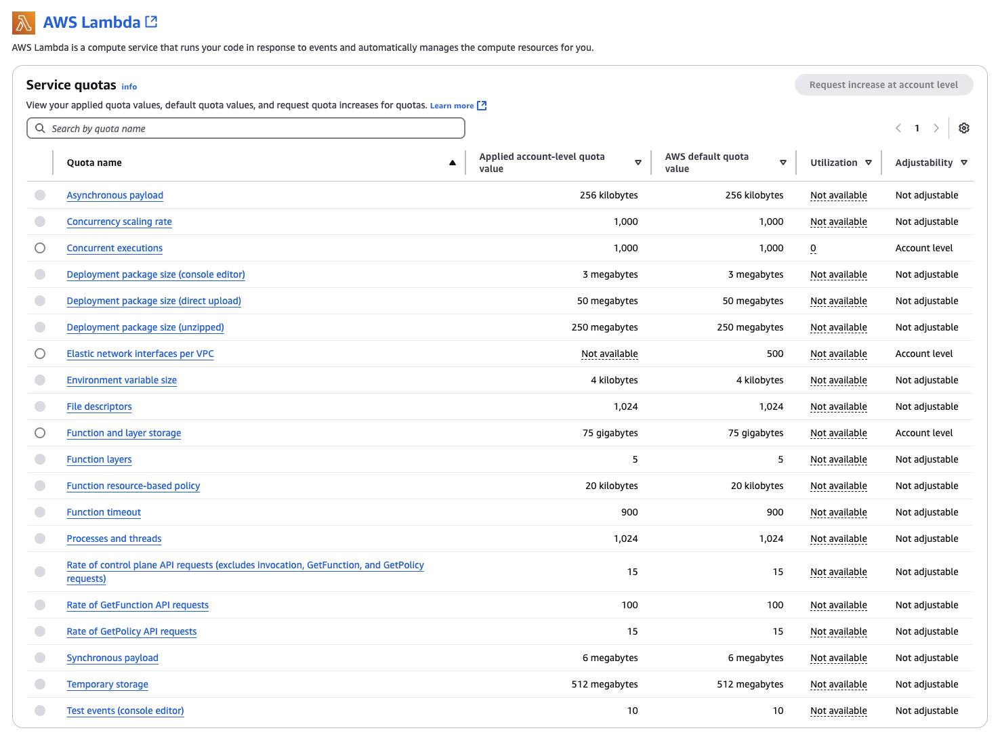

# Lambda quotas

###### Important

New AWS accounts have reduced concurrency and memory quotas. AWS raises these quotas automatically based on your usage.

AWS Lambda is designed to scale rapidly to meet demand, allowing your functions to scale up to serve traffic
in your application. Lambda is designed for short-lived compute tasks that do not retain or rely upon state between
invocations. Code can run for up to 15 minutes in a single invocation and a single function can use up to
10,240 MB of memory.

It’s important to understand the guardrails that are put in place to protect your account and the workloads of
other customers. Service quotas exist in all AWS services and consist of hard limits, which you cannot change,
and soft limits, which you can request increases for. By default, all new accounts are assigned a quota profile
that allows exploration of AWS services.

To see the quotas that apply to your account, navigate to the
[Service Quotas dashboard](https://console.aws.amazon.com/servicequotas/home "https://console.aws.amazon.com/servicequotas/home"). Here, you can view
your service quotas, request a quota increase, and view current utilization. From here, you can drill down to a
specific AWS service, such as Lambda:

The following sections list default quotas and limits in Lambda by category.

###### Topics

- [Compute and storage](#compute-and-storage "#compute-and-storage")
- [Function configuration, deployment, and
  execution](#function-configuration-deployment-and-execution "#function-configuration-deployment-and-execution")
- [Lambda API requests](#api-requests "#api-requests")
- [Other services](#quotas-other-services "#quotas-other-services")

## Compute and storage

Lambda sets quotas for the amount of compute and storage resources that you can use to run and store functions.
Quotas for concurrent executions and storage apply per AWS Region. Elastic network interface (ENI) quotas apply
per virtual private cloud (VPC), regardless of Region. The following quotas can be increased from their default
values. For more information, see [Requesting a quota increase](../../../servicequotas/latest/userguide/request-quota-increase.md "../../../servicequotas/latest/userguide/request-quota-increase.md") in the
_Service Quotas User Guide_.

| Resource                                                                                                                                                                                                                                                                                                                                                                                                                                      | Default quota                                                                                                                                      | Can be increased up to |
| --------------------------------------------------------------------------------------------------------------------------------------------------------------------------------------------------------------------------------------------------------------------------------------------------------------------------------------------------------------------------------------------------------------------------------------------- | -------------------------------------------------------------------------------------------------------------------------------------------------- | ---------------------- |
| Concurrent executions                                                                                                                                                                                                                                                                                                                                                                                                                         | 1,000                                                                                                                                              | Tens of thousands      |
| Storage for uploaded functions (.zip file archives) and layers. Each function version and layer version consumes storage. For best practices on managing your code storage, see [Monitoring Lambda code storage](https://serverlessland.com/content/service/lambda/guides/aws-lambda-operator-guide/code-storage "https://serverlessland.com/content/service/lambda/guides/aws-lambda-operator-guide/code-storage") in Serverless Land. | 75 GB                                                                                                                                              | Terabytes              |
| Storage for functions defined as container images. These images are stored in Amazon ECR.                                                                                                                                                                                                                                                                                                                                                     | See [Amazon ECR service quotas](../../../AmazonECR/latest/userguide/service-quotas.md "../../../AmazonECR/latest/userguide/service-quotas.md"). |                        |
| [Elastic network interfaces per virtual private cloud (VPC)](configuration-vpc.md "configuration-vpc.md") NoteThis quota is shared with other services, such as Amazon Elastic File System (Amazon EFS). See [Amazon VPC quotas](../../../vpc/latest/userguide/amazon-vpc-limits.md "../../../vpc/latest/userguide/amazon-vpc-limits.md").                                                                                              | 500                                                                                                                                                | Thousands              |

For details on concurrency and how Lambda scales your function concurrency in response to traffic, see [Understanding Lambda function scaling](lambda-concurrency.md "lambda-concurrency.md").

## Function configuration, deployment, and

execution

The following quotas apply to function configuration, deployment, and execution. Except as noted, they can't be changed.

###### Note

The Lambda documentation, log messages, and console use the abbreviation MB (rather than MiB) to refer to
1,024 KB.

| Resource                                                                                                      | Quota                                                                                                                                                                                                                                                                                                                                                                                  |
| ------------------------------------------------------------------------------------------------------------- | -------------------------------------------------------------------------------------------------------------------------------------------------------------------------------------------------------------------------------------------------------------------------------------------------------------------------------------------------------------------------------------- |
| Function [memory allocation](configuration-memory.md "configuration-memory.md")                               | 128 MB to 10,240 MB, in 1-MB increments. **Note:\* • Lambda allocates CPU power in proportion to the amount of memory configured. You can increase or decrease the memory and CPU power allocated to your function using the **Memory (MB)\* • setting. At 1,769 MB, a function has the equivalent of one vCPU.                                                               |
| Function timeout                                                                                              | 900 seconds (15 minutes)                                                                                                                                                                                                                                                                                                                                                               |
| Function [environment variables](configuration-envvars.md "configuration-envvars.md")                         | 4 KB, for all environment variables associated with the function, in aggregate                                                                                                                                                                                                                                                                                                         |
| Function [resource-based policy](access-control-resource-based.md "access-control-resource-based.md")         | 20 KB                                                                                                                                                                                                                                                                                                                                                                                  |
| Function [layers](chapter-layers.md "chapter-layers.md")                                                      | 5 layers                                                                                                                                                                                                                                                                                                                                                                               |
| Function [concurrency scaling limit](scaling-behavior.md "scaling-behavior.md")                               | For each function, 1,000 execution environments every 10 seconds                                                                                                                                                                                                                                                                                                                       |
| [Invocation payload](lambda-invocation.md "lambda-invocation.md") (request and response)                      | 6 MB each for request and response (synchronous) 200 MB for each [streamed response](configuration-response-streaming.md "configuration-response-streaming.md") (synchronous) 1 MB (asynchronous) 1 MB for the total combined size of request line and header values                                                                                                          |
| Bandwidth for [streamed responses](configuration-response-streaming.md "configuration-response-streaming.md") | Uncapped for the first 6 MB of your function's response For responses larger than 6 MB, 2MBps for the remainder of the response                                                                                                                                                                                                                                                     |
| [Deployment package (.zip file archive)](configuration-function-zip.md "configuration-function-zip.md") size  | 50 MB (zipped, when uploaded through the Lambda API or SDKs). Upload larger files with Amazon S3. 50 MB (when uploaded through the Lambda console) 250 MB The maximum size of the contents of a deployment package, including layers and custom runtimes. (unzipped)                                                                                                             |
| Container image settings size                                                                                 | 16 KB                                                                                                                                                                                                                                                                                                                                                                                  |
| [Container image](images-create.md "images-create.md") code package size                                      | 10 GB (maximum uncompressed image size, including all layers)                                                                                                                                                                                                                                                                                                                          |
| Test events (console editor)                                                                                  | 10                                                                                                                                                                                                                                                                                                                                                                                     |
| `/tmp` directory storage                                                                                      | Between 512 MB and 10,240 MB, in 1-MB increments                                                                                                                                                                                                                                                                                                                                       |
| File descriptors                                                                                              | 1,024 NoteLambda Managed Instances use the default file descriptor limits from [Bottlerocket](https://aws.amazon.com/bottlerocket/ "https://aws.amazon.com/bottlerocket/"). For more information, see [Understanding the Lambda Managed Instances execution environment](lambda-managed-instances-execution-environment.md "lambda-managed-instances-execution-environment.md").    |
| Execution processes/threads                                                                                   | 1,024 NoteLambda Managed Instances use the default process and thread limits from [Bottlerocket](https://aws.amazon.com/bottlerocket/ "https://aws.amazon.com/bottlerocket/"). For more information, see [Understanding the Lambda Managed Instances execution environment](lambda-managed-instances-execution-environment.md "lambda-managed-instances-execution-environment.md"). |

## Lambda API requests

The following quotas are associated with Lambda API requests.

| Resource                                                                                                  | Quota                                                                                                                                                                                                                                                                                        |
| --------------------------------------------------------------------------------------------------------- | -------------------------------------------------------------------------------------------------------------------------------------------------------------------------------------------------------------------------------------------------------------------------------------------- |
| Invocation requests per function per Region (synchronous)                                                 | Each instance of your execution environment can serve up to 10 requests per second. In other words, the total invocation limit is 10 times your concurrency limit. See [Understanding Lambda function scaling](lambda-concurrency.md "lambda-concurrency.md").                         |
| Invocation requests per function per Region (asynchronous)                                                | Each instance of your execution environment can serve an unlimited number of requests. In other words, the total invocation limit is based only on concurrency available to your function. See [Understanding Lambda function scaling](lambda-concurrency.md "lambda-concurrency.md"). |
| Invocation requests per function version or alias (requests per second)                                   | 10 x allocated [provisioned concurrency](configuration-concurrency.md "configuration-concurrency.md") NoteThis quota applies only to functions that use provisioned concurrency.                                                                                                          |
| [GetFunction](../api/API_GetFunction.md "../api/API_GetFunction.md") API requests                         | 100 requests per second. Cannot be increased.                                                                                                                                                                                                                                                |
| [GetPolicy](../api/API_GetPolicy.md "../api/API_GetPolicy.md") API requests                               | 15 requests per second. Cannot be increased.                                                                                                                                                                                                                                                 |
| Remainder of the control plane API requests (excludes invocation, GetFunction, and GetPolicy requests) | 15 requests per second across all APIs (not 15 requests per second per API). Cannot be increased.                                                                                                                                                                                            |

## Other services

Quotas for other services, such as AWS Identity and Access Management (IAM), Amazon CloudFront (Lambda@Edge), and Amazon Virtual Private Cloud (Amazon VPC), can
impact your Lambda functions. For more information, see [AWS service quotas](../../../general/latest/gr/aws_service_limits.md "../../../general/latest/gr/aws_service_limits.md") in the
_Amazon Web Services General Reference_, and [Invoking Lambda with events from other AWS services](lambda-services.md "lambda-services.md").

Many applications involving Lambda use multiple AWS services. Because different services
have different quotas for various features, it can be challenging to manage these quotas across
your entire application. For example, API Gateway has a default throttle limit of 10,000 requests per
second, whereas Lambda has a default concurrency limit of 1,000. Due to this mismatch, it's possible
to have more incoming requests from API Gateway that Lambda can handle. You can resolve this by requesting
a Lambda concurrency limit increase to match the expected level of traffic.

Load testing your application allows you to monitor the performance of your application end-to-end
before deploying to production. During a load test, you can identify any quotas that may act as a
limiting factor for the traffic levels you expect and take action accordingly.
