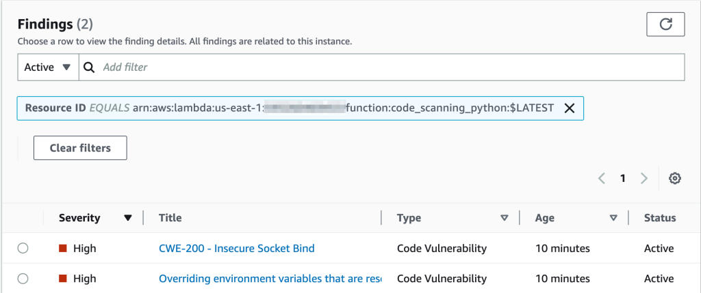
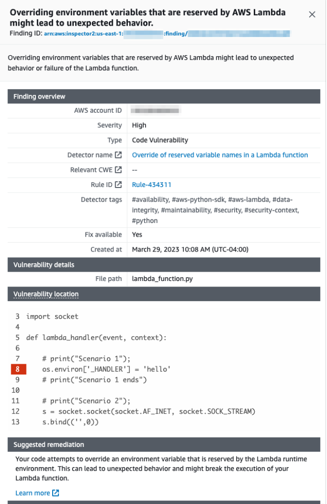

# Automate security assessments for Lambda with Amazon Inspector

[Amazon Inspector](https://aws.amazon.com/inspector/ "https://aws.amazon.com/inspector/") is a vulnerability
management service that continually scans workloads for known software vulnerabilities and
unintended network exposure. Amazon Inspector creates a finding that describes the vulnerability,
identifies the affected resource, rates the severity of the vulnerability, and provides
remediation guidance.

Amazon Inspector support provides continuous, automated security
vulnerability assessments for Lambda functions and layers. Amazon Inspector provides two scan
types for Lambda:

- **Lambda standard scanning (default):** Scans application dependencies within a Lambda function
  and its layers
  for [package
  vulnerabilities](../../../inspector/latest/user/findings-types.md#findings-types-package "../../../inspector/latest/user/findings-types.md#findings-types-package").
- **Lambda code scanning**: Scans the custom application code in your functions and layers
  for [code
  vulnerabilities](../../../inspector/latest/user/findings-types.md#findings-types-code "../../../inspector/latest/user/findings-types.md#findings-types-code"). You can either activate Lambda standard scanning or activate Lambda
  standard scanning together with Lambda code scanning.
  To enable Amazon Inspector, navigate to the [Amazon Inspector console](https://console.aws.amazon.com/inspector/ "https://console.aws.amazon.com/inspector/"), expand the **Settings**
  section, and choose **Account Management**. On the **Accounts** tab, choose **Activate**, and then select one
  of the scan options.

You can enable Amazon Inspector for multiple accounts and delegate permissions to manage Amazon
Inspector for the organization to specific accounts while setting up Amazon Inspector. While
enabling, you need to grant Amazon Inspector permissions by creating the
role: `AWSServiceRoleForAmazonInspector2`. The Amazon Inspector console allows you to create this role using a one-click option.

For Lambda standard scanning, Amazon Inspector initiates vulnerability scans of Lambda functions
in the following situations:

- As soon as Amazon Inspector discovers an existing Lambda function.
- When you deploy a new Lambda function.
- When you deploy an update to the application code or dependencies of an existing Lambda
  function or its layers.
- Whenever Amazon Inspector adds a new common vulnerabilities and exposures (CVE) item to its
  database, and that CVE is relevant to your function.
  For Lambda code scanning, Amazon Inspector evaluates your Lambda function application code using
  automated reasoning and machine learning that analyzes your application code for overall
  security compliance. If Amazon Inspector detects a vulnerability in your Lambda function
  application code, Amazon Inspector produces a detailed **Code Vulnerability** finding. For a list
  of possible detections, see the
  [Amazon CodeGuru Detector
  Library](../../../codeguru/detector-library.md "../../../codeguru/detector-library.md").

To view the findings, go to the [Amazon Inspector console](https://console.aws.amazon.com/inspector/ "https://console.aws.amazon.com/inspector/"). On the **Findings** menu, choose **By Lambda function** to display the security scan results that were performed on Lambda functions.

To exclude a Lambda function from standard scanning, tag the function with the following
key-value pair:

- `Key:InspectorExclusion`
- `Value:LambdaStandardScanning`
  To exclude a Lambda function from code scans, tag the function with the
  following key-value pair:

- `Key:InspectorCodeExclusion`
- `Value:``LambdaCodeScanning`
  For example, as shown in following image, Amazon Inspector automatically detects vulnerabilities
  and categorizes the findings of type **Code Vulnerability**, which indicates that the vulnerability is
  in the code of the function, and not in one of the code-dependent libraries. You can check these
  details for a specific function or multiple functions at once.

You can dive further into each of these findings and learn how to remediate the issue.

While working with your Lambda functions, ensure that you comply with the naming conventions for
your Lambda functions. For more information, see [Working with Lambda environment variables](configuration-envvars.md "configuration-envvars.md").

You are responsible for the remediation suggestions that you accept. Always review remediation
suggestions before accepting them. You might need to make edits to remediation suggestions to ensure
that your code does what you intended.
