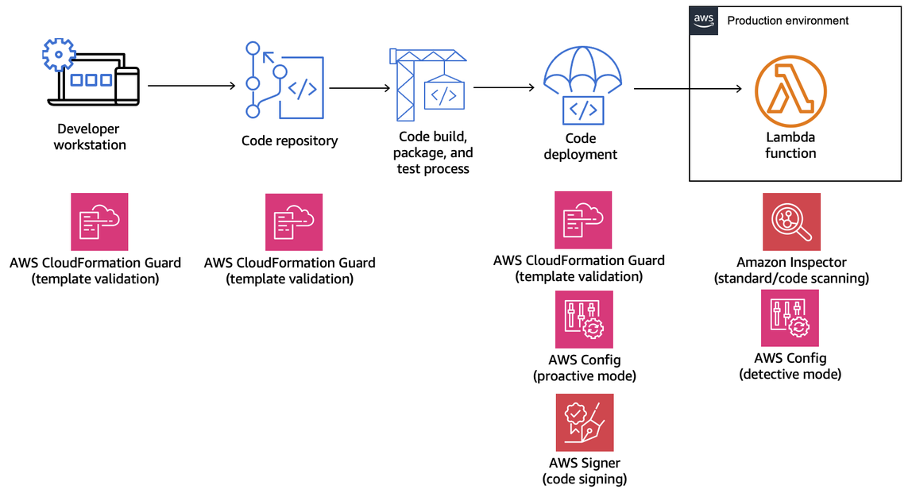

# Create a governance strategy for Lambda functions and layers

To build and deploy serverless, cloud-native applications, you must allow for agility and speed to market with appropriate governance and guardrails. You set
business-level priorities, maybe emphasizing agility as the top priority, or
alternatively emphasizing risk aversion via governance, guardrails, and controls. Realistically, you won't have an "either/or" strategy but an "and" strategy that balances both agility and guardrails in your software development lifecycle. No matter
where these requirements fall in your company's lifecycle, governance capabilities are likely to become an
implementation requirement in your processes and toolchains.

Here are a few examples of governance controls that an organization might implement for Lambda:

- Lambda functions must not be publicly accessible.
- Lambda functions must be attached to a VPC.
- Lambda functions should not use deprecated runtimes.
- Lambda functions must be tagged with a set of required tags.
- Lambda layers must not be accessible outside of the organization.
- Lambda functions with an attached security group must have matching tags between the function
  and security group.
- Lambda functions with an attached layer must use an approved version
- Lambda environment variables must be encrypted at rest with a customer managed key.
  The following diagram is an example of an in-depth governance strategy that implements controls and policy throughout the software development and deployment process:

The following topics explain how to implement controls for developing and deploying
Lambda functions in your organization, both for the startup and the enterprise. Your
organization might already have tools in place. The following topics take a modular approach to
these controls, so that you can pick and choose the components you actually need.

###### Topics

- [Proactive controls for Lambda with AWS CloudFormation Guard](governance-cloudformation-guard.md "governance-cloudformation-guard.md")
- [Implement preventative controls for Lambda with AWS Config](governance-config.md "governance-config.md")
- [Detect non-compliant Lambda deployments and configurations with AWS Config](governance-config-detection.md "governance-config-detection.md")
- [Lambda code signing with AWS Signer](governance-code-signing.md "governance-code-signing.md")
- [Automate security assessments for Lambda with Amazon Inspector](governance-code-scanning.md "governance-code-scanning.md")
- [Implement observability for Lambda security and compliance](governance-observability.md "governance-observability.md")
