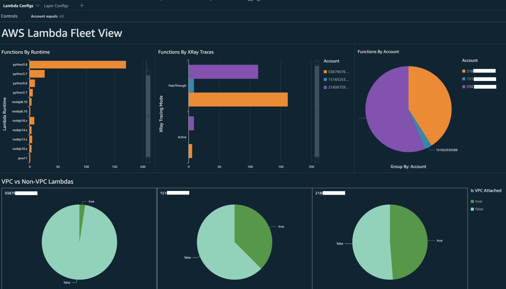
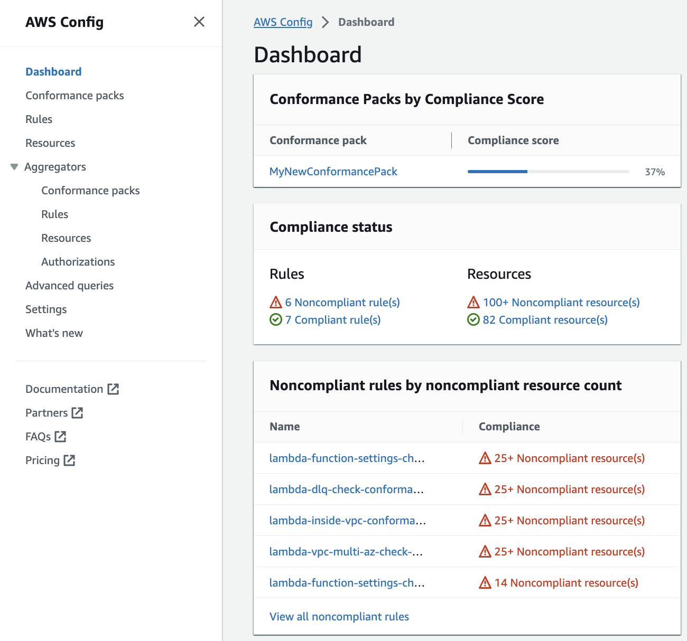
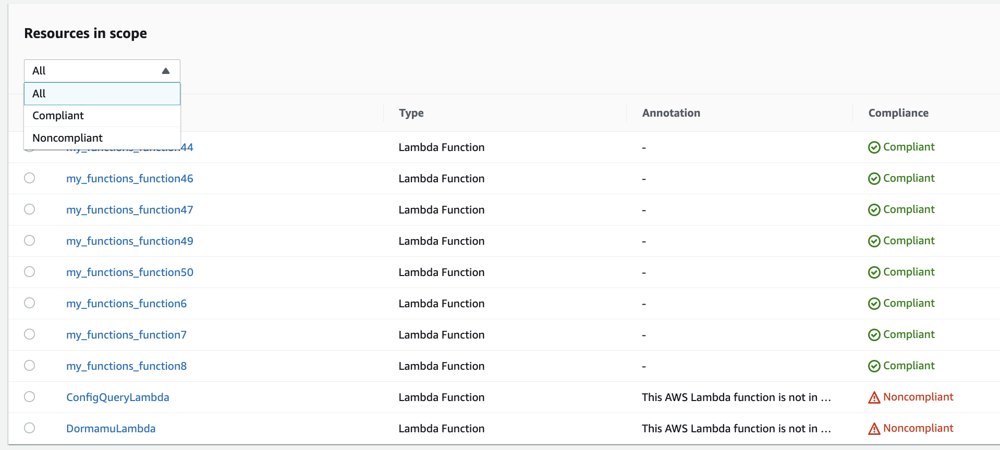
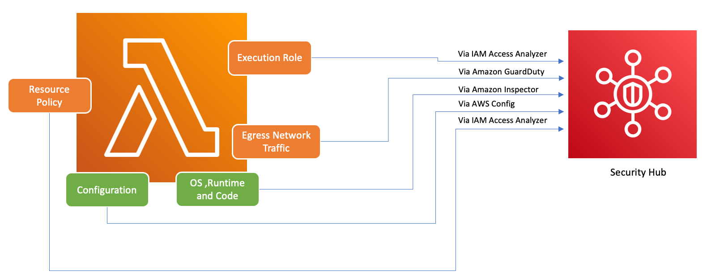
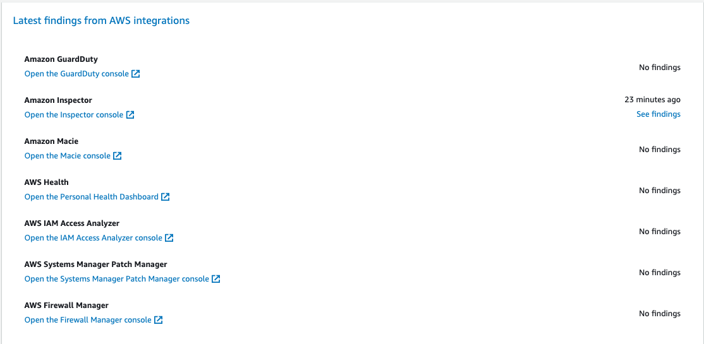
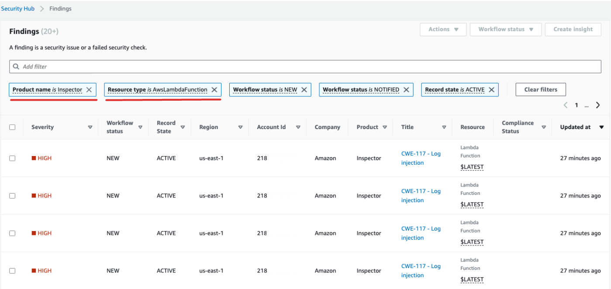

# Implement observability for Lambda security and compliance

AWS Config is a useful tool to find and fix non-compliant AWS Serverless
resources. Every change you make to your serverless resources is recorded in AWS Config.
Additionally, AWS Config allows you to store configuration snapshot data on S3. You can use Amazon Athena and Amazon Quick Suite to make dashboards and see AWS Config data. In [Detect non-compliant Lambda deployments and configurations with AWS Config](governance-config-detection.md "governance-config-detection.md"), we discussed how we can visualize a certain configuration like Lambda layers.
This topic expands on these concepts.

## Visibility into Lambda configurations

You can use queries to pull important configurations like AWS account ID, Region, AWS X-Ray tracing configuration, VPC
configuration, memory size, runtime, and tags. Here is a sample query you can use to pull this information
from Athena:

```
WITH unnested AS (
    SELECT
      item.awsaccountid AS account_id,
      item.awsregion AS region,
      item.configuration AS lambda_configuration,
      item.resourceid AS resourceid,
      item.resourcename AS resourcename,
      item.configuration AS configuration,
      json_parse(item.configuration) AS lambda_json
    FROM
      default.aws_config_configuration_snapshot,
      UNNEST(configurationitems) as t(item)
    WHERE
      "dt" = 'latest'
      AND item.resourcetype = 'AWS::Lambda::Function'
  )

  SELECT DISTINCT
    account_id,
    tags,
    region as Region,
    resourcename as FunctionName,
    json_extract_scalar(lambda_json, '$.memorySize') AS memory_size,
    json_extract_scalar(lambda_json, '$.timeout') AS timeout,
    json_extract_scalar(lambda_json, '$.runtime') AS version
    json_extract_scalar(lambda_json, '$.vpcConfig.SubnetIds') AS vpcConfig
    json_extract_scalar(lambda_json, '$.tracingConfig.mode') AS tracingConfig
  FROM
    unnested
```

You can use the query to build an Quick Suite dashboard and visualize the data. To aggregate AWS
resource configuration data, create tables in Athena, and build Quick Suite dashboards on the data
from Athena, see
[Visualizing AWS Config data using Athena and Amazon Quick Suite](https://aws.amazon.com/blogs/mt/visualizing-aws-config-data-using-amazon-athena-and-amazon-quicksight/ "https://aws.amazon.com/blogs/mt/visualizing-aws-config-data-using-amazon-athena-and-amazon-quicksight/") on the AWS Cloud Operations and Management blog. Notably, this query also retrieves tag information for the functions. This allows for deeper insights into your workloads and environments,
especially if you employ custom tags.



For more information on actions that you can take, see the [Addressing the observability findings](#governance-observability-addressing "#governance-observability-addressing") section later in this topic.

## Visibility into Lambda compliance

With the data generated by AWS Config, you can create organization-level dashboards to
monitor compliance. This allows for consistent tracking and
monitoring of:

- Compliance packs by compliance score
- Rules by non-compliant resources
- Compliance status



Check each rule to identify non-compliant resources for that rule. For
example, if your organization mandates that all Lambda functions must be associated with a VPC and
if you have deployed an AWS Config rule to identify compliance, you can select the `lambda-inside-vpc` rule in the list above.



For more information on actions that you can take, see the [Addressing the observability findings](#governance-observability-addressing "#governance-observability-addressing") section below.

## Visibility into Lambda function boundaries

using Security Hub CSPM



To ensure that AWS services including Lambda are used securely, AWS introduced the
Foundational Security Best Practices v1.0.0. This set of best practices provides clear guidelines
for securing resources and data in the AWS environment, emphasizing the importance of maintaining
a strong security posture. The AWS Security Hub CSPM complements this by offering a unified security
and compliance center. It aggregates, organizes, and prioritizes security findings from multiple
AWS services like Amazon Inspector, AWS Identity and Access Management Access Analyzer, and Amazon GuardDuty.

If you have Security Hub CSPM, Amazon Inspector, IAM Access Analyzer, and GuardDuty enabled
within your AWS organization, Security Hub CSPM automatically aggregates findings from these services.
For instance, let's consider Amazon Inspector. Using Security Hub CSPM, you can efficiently identify
code and package vulnerabilities in Lambda functions. In the Security Hub CSPM console, navigate to the
bottom section labeled **Latest findings from AWS integrations**. Here, you can view and
analyze findings sourced from various integrated AWS services.



To see details, choose the **See findings** link in the second
column. This displays a list of findings filtered by product, such as Amazon Inspector. To limit your search to Lambda functions, set `ResourceType` to `AwsLambdaFunction`. This displays findings from Amazon Inspector related to Lambda functions.



For GuardDuty, you can identify suspicious network traffic patterns. Such anomalies might suggest the existence of potentially malicious code
within your Lambda function.

With IAM Access Analyzer, you can check policies, especially those with condition statements that grant function access to external entities.
Moreover, IAM Access Analyzer evaluates permissions set when using the [AddPermission](../api/API_AddPermission.md "../api/API_AddPermission.md") operation in the Lambda API alongside an
`EventSourceToken`.

## Addressing the observability findings

Given the wide-ranging configurations possible for Lambda functions and their distinct
requirements, a standardized automation solution for remediation might not suit every situation.
Additionally, changes are implemented differently across various environments. If you encounter
any configuration that seems non-compliant, consider the following guidelines:

1. **Tagging strategy**

We recommend implementing a comprehensive tagging strategy. Each Lambda
function should be tagged with key information such as:

    * **Owner:** The person or team responsible for the function.
    * **Environment:** Production, staging, development, or sandbox.
    * **Application:** The broader context to which this function belongs, if applicable.

2. **Owner outreach**

Instead of automating the breaking changes (like VPC configuration adjustment),
proactively contact the owners of non-compliant functions (identified by the owner tag)
providing them sufficient time to either:

    * Adjust non-compliant configurations on Lambda functions.
    * Provide an explanation and request an exception, or refine the compliance standards.

3. **Maintain a configuration management database (CMDB)**

While tags can provide immediate context,
maintaining a centralized CMDB can provide deeper insights. It can hold more granular information
about each Lambda function, its dependencies, and other critical metadata. A CMDB is an invaluable
resource for auditing, compliance checks, and identifying function owners.

As the landscape of serverless infrastructure continually evolves, it's essential to adopt a
proactive stance towards monitoring. With tools like AWS Config, Security Hub CSPM, and Amazon Inspector, potential anomalies or non-compliant configurations can be swiftly identified. However,
tools alone cannot ensure total compliance or optimal configurations. It's crucial to pair these
tools with well-documented processes and best practices.

- **Feedback loop:** Once remediation steps are undertaken, ensure there's a feedback loop. This
  means periodically revisiting non-compliant resources to confirm if they've been updated or
  are still running with the same issues.
- **Documentation:** Always document the observations, actions taken, and any exceptions granted.
  Proper documentation not only helps during audits but also aids in enhancing the process for
  better compliance and security in the future.
- **Training and awareness:** Ensure that all stakeholders, especially Lambda function owners, are
  regularly trained and made aware of best practices, organizational policies, and compliance
  mandates. Regular workshops, webinars, or training sessions can go a long way in ensuring
  everyone is on the same page when it comes to security and compliance.

In conclusion, while tools and technologies provide robust capabilities to detect and flag
potential issues, the human element—understanding, communication, training, and documentation—
remains pivotal. Together, they form a potent combination to ensure that your Lambda functions
and broader infrastructure remain compliant, secure, and optimized for your business needs.
