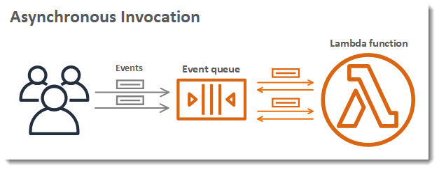

# Invoking a Lambda function asynchronously

Several AWS services, such as Amazon Simple Storage Service (Amazon S3) and Amazon Simple Notification Service (Amazon SNS), invoke functions asynchronously to
process events. You can also invoke a Lambda function asynchronously using the AWS Command Line Interface (AWS CLI) or one of the AWS SDKs.
When you invoke a function asynchronously, you don't wait for a response from the function code. You
hand off the event to Lambda and Lambda handles the rest. You can configure how Lambda handles errors, and can send
invocation records to a downstream resource such as Amazon Simple Queue Service (Amazon SQS) or Amazon EventBridge (EventBridge) to chain together
components of your application.

The following diagram shows clients invoking a Lambda function asynchronously. Lambda queues the events before
sending them to the function.


For asynchronous invocation, Lambda places the event in a queue and returns a success response without
additional information. A separate process reads events from the queue and sends them to your function.

To invoke a Lambda function asynchronously using the AWS Command Line Interface (AWS CLI) or one of the AWS SDKs, set the [InvocationType](../api/API_Invoke.md#lambda-Invoke-request-InvocationType "../api/API_Invoke.md#lambda-Invoke-request-InvocationType") parameter to `Event`. The
following example shows an AWS CLI command to invoke a function.

```
aws lambda invoke \
  --function-name my-function  \
  `--invocation-type` `Event` \
  --cli-binary-format raw-in-base64-out \
  --payload '{ "key": "value" }' response.json

```

You should see the following output:

```
{
    "StatusCode": 202
}
```

The **cli-binary-format** option is required if you're using AWS CLI version 2. To make this the default setting, run `aws configure set cli-binary-format raw-in-base64-out`. For more information, see [AWS CLI supported global command line options](../../../cli/latest/userguide/cli-configure-options.md#cli-configure-options-list "../../../cli/latest/userguide/cli-configure-options.md#cli-configure-options-list") in the _AWS Command Line Interface User Guide for Version 2_.

The output file (`response.json`) doesn't contain any information, but is still created when you
run this command. If Lambda isn't able to add the event to the queue, the error message appears in the command
output.
