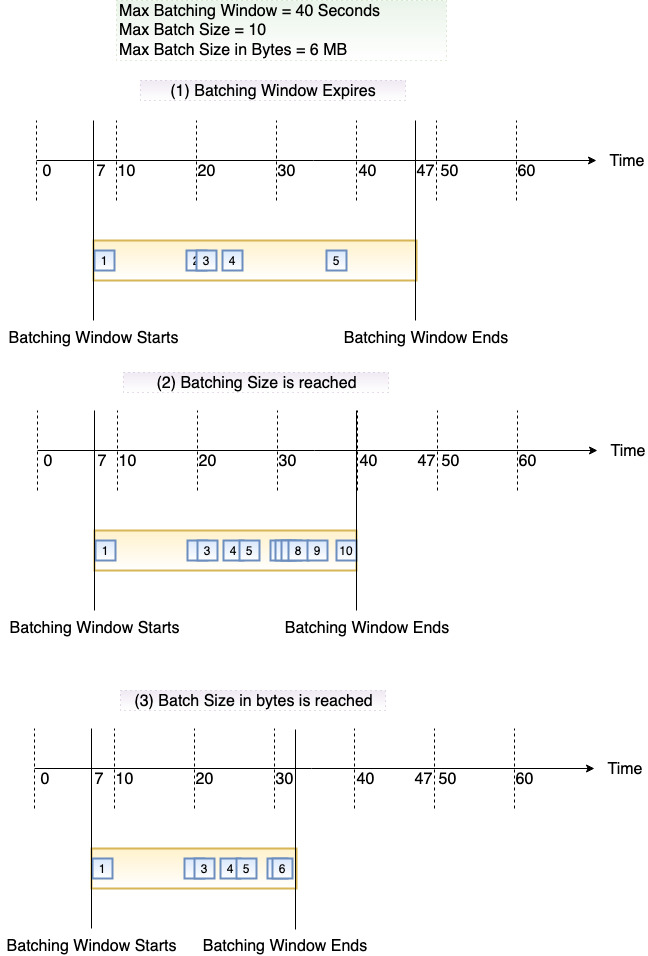

# How Lambda processes records from stream and queue-based event sources

An _event source mapping_ is a Lambda resource that reads items from stream and queue-based
services and invokes a function with batches of records. Within an event source mapping, resources called
_event pollers_ actively poll for new messages and invoke functions. By default, Lambda automatically
scales event pollers, but for certain event source types, you can use [provisioned mode](#invocation-eventsourcemapping-provisioned-mode "#invocation-eventsourcemapping-provisioned-mode") to control the minimum and maximum number of event pollers dedicated to your event source mapping.

The following services use event source mappings to invoke Lambda functions:

- [Amazon DocumentDB (with MongoDB compatibility) (Amazon DocumentDB)](with-documentdb.md "with-documentdb.md")
- [Amazon DynamoDB](with-ddb.md "with-ddb.md")
- [Amazon Kinesis](with-kinesis.md "with-kinesis.md")
- [Amazon MQ](with-mq.md "with-mq.md")
- [Amazon Managed Streaming for Apache Kafka (Amazon MSK)](with-msk.md "with-msk.md")
- [Self-managed Apache Kafka](with-kafka.md "with-kafka.md")
- [Amazon Simple Queue Service (Amazon SQS)](with-sqs.md "with-sqs.md")

###### Warning

Lambda event source mappings process each event at least once, and duplicate processing of records can occur. To avoid potential issues
related to duplicate events, we strongly recommend that you make your function code idempotent. To learn more, see [How do I make my Lambda function idempotent](https://repost.aws/knowledge-center/lambda-function-idempotent "https://repost.aws/knowledge-center/lambda-function-idempotent")
in the AWS Knowledge Center.

## How event source mappings differ from direct triggers

Some AWS services can directly invoke Lambda functions using _triggers_. These services push events to Lambda, and the function is invoked immediately when the specified event occurs. Triggers are suitable for discrete events and real-time processing. When you [create a trigger using the Lambda console](lambda-services.md#lambda-invocation-trigger "lambda-services.md#lambda-invocation-trigger"), the console interacts with the corresponding AWS service to configure the event notification on that service. The trigger is actually stored and managed by the service that generates the events, not by Lambda. Here are some examples of services that use triggers to invoke Lambda
functions:

- **Amazon Simple Storage Service (Amazon S3):** Invokes a function when an object is created, deleted, or modified in a bucket. For more information, see [Tutorial: Using an Amazon S3 trigger to invoke a Lambda function](with-s3-example.md "with-s3-example.md").
- **Amazon Simple Notification Service (Amazon SNS):** Invokes a function when a message is published to an SNS topic. For more information, see [Tutorial: Using AWS Lambda with Amazon Simple Notification Service](with-sns-example.md "with-sns-example.md").
- **Amazon API Gateway:** Invokes a function when an API request is made to a specific endpoint. For more information, see [Invoking a Lambda function using an Amazon API Gateway endpoint](services-apigateway.md "services-apigateway.md").

Event source mappings are Lambda resources created and managed within the Lambda service.
Event source mappings are designed for processing high-volume streaming data or messages from
queues. Processing records from a stream or queue in batches is more efficient than processing
records individually.

## Batching behavior

By default, an event source mapping batches
records together into a single payload that Lambda sends to your function. To fine-tune batching behavior, you can
configure a batching window ([MaximumBatchingWindowInSeconds](../api/API_CreateEventSourceMapping.md#lambda-CreateEventSourceMapping-request-MaximumBatchingWindowInSeconds "../api/API_CreateEventSourceMapping.md#lambda-CreateEventSourceMapping-request-MaximumBatchingWindowInSeconds")) and a batch size
([BatchSize](../api/API_CreateEventSourceMapping.md#lambda-CreateEventSourceMapping-response-BatchSize "../api/API_CreateEventSourceMapping.md#lambda-CreateEventSourceMapping-response-BatchSize")). A batching window is the maximum amount of time to gather records into a single payload.
A batch size is the maximum number of records in a single batch. Lambda invokes your function when one of the
following three criteria is met:

- **The batching window reaches its maximum value.** Default batching window behavior
  varies depending on the specific event source.
  - **For Kinesis, DynamoDB, and Amazon SQS event sources:** The default batching
    window is 0 seconds. This means that Lambda invokes your function as soon as records are available. To set a batching window, configure `MaximumBatchingWindowInSeconds`. You can
    set this parameter to any value from 0 to 300 seconds in increments of 1 second. If you configure a batching window, the
    next window begins as soon as the previous function invocation completes.
  - **For Amazon MSK, self-managed Apache Kafka, Amazon MQ, and Amazon DocumentDB event sources:** The
    default batching window is 500 ms. You can configure
    `MaximumBatchingWindowInSeconds` to any value from 0 seconds to 300
    seconds in increments of seconds. In provisioned mode for Kafka event source mappings, when you
    configure a batching window, the next window begins as soon as the previous batch is
    completed. In non-provisioned Kafka event source mappings, when you configure a batching window, the
    next window begins as soon as the previous function invocation completes.
    To minimize latency when using Kafka event source mappings in provisioned mode, set `MaximumBatchingWindowInSeconds` to 0.
    This setting ensures that Lambda will start processing the next batch
    immediately after completing the current function invocation. For additional information on low
    latency processing, see [Low latency Apache Kafka](with-kafka-low-latency.md "with-kafka-low-latency.md").
  - **For Amazon MQ and Amazon DocumentDB event sources:** The default
    batching window is 500 ms. You can configure
    `MaximumBatchingWindowInSeconds` to any value from 0 seconds to 300
    seconds in increments of seconds. A batching window begins as soon as the first record
    arrives.

  ###### Note

  Because you can only change `MaximumBatchingWindowInSeconds` in
  increments of seconds, you cannot revert to the 500 ms default batching window after
  you have changed it. To restore the default batching window, you must create a new
  event source mapping.

- **The batch size is met.** The minimum batch size is 1. The default and
  maximum batch size depend on the event source. For details about these values, see the [BatchSize](../api/API_CreateEventSourceMapping.md#lambda-CreateEventSourceMapping-request-BatchSize "../api/API_CreateEventSourceMapping.md#lambda-CreateEventSourceMapping-request-BatchSize") specification for the `CreateEventSourceMapping` API
  operation.
- **The payload size reaches [6 MB](gettingstarted-limits.md "gettingstarted-limits.md").** You cannot modify this limit.

The following diagram illustrates these three conditions. Suppose a batching window begins at `t = 7`
seconds. In the first scenario, the batching window reaches its 40 second maximum at `t = 47` seconds after
accumulating 5 records. In the second scenario, the batch size reaches 10 before the batching window expires,
so the batching window ends early. In the third scenario, the maximum payload size is reached before the batching
window expires, so the batching window ends early.

We recommend that you test with different batch and record sizes so that the polling frequency
of each event source is tuned to how quickly your function is able to complete its task. The
[CreateEventSourceMapping](../api/API_CreateEventSourceMapping.md "../api/API_CreateEventSourceMapping.md") BatchSize parameter controls the maximum number of
records that can be sent to your function with each invoke. A larger batch size can often more efficiently
absorb the invoke overhead across a larger set of records, increasing your throughput.

Lambda doesn't wait for any configured [extensions](lambda-extensions.md "lambda-extensions.md") to complete
before sending the next batch for processing. In other words, your extensions may continue to run as Lambda
processes the next batch of records. This can cause throttling issues if you breach any of your account's
[concurrency](lambda-concurrency.md "lambda-concurrency.md") settings or limits. To detect whether this is a
potential issue, monitor your functions and check whether you're seeing higher
[concurrency metrics](monitoring-concurrency.md#general-concurrency-metrics "monitoring-concurrency.md#general-concurrency-metrics") than expected for your event
source mapping. Due to short times in between invokes, Lambda may briefly report higher concurrency usage
than the number of shards. This can be true even for Lambda functions without extensions.

By default, if your function returns an error, the event source mapping reprocesses the entire batch until the
function succeeds, or the items in the batch expire. To ensure in-order processing, the event source mapping
pauses processing for the affected shard until the error is resolved. For stream sources (DynamoDB and Kinesis),
you can configure the maximum number of times that Lambda retries when your function returns an error.
Service errors or throttles where the batch does not reach your function do not count toward retry
attempts. You can also configure the event source mapping to send an invocation record to a
[destination](invocation-async-retain-records.md#invocation-async-destinations "invocation-async-retain-records.md#invocation-async-destinations") when it discards an event batch.

## Provisioned mode

Lambda event source mappings use event pollers to poll your event source for new messages. By default,
Lambda manages the autoscaling of these pollers depending on message volume. When message traffic increases,
Lambda automatically increases the number of event pollers to handle the load, and reduces them when
traffic decreases.

In provisioned mode, you can fine-tune the throughput of your event source mapping by defining
minimum and maximum limits for the number of provisioned event pollers. Lambda then scales your event
source mapping between the minimum and maximum number of event pollers in a responsive manner. These
provisioned event pollers are dedicated to your event source mapping, enhancing your ability to handle
unpredictable spikes in events.

In Lambda, an event poller is a compute unit capable of handling up to 5 MBps of throughput.
For reference, suppose your event source produces an average payload of 1MB, and the average function duration is 1 sec.
If the payload doesn’t undergo any transformation (such as filtering), a single poller can support 5 MBps throughput,
and 5 concurrent Lambda invocations. Using provisioned mode incurs additional costs. For pricing estimates,
see [AWS Lambda pricing](https://aws.amazon.com/lambda/pricing/ "https://aws.amazon.com/lambda/pricing/").

Provisioned mode is supported only for Amazon MSK and self-managed Apache Kafka event sources. While concurrency settings
give you control over the scaling of your function, provisioned mode gives you control over the
throughput of your event source mapping. To ensure maximum performance, you may need to adjust both
settings independently. For details about configuring provisioned mode, see the following sections:

- [Configuring provisioned mode for Amazon MSK
  event source mappings](kafka-scaling-modes.md "kafka-scaling-modes.md")
- [Configuring provisioned mode for self-managed Apache Kafka
  event source mappings](kafka-scaling-modes.md#kafka-provisioned-mode "kafka-scaling-modes.md#kafka-provisioned-mode")

To minimize latency when using Kafka event source mappings in provisioned mode, set `MaximumBatchingWindowInSeconds` to 0.
This setting ensures that Lambda will start processing the next batch
immediately after completing the current function invocation. For additional information on low
latency processing, see [Low latency Apache Kafka](with-kafka-low-latency.md "with-kafka-low-latency.md").

After configuring provisioned mode, you can observe the usage of event pollers for your workload by monitoring
the `ProvisionedPollers` metric. For more information, see [Event source mapping metrics](monitoring-metrics-types.md#event-source-mapping-metrics "monitoring-metrics-types.md#event-source-mapping-metrics").

## Event source mapping API

To manage an event source with the [AWS Command Line Interface (AWS CLI)](../../../cli/latest/userguide/getting-started-install.md "../../../cli/latest/userguide/getting-started-install.md") or an [AWS SDK](https://aws.amazon.com/getting-started/tools-sdks/ "https://aws.amazon.com/getting-started/tools-sdks/"), you can use the following API operations:

- [CreateEventSourceMapping](../api/API_CreateEventSourceMapping.md "../api/API_CreateEventSourceMapping.md")
- [ListEventSourceMappings](../api/API_ListEventSourceMappings.md "../api/API_ListEventSourceMappings.md")
- [GetEventSourceMapping](../api/API_GetEventSourceMapping.md "../api/API_GetEventSourceMapping.md")
- [UpdateEventSourceMapping](../api/API_UpdateEventSourceMapping.md "../api/API_UpdateEventSourceMapping.md")
- [DeleteEventSourceMapping](../api/API_DeleteEventSourceMapping.md "../api/API_DeleteEventSourceMapping.md")
