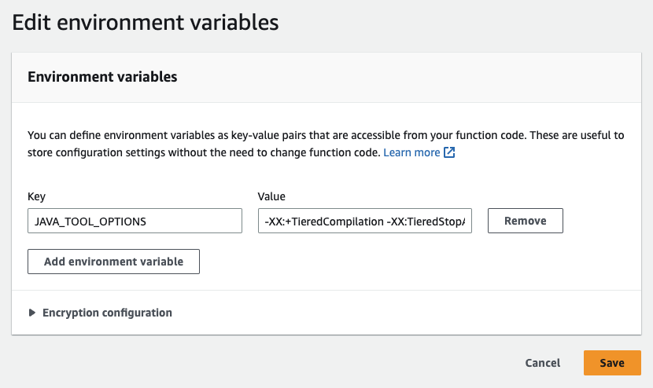

# Customize Java runtime startup behavior for Lambda functions

This page describes settings specific to Java functions in AWS Lambda. You can use these
settings to customize Java runtime startup behavior. This can reduce overall function latency
and improve overall function performance, without having to modify any code.

###### Sections

- [Understanding the JAVA_TOOL_OPTIONS environment variable](#java-tool-options "#java-tool-options")

## Understanding the `JAVA_TOOL_OPTIONS` environment variable

In Java, Lambda supports the `JAVA_TOOL_OPTIONS` environment variable
to set additional command-line variables in Lambda. You can use this environment variable
in various ways, such as to customize tiered-compilation settings. The next example
demonstrates how to use the `JAVA_TOOL_OPTIONS` environment variable for this
use case.

### Example: Customizing tiered compilation settings

Tiered compilation is a feature of the Java virtual machine (JVM). You can use
specific tiered compilation settings to make best use of the JVM's just-in-time (JIT)
compilers. Typically, the C1 compiler is optimized for fast start-up time. The C2
compiler is optimized for best overall performance, but it also uses more memory and
takes a longer time to achieve it.

There are 5 different levels of tiered compilation. At Level 0, the JVM interprets
Java byte code. At Level 4, the JVM uses the C2 compiler to analyze profiling data
collected during application startup. Over time, it monitors code usage to identify
the best optimizations.

Customizing the tiered compilation level can help you reduce Java function
cold start latency. For example, set the tiered compilation level to 1 to have
the JVM use the C1 compiler. This compiler quickly produces optimized native code
but it doesn't generate any profiling data and never uses the C2 compiler.

In the Java 17 runtime, the JVM flag for tiered compilation is set to stop at
level 1 by default. For the Java 11 runtime and below, you can set the tiered
compilation level to 1 by doing the following steps:

###### To customize tiered compilation settings (console)

1. Open the [Functions page](https://console.aws.amazon.com/lambda/home#/functions "https://console.aws.amazon.com/lambda/home#/functions") in the Lambda console.
2. Choose a Java function that you want to customize tiered compilation for.
3. Choose the **Configuration** tab, then choose
   **Environment variables** in the left menu.
4. Choose **Edit**.
5. Choose **Add environment variable**.
6. For the key, enter `JAVA_TOOL_OPTIONS`. For the value, enter
   `-XX:+TieredCompilation -XX:TieredStopAtLevel=1`.

 7. Choose **Save**.

###### Note

You can also use Lambda SnapStart to mitigate cold start issues. SnapStart
uses cached snapshots of your execution environment to significantly improve
start-up performance. For more information about SnapStart features, limitations,
and supported regions, see [Improving startup performance with Lambda SnapStart](snapstart.md "snapstart.md").

### Example: Customizing GC behavior using JAVA_TOOL_OPTIONS

Java 11 runtimes use the
[Serial](https://docs.oracle.com/en/java/javase/18/gctuning/available-collectors.html#GUID-45794DA6-AB96-4856-A96D-FDE5F7DEE498 "https://docs.oracle.com/en/java/javase/18/gctuning/available-collectors.html#GUID-45794DA6-AB96-4856-A96D-FDE5F7DEE498") garbage collector (GC) for garbage collection. By default, Java 17 runtimes
also use the Serial GC. However, with Java 17 you can also use the
`JAVA_TOOL_OPTIONS` environment variable to change the default GC. You can
choose between the Parallel GC and [Shenandoah GC](https://wiki.openjdk.org/display/shenandoah/Main "https://wiki.openjdk.org/display/shenandoah/Main").

For example, if your workload uses more memory and multiple CPUs, consider using the
Parallel GC for better performance. You can do this by appending the following to the
value of your `JAVA_TOOL_OPTIONS` environment variable:

```
-XX:+UseParallelGC
```
