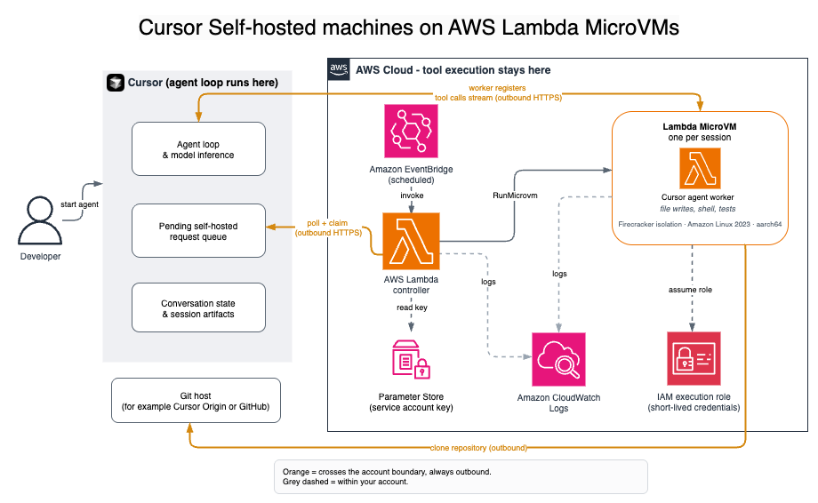

# Using Lambda MicroVMs as a sandbox for Cursor Cloud Agents

You can use AWS Lambda MicroVMs as self-hosted machines for your Cursor
Cloud Agents, keeping repositories, tool execution, and network access in
infrastructure you control. Cursor hosts the agent loop and model; the Lambda
MicroVM is where the worker claims pool requests and runs tool calls. With
this pattern, you control the execution environment – what is
installed in the image, what network access is available, and what AWS
resources the worker's IAM role can reach.

Each MicroVM is a Firecracker-isolated virtual machine with
snapshot-based startup, runs for up to 8 hours, and is terminated when the
session ends. Sessions never share state. You get the security boundary of a
VM with the operational model of serverless – no clusters to manage,
no idle pool capacity to pay for. You orchestrate MicroVMs with a scheduled
controller Lambda function that responds to pending pool requests. Review the
[Run self-hosted
machines for Cursor Cloud Agents on AWS Lambda MicroVMs](https://github.com/anysphere/aws-lambda-workers "https://github.com/anysphere/aws-lambda-workers") reference
template for more detail.

## How it works

A scheduled controller launches one MicroVM per pending pool
request:

1. You start a cloud agent at [cursor.com/agents](https://cursor.com/agents "https://cursor.com/agents") against a
   self-hosted machine. The request stays pending until a worker claims
   it.
2. The controller Lambda function runs `agent worker controller
 --spawn ./spawn.sh` for a five-minute Server-Sent Events (SSE)
   poll window. When it sees a matching request, it runs
   `spawn.sh`.
3. `spawn.sh` calls `RunMicrovm` (`aws
 lambda-microvms run-microvm`) and returns without waiting. It
   forwards the claim's `CURSOR_*` environment into the guest
   through `--run-hook-payload`.
4. The MicroVM `/run` hook (`hook.py`) applies
   that payload and starts `entrypoint.sh`, which runs
   `cursor-agent worker --pool … start`. The worker
   executes tool calls in your account.
5. When the session is idle past the release timeout, the worker
   releases and the MicroVM terminates.

Your Cursor service-account API key is stored in AWS Systems Manager
Parameter Store as a `SecureString`. The controller and the
MicroVM read it at runtime through `ssm:GetParameter`; the key
is never baked into the image.

## Key properties

| Property                       | Benefit                                                                       |
| ------------------------------ | ----------------------------------------------------------------------------- |
| Firecracker isolation          | Hardware-virtualized boundary per session                                     |
| Snapshot boot                  | Lambda restores the guest from a Firecracker snapshot of your<br>image        |
| IAM through the execution role | Guest uses short-lived credentials from<br>`MicroVmExecutionRoleArn`          |
| Stateful duration              | Each MicroVM can run up to 8 hours<br>(`--maximum-duration-in-seconds 28800`) |
| Pay-per-session                | You pay for a MicroVM's runtime, not for idle pool<br>capacity                |

## Prerequisites

- An AWS account with Lambda MicroVMs enabled, plus permission to
  use Amazon S3, IAM, CloudFormation, and Systems Manager Parameter Store
- A Cursor Enterprise account
- A Cursor team with self-hosted machines enabled
- A [service
  account API key](https://cursor.com/docs/account/enterprise/service-accounts "https://cursor.com/docs/account/enterprise/service-accounts") for pool workers
- The [AWS
  CLI](../../../cli/latest/userguide/getting-started-install.md "../../../cli/latest/userguide/getting-started-install.md") updated to the latest stable version, and Docker (the
  deploy script builds the controller image)

## Deploying the reference implementation



The [anysphere/aws-lambda-workers](https://github.com/anysphere/aws-lambda-workers "https://github.com/anysphere/aws-lambda-workers")
repository provides a minimal, working deployment. It includes:

- A CloudFormation stack (`cloudformation.yaml`): a scheduled
  controller Lambda function, an EventBridge `rate(1 minute)` rule, an
  Amazon S3 artifact bucket, a dead-letter queue, and the IAM roles
  (`MicroVmExecutionRole`, `BuildRole`,
  `SpawnRole`, `ControllerRole`)
- A controller image (`controller/Dockerfile`,
  `controller/handler.py`) that runs one SSE poll window per
  invoke
- A MicroVM image (`microvm-image/`:
  `Dockerfile`, `hook.py`,
  `entrypoint.sh`)
- A spawn hook (`spawn.sh`) and a deploy script
  (`deploy.sh`)

Deployment steps:

1. **Store the service-account API key in
   SSM.**

```
aws ssm put-parameter --type SecureString \
  --name /cursor-lambda-workers/cursor-api-key \
  --value "YOUR_SERVICE_ACCOUNT_KEY"
```

2. **Deploy the stack.**
   `deploy.sh` builds the controller image and runs `aws
 cloudformation deploy`.

```
POOL_NAMES=default ./deploy.sh
# POOL_NAMES=gpu,default ./deploy.sh
# ALL_POOLS=true ./deploy.sh
```

3. **Build the MicroVM image** from
   `microvm-image/` using the stack outputs. Enable the
   `ready` and `validate` image hooks and the
   `run` MicroVM hook so they are captured in the snapshot
   path.

```
BUCKET=$(aws cloudformation describe-stacks --stack-name cursor-lambda-workers \
  --query "Stacks[0].Outputs[?OutputKey=='ArtifactBucketName'].OutputValue" --output text)
BUILD_ROLE=$(aws cloudformation describe-stacks --stack-name cursor-lambda-workers \
  --query "Stacks[0].Outputs[?OutputKey=='BuildRoleArn'].OutputValue" --output text)
BASE=$(aws lambda-microvms list-managed-microvm-images --query "items[0].imageArn" --output text)
( cd microvm-image && zip -r /tmp/app.zip . )
aws s3 cp /tmp/app.zip "s3://${BUCKET}/app.zip"
aws lambda-microvms create-microvm-image \
  --code-artifact "uri=s3://${BUCKET}/app.zip" \
  --name cursor-pool-worker \
  --base-image-arn "${BASE}" \
  --build-role-arn "${BUILD_ROLE}" \
  --environment-variables "POOL_NAME=default,CURSOR_API_KEY_PARAM_NAME=/cursor-lambda-workers/cursor-api-key" \
  --hooks '{"port":9000,"microvmImageHooks":{"ready":"ENABLED","readyTimeoutInSeconds":60,"validate":"ENABLED","validateTimeoutInSeconds":60},"microvmHooks":{"run":"ENABLED","runTimeoutInSeconds":60}}'
```

4. **Start a cloud agent** from [cursor.com/agents](https://cursor.com/agents "https://cursor.com/agents") against the
   pool (or against a repository in repo-bound mode) to verify.

For detailed instructions, see the [repository
README](https://github.com/anysphere/aws-lambda-workers/blob/main/README.md "https://github.com/anysphere/aws-lambda-workers/blob/main/README.md").

## Pool and repo modes

Keep the stack's `PoolNames` and the image's
`POOL_NAME` aligned so the controller and the guest serve the
same pool.

- **Any-repo mode** – Routing is
  by pool name, not by git remote. The guest starts the worker from a
  workspace with no git remote, so the worker omits `repo=`
  labels. Users choose the **Any repo**
  group and pool name when starting an agent.
- **Repo-bound mode** – The
  worker serves one or more specific git remotes. Either bake the clone
  into the MicroVM image, or set `CURSOR_REPO_URL` so
  `entrypoint.sh` clones it at start. The worker derives the
  `repo=` label from the git remote. Private repositories
  require git credentials on the worker.

## Networking

The reference `spawn.sh` attaches the managed
`INTERNET_EGRESS` connector so the worker can reach Cursor's
control plane, and `ALL_INGRESS` for the image hooks.
Outbound-only workers never receive inbound HTTPS after boot.

To reach private resources (for example an Amazon Aurora database or
Amazon ElastiCache cluster) or to apply your own restrictions, attach a VPC
egress connector at launch time in place of `INTERNET_EGRESS`.
See [Working with egress network connectors](microvms-networking.md#microvms-networking-connectors "microvms-networking.md#microvms-networking-connectors").

## Monitoring

**Guest logs** – MicroVM logs go to
CloudWatch Logs:

```
aws logs tail /aws/lambda/microvms/cursor-pool-worker --follow
```

**Controller logs** – The
controller Lambda function logs to
`/aws/lambda/cursor-lambda-workers-controller`.

**Running MicroVMs** – List the
running MicroVMs for the image:

```
aws lambda-microvms list-microvms --image-identifier cursor-pool-worker
```

## Troubleshooting

| Symptom                              | Cause                                                                                                                                                                     |
| ------------------------------------ | ------------------------------------------------------------------------------------------------------------------------------------------------------------------------- |
| Image build fails (S3 or IAM)        | Verify stack outputs `ArtifactBucketName` and<br>`BuildRoleArn`; the zip must land in that bucket and the<br>build role must be able to read it                           |
| No MicroVM launches                  | Controller not running or unable to call<br>`RunMicrovm`; confirm the `cursor-pool-worker`<br>image exists and (for a local controller) that<br>`SpawnRoleArn` is assumed |
| Worker exits immediately             | Guest is missing `CURSOR_API_KEY` (SSM<br>`/cursor-lambda-workers/cursor-api-key`), or the<br>`/run` hook did not start `cursor-agent worker<br>… start`                  |
| `Exec format error` on `node`        | Image installed the wrong CLI architecture; MicroVMs here are<br>aarch64 (`arm64`)                                                                                        |
| Service-account key reported invalid | `CURSOR_API_ENDPOINT` / `CURSOR_API_URL`<br>were forwarded into the guest; these must stay unset so<br>`worker start` uses the default auth host                          |
| Image built before hooks enabled     | Rebuild the MicroVM image so `ready`,<br>`validate`, and `run` hooks are in the<br>snapshot path                                                                          |

## Related resources

- [AWS
  Lambda MicroVMs](lambda-microvms-guide.md "lambda-microvms-guide.md")
- [RunMicrovm
  CLI reference](../../../cli/latest/reference/lambda-microvms/run-microvm.md "../../../cli/latest/reference/lambda-microvms/run-microvm.md")
- [Cursor
  self-hosted machines Quickstart](https://cursor.com/docs/cloud-agent/bring-your-own-machine "https://cursor.com/docs/cloud-agent/bring-your-own-machine")
- Reference template: [anysphere/aws-lambda-workers](https://github.com/anysphere/aws-lambda-workers "https://github.com/anysphere/aws-lambda-workers")
