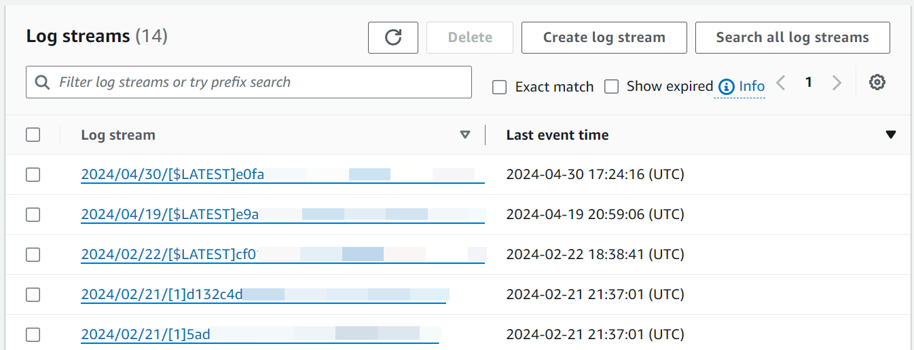
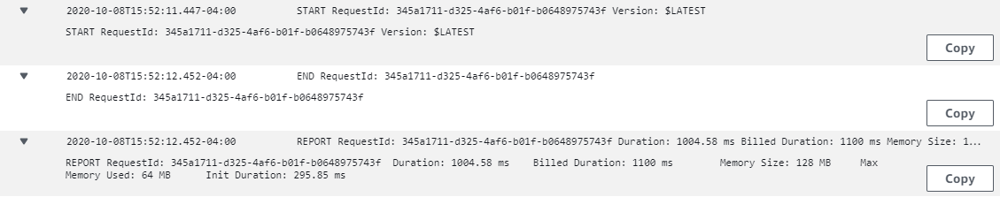
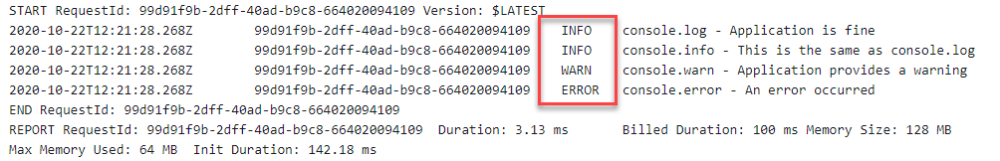
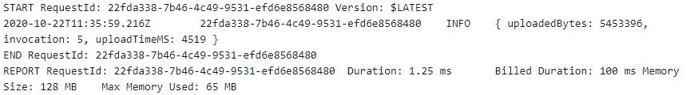
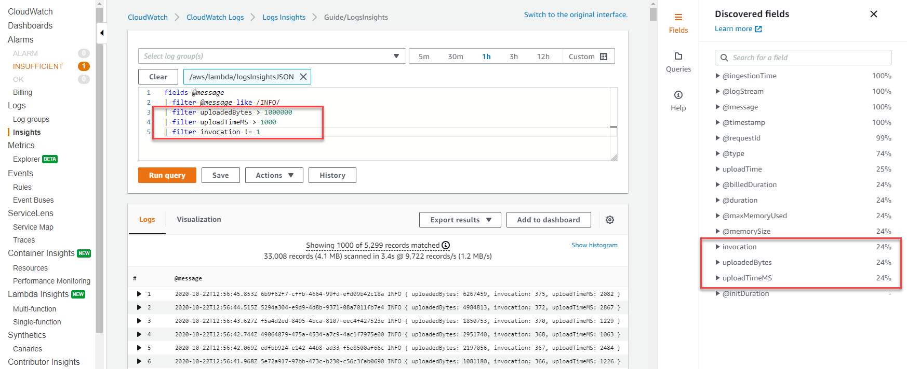
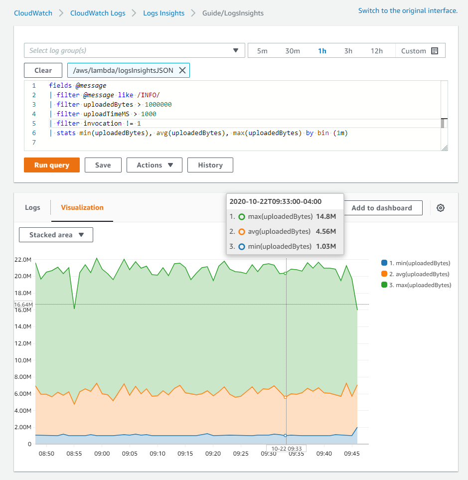
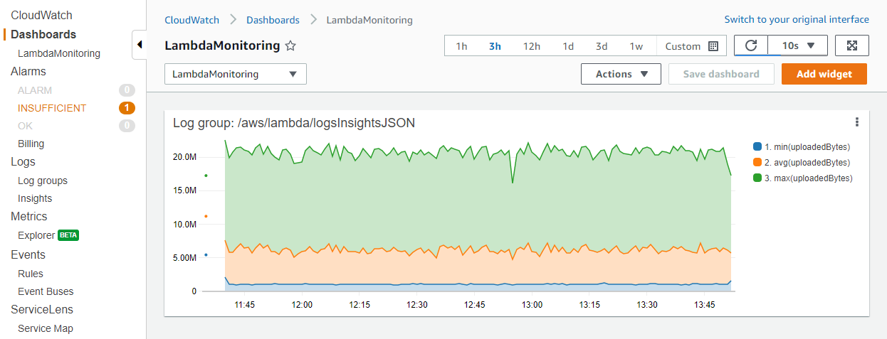

# Viewing CloudWatch logs for Lambda functions

You can view Amazon CloudWatch logs for your Lambda function using the Lambda console, the CloudWatch console, or the AWS Command Line Interface (AWS CLI). Follow
the instructions in the following sections to access your function's logs.

## Stream function logs with CloudWatch Logs Live Tail

Amazon CloudWatch Logs Live Tail helps you quickly troubleshoot your functions by displaying a streaming list of new log events directly in the Lambda console. You can view and filter ingested logs from your Lambda functions in real time, helping you to detect and resolve issues quickly.

###### Note

Live Tail sessions incur costs by session usage time, per minute. For more information about pricing, see [Amazon CloudWatch Pricing](https://aws.amazon.com/cloudwatch/pricing/ "https://aws.amazon.com/cloudwatch/pricing/").

### Comparing Live Tail and --log-type Tail

There are several differences between CloudWatch Logs Live Tail and the [LogType: Tail](../api/API_Invoke.md#lambda-Invoke-request-LogType "../api/API_Invoke.md#lambda-Invoke-request-LogType") option in the Lambda API (`--log-type Tail` in the AWS CLI):

- `--log-type Tail` returns only the first 4 KB of the invocation logs. Live Tail does not share this limit, and can receive up to 500 log events per second.
- `--log-type Tail` captures and sends the logs with the response, which can impact the function's response latency. Live Tail does not affect function response latency.
- `--log-type Tail` supports synchronous invocations only. Live Tail works for both synchronous and asynchronous invocations.

###### Note

[Lambda Managed Instances](lambda-managed-instances.md "lambda-managed-instances.md") does not support the `--log-type Tail` option. Use CloudWatch Logs Live Tail or query CloudWatch Logs directly to view logs for Managed Instances functions.

### Permissions

The following permissions are required to start and stop CloudWatch Logs Live Tail sessions:

- `logs:DescribeLogGroups`
- `logs:StartLiveTail`
- `logs:StopLiveTail`

### Start a Live Tail session in the Lambda console

1. Open the [Functions page](https://console.aws.amazon.com/lambda/home#/functions "https://console.aws.amazon.com/lambda/home#/functions") of the Lambda console.
2. Choose the name of the function.
3. Choose the **Test** tab.
4. In the **Test event** pane, choose **CloudWatch Logs Live Tail**.
5. For **Select log groups**, the function's log group is selected by default. You can select up to five log groups at a time.
6. (Optional) To display only log events that contain certain words or other strings, enter the word
   or string in the **Add filter pattern** box. The filters field is case-sensitive. You can include multiple terms and pattern operators in this field, including regular expressions (regex). For more information about pattern syntax, see [Filter pattern syntax](../../../AmazonCloudWatch/latest/logs/FilterAndPatternSyntax.md "../../../AmazonCloudWatch/latest/logs/FilterAndPatternSyntax.md"). in the _Amazon CloudWatch Logs User Guide_.
7. Choose **Start**. Matching log events begin appearing in the window.
8. To stop the Live Tail session, choose **Stop**.

###### Note

The Live Tail session automatically stops after 15 minutes of inactivity or when the Lambda console session times out.

## Access function logs using the console

1. Open the [Functions page](https://console.aws.amazon.com/lambda/home#/functions "https://console.aws.amazon.com/lambda/home#/functions") of the Lambda console.
2. Select a function.
3. Choose the **Monitor** tab.
4. Choose **View CloudWatch logs** to open the CloudWatch console.
5. Scroll down and choose the **Log stream** for the function invocations you want to look at.



Each instance of a Lambda function has a dedicated log stream. If a function scales up, each
concurrent instance has its own log stream. Each time a new execution environment is created in
response to an invocation, this generates a new log stream. The naming convention for log streams is:

```
YYYY/MM/DD[Function version][Execution environment GUID]
```

A single execution environment writes to the same log stream during its lifetime. The log stream
contains messages from that execution environment and also any output from your Lambda function’s code.
Every message is timestamped, including your custom logs. Even if your function does not log any
output from your code, there are three minimal log statements generated per invocation
(START, END and REPORT):



These logs show:

- **RequestId** – this is a unique ID generated per request.
  If the Lambda function retries a request, this ID does not change and appears in the logs for
  each subsequent retry.
- **Start/End** – these bookmark a single invocation, so every
  log line between these belongs to the same invocation.
- **Duration** – the total invocation time for the handler
  function, excluding `INIT` code.
- **Billed Duration** – applies rounding logic for billing purposes.
- **Memory Size** – the amount of memory allocated to the function.
- **Max Memory Used** – the maximum amount of memory used during the invocation.
- **Init Duration** – the time taken to run the `INIT`
  section of code, outside of the main handler.

## Access logs with the AWS CLI

The AWS CLI is an open-source tool that enables you to interact with AWS services using commands in your command line shell. To complete the steps in this section, you must have the [AWS CLI version 2](../../../cli/latest/userguide/getting-started-install.md "../../../cli/latest/userguide/getting-started-install.md").

You can use the [AWS CLI](../../../cli/latest/userguide/cli-chap-welcome.md "../../../cli/latest/userguide/cli-chap-welcome.md") to retrieve logs for an invocation using the `--log-type` command option. The response contains a `LogResult` field that contains up to 4 KB of base64-encoded logs from the invocation.

###### Example retrieve a log ID

The following example shows how to retrieve a _log ID_ from the `LogResult` field for a function named `my-function`.

```
`aws lambda invoke --function-name my-function out --log-type Tail`
```

You should see the following output:

```
{
    "StatusCode": 200,
    "LogResult": "U1RBUlQgUmVxdWVzdElkOiA4N2QwNDRiOC1mMTU0LTExZTgtOGNkYS0yOTc0YzVlNGZiMjEgVmVyc2lvb...",
    "ExecutedVersion": "$LATEST"
}
```

###### Example decode the logs

In the same command prompt, use the `base64` utility to decode the logs. The following example shows how to retrieve base64-encoded logs for `my-function`.

```
`aws lambda invoke --function-name my-function out --log-type Tail \
--query 'LogResult' --output text --cli-binary-format raw-in-base64-out | base64 --decode`
```

The **cli-binary-format** option is required if you're using AWS CLI version 2. To make this the default setting, run `aws configure set cli-binary-format raw-in-base64-out`. For more information, see [AWS CLI supported global command line options](../../../cli/latest/userguide/cli-configure-options.md#cli-configure-options-list "../../../cli/latest/userguide/cli-configure-options.md#cli-configure-options-list") in the _AWS Command Line Interface User Guide for Version 2_.

You should see the following output:

```
START RequestId: 57f231fb-1730-4395-85cb-4f71bd2b87b8 Version: $LATEST
"AWS_SESSION_TOKEN": "AgoJb3JpZ2luX2VjELj...", "_X_AMZN_TRACE_ID": "Root=1-5d02e5ca-f5792818b6fe8368e5b51d50;Parent=191db58857df8395;Sampled=0"",ask/lib:/opt/lib",
END RequestId: 57f231fb-1730-4395-85cb-4f71bd2b87b8
REPORT RequestId: 57f231fb-1730-4395-85cb-4f71bd2b87b8  Duration: 79.67 ms      Billed Duration: 80 ms         Memory Size: 128 MB     Max Memory Used: 73 MB
```

The `base64` utility is available on Linux, macOS, and [Ubuntu on Windows](https://docs.microsoft.com/en-us/windows/wsl/install-win10 "https://docs.microsoft.com/en-us/windows/wsl/install-win10"). macOS users may need to use `base64 -D`.

###### Example get-logs.sh script

In the same command prompt, use the following script to download the last five log events. The script uses `sed` to remove quotes from the output file, and sleeps for 15 seconds to allow time for the logs to become available. The output includes the response from Lambda and the output from the `get-log-events` command.

Copy the contents of the following code sample and save in your Lambda project directory as `get-logs.sh`.

The **cli-binary-format** option is required if you're using AWS CLI version 2. To make this the default setting, run `aws configure set cli-binary-format raw-in-base64-out`. For more information, see [AWS CLI supported global command line options](../../../cli/latest/userguide/cli-configure-options.md#cli-configure-options-list "../../../cli/latest/userguide/cli-configure-options.md#cli-configure-options-list") in the _AWS Command Line Interface User Guide for Version 2_.

```
#!/bin/bash
aws lambda invoke --function-name my-function --cli-binary-format raw-in-base64-out --payload '{"key": "value"}' out
sed -i'' -e 's/"//g' out
sleep 15
aws logs get-log-events --log-group-name /aws/lambda/`my-function` --log-stream-name `stream1` --limit 5
```

###### Example macOS and Linux (only)

In the same command prompt, macOS and Linux users may need to run the following command to ensure the script is executable.

```
`chmod -R 755 get-logs.sh`
```

###### Example retrieve the last five log events

In the same command prompt, run the following script to get the last five log events.

```
`./get-logs.sh`
```

You should see the following output:

```
{
    "StatusCode": 200,
    "ExecutedVersion": "$LATEST"
}
{
    "events": [
        {
            "timestamp": 1559763003171,
            "message": "START RequestId: 4ce9340a-b765-490f-ad8a-02ab3415e2bf Version: $LATEST\n",
            "ingestionTime": 1559763003309
        },
        {
            "timestamp": 1559763003173,
            "message": "2019-06-05T19:30:03.173Z\t4ce9340a-b765-490f-ad8a-02ab3415e2bf\tINFO\tENVIRONMENT VARIABLES\r{\r  \"AWS_LAMBDA_FUNCTION_VERSION\": \"$LATEST\",\r ...",
            "ingestionTime": 1559763018353
        },
        {
            "timestamp": 1559763003173,
            "message": "2019-06-05T19:30:03.173Z\t4ce9340a-b765-490f-ad8a-02ab3415e2bf\tINFO\tEVENT\r{\r  \"key\": \"value\"\r}\n",
            "ingestionTime": 1559763018353
        },
        {
            "timestamp": 1559763003218,
            "message": "END RequestId: 4ce9340a-b765-490f-ad8a-02ab3415e2bf\n",
            "ingestionTime": 1559763018353
        },
        {
            "timestamp": 1559763003218,
            "message": "REPORT RequestId: 4ce9340a-b765-490f-ad8a-02ab3415e2bf\tDuration: 26.73 ms\tBilled Duration: 27 ms \tMemory Size: 128 MB\tMax Memory Used: 75 MB\t\n",
            "ingestionTime": 1559763018353
        }
    ],
    "nextForwardToken": "f/34783877304859518393868359594929986069206639495374241795",
    "nextBackwardToken": "b/34783877303811383369537420289090800615709599058929582080"
}
```

## Parsing logs and structured logging

With CloudWatch Logs Insights, you can search and analyze log data using a specialized
[query syntax](../../../AmazonCloudWatch/latest/logs/CWL_QuerySyntax.md "../../../AmazonCloudWatch/latest/logs/CWL_QuerySyntax.md").
It performs queries over multiple log groups and provides powerful filtering using
[glob](<https://en.wikipedia.org/wiki/Glob_(programming)> "https://en.wikipedia.org/wiki/Glob_(programming)") and
[regular expressions](https://en.wikipedia.org/wiki/Regular_expression "https://en.wikipedia.org/wiki/Regular_expression") pattern matching.

You can take advantage of these capabilities by implementing structured logging in your Lambda
functions. Structured logging organizes your logs into a pre-defined format, making it easier to query for.
Using log levels is an important first step in generating filter-friendly logs that separate informational
messages from warnings or errors. For example, consider the following Node.js code:

```
exports.handler = async (event) => {
    console.log("console.log - Application is fine")
    console.info("console.info - This is the same as console.log")
    console.warn("console.warn - Application provides a warning")
    console.error("console.error - An error occurred")
}
```

The resulting CloudWatch log file contains a separate field specifying the log level:



A CloudWatch Logs Insights query can then filter on log level. For example, to query for errors only, you can use
the following query:

```
fields @timestamp, @message
| filter @message like /ERROR/
| sort @timestamp desc
```

### JSON structured logging

JSON is commonly used to provide structure for application logs. In the following example, the logs have
been converted to JSON to output three distinct values:



The CloudWatch Logs Insights feature automatically discovers values in JSON output and parses the messages as
fields, without the need for custom glob or regular expression. By using the JSON-structured logs, the
following query finds invocations where the uploaded file was larger than 1 MB, the upload time was more
than 1 second, and the invocation was not a cold start:

```
fields @message
| filter @message like /INFO/
| filter uploadedBytes > 1000000
| filter uploadTimeMS > 1000
| filter invocation != 1
```

This query might produce the following result:



The discovered fields in JSON are automatically populated in the _Discovered fields_
menu on the right side. Standard fields emitted by the Lambda service are prefixed with '@', and you can
query on these fields in the same way. Lambda logs always include the fields @timestamp, @logStream, @message,
@requestId, @duration, @billedDuration, @type, @maxMemoryUsed, @memorySize. If X-Ray is enabled for a
function, logs also include @xrayTraceId and @xraySegmentId.

When an AWS event source such as Amazon S3, Amazon SQS, or Amazon EventBridge invokes your function, the entire event
is provided to the function as a JSON object input. By logging this event in the first line of the
function, you can then query on any of the nested fields using CloudWatch Logs Insights.

### Useful Insights queries

The following table shows example Insights queries that can be useful for monitoring Lambda functions.

| Description                                    | Example query syntax                                                                |
| ---------------------------------------------- | ----------------------------------------------------------------------------------- | ----------------------------------------------------------------------------------------------------------------------------------------------------------------------------------------------------------------------------------------------------------------------------------------------------------------------------- | -------------------------------- | ---------------- |
| The last 100 errors                            | ```<br>fields Timestamp, LogLevel, Message<br>                                      | filter LogLevel == "ERR"<br>                                                                                                                                                                                                                                                                                                  | sort @timestamp desc<br>         | limit 100<br>``` |
| The top 100 highest billed invocations         | ```<br>filter @type = "REPORT"<br>                                                  | fields @requestId, @billedDuration<br>                                                                                                                                                                                                                                                                                        | sort by @billedDuration desc<br> | limit 100<br>``` |
| Percentage of cold starts in total invocations | ```<br>filter @type = "REPORT"<br>                                                  | stats sum(strcontains(@message, "Init Duration"))/count(\*)<br>• 100 as<br>coldStartPct, avg(@duration)<br>by bin(5m)<br>```                                                                                                                                                                                                  |
| Percentile report of Lambda duration           | ```<br>filter @type = "REPORT"<br>                                                  | stats<br>avg(@billedDuration) as Average,<br>percentile(@billedDuration, 99) as NinetyNinth,<br>percentile(@billedDuration, 95) as NinetyFifth,<br>percentile(@billedDuration, 90) as Ninetieth<br>by bin(30m)<br>```                                                                                                         |
| Percentile report of Lambda memory usage       | ```<br>filter @type="REPORT"<br>                                                    | stats avg(@maxMemoryUsed/1024/1024) as mean_MemoryUsed,<br>min(@maxMemoryUsed/1024/1024) as min_MemoryUsed,<br>max(@maxMemoryUsed/1024/1024) as max_MemoryUsed,<br>percentile(@maxMemoryUsed/1024/1024, 95) as Percentile95<br>```                                                                                            |
| Invocations using 100% of assigned memory      | ```<br>filter @type = "REPORT" and @maxMemoryUsed=@memorySize<br>                   | stats<br>count_distinct(@requestId)<br>by bin(30m)<br>```                                                                                                                                                                                                                                                                     |
| Average memory used across invocations         | `<br>avgMemoryUsedPERC,<br>avg(@billedDuration) as avgDurationMS<br>by bin(5m)<br>` |
| Visualization of memory statistics             | ```<br>filter @type = "REPORT"<br>                                                  | stats<br>max(@maxMemoryUsed / 1024 / 1024) as maxMemMB,<br>avg(@maxMemoryUsed / 1024 / 1024) as avgMemMB,<br>min(@maxMemoryUsed / 1024 / 1024) as minMemMB,<br>(avg(@maxMemoryUsed / 1024 / 1024) / max(@memorySize / 1024 / 1024))<br>• 100 as avgMemUsedPct,<br>avg(@billedDuration) as avgDurationMS<br>by bin(30m)<br>``` |
| Invocations where Lambda exited                | ```<br>filter @message like /Process exited/<br>                                    | stats count() by bin(30m)<br>```                                                                                                                                                                                                                                                                                              |
| Invocations that timed out                     | ```<br>filter @message like /Task timed out/<br>                                    | stats count() by bin(30m)<br>```                                                                                                                                                                                                                                                                                              |
| Latency report                                 | ```<br>filter @type = "REPORT"<br>                                                  | stats avg(@duration), max(@duration), min(@duration)<br>by bin(5m)<br>```                                                                                                                                                                                                                                                     |
| Over-provisioned memory                        | ```<br>filter @type = "REPORT"<br>                                                  | stats max(@memorySize / 1024 / 1024) as provisonedMemMB,<br>min(@maxMemoryUsed / 1024 / 1024) as smallestMemReqMB,<br>avg(@maxMemoryUsed / 1024 / 1024) as avgMemUsedMB,<br>max(@maxMemoryUsed / 1024 / 1024) as maxMemUsedMB,<br>provisonedMemMB<br>• maxMemUsedMB as overProvisionedMB<br>```                               |

## Log visualization and dashboards

For any CloudWatch Logs Insights query, you can export the results to markdown or CSV format. In some cases,
it might be more useful to create
[visualizations from queries](../../../AmazonCloudWatch/latest/logs/CWL_Insights-Visualizing-Log-Data.md "../../../AmazonCloudWatch/latest/logs/CWL_Insights-Visualizing-Log-Data.md"), providing there is at least one aggregation function. The `stats`
function allows you to define aggregations and grouping.

The previous _logInsightsJSON_ example filtered on upload size and upload time and excluded first invocations. This resulted in a table of data. For monitoring a production system, it may be more useful to visualize minimum, maximum, and average file sizes to find outliers. To do this, apply the stats function with the required aggregates, and group on a time value such as every minute:

For example, consider the following query. This is the same example query from the
[JSON structured logging](#querying-logs-json "#querying-logs-json") section, but with additional aggregation functions:

```
fields @message
| filter @message like /INFO/
| filter uploadedBytes > 1000000
| filter uploadTimeMS > 1000
| filter invocation != 1
| stats min(uploadedBytes), avg(uploadedBytes), max(uploadedBytes) by bin (1m)
```

We included these aggregates because it may be more useful to visualize minimum, maximum,
and average file sizes to find outliers. You can view the results in the **Visualization** tab:



After you have finished building the visualization, you can optionally add the graph to a CloudWatch dashboard.
To do this, choose **Add to dashboard** above the visualization. This adds the query as a
widget and enables you to select automatic refresh intervals, making it easier to continuously monitor the results:


