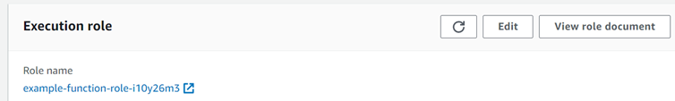
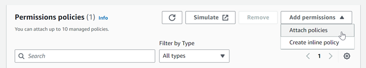
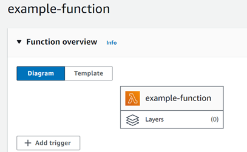

# Process DynamoDB records with Lambda

Create an event source mapping to tell Lambda to send records from your stream to a Lambda function. You can
create multiple event source mappings to process the same data with multiple Lambda functions, or to process items
from multiple streams with a single function.

To configure your function to read from DynamoDB Streams, attach the [AWSLambdaDynamoDBExecutionRole](../../../aws-managed-policy/latest/reference/AWSLambdaDynamoDBExecutionRole.md "../../../aws-managed-policy/latest/reference/AWSLambdaDynamoDBExecutionRole.md") AWS managed policy to your execution role and then create a **DynamoDB**
trigger.

###### To add permissions and create a trigger

1. Open the [Functions page](https://console.aws.amazon.com/lambda/home#/functions "https://console.aws.amazon.com/lambda/home#/functions") of the Lambda console.
2. Choose the name of a function.
3. Choose the **Configuration** tab, and then choose **Permissions**.
4. Under **Role name**, choose the link to your execution role. This link opens the role in the IAM console.

 5. Choose **Add permissions**, and then choose **Attach policies**.

 6. In the search field, enter `AWSLambdaDynamoDBExecutionRole`. Add this policy to your execution role. This is an AWS managed policy that contains the permissions your function needs to read from the DynamoDB stream. For more information about this policy, see [AWSLambdaDynamoDBExecutionRole](../../../aws-managed-policy/latest/reference/AWSLambdaDynamoDBExecutionRole.md "../../../aws-managed-policy/latest/reference/AWSLambdaDynamoDBExecutionRole.md") in the _AWS Managed Policy Reference_. 7. Go back to your function in the Lambda console. Under **Function overview**, choose **Add trigger**.

 8. Choose a trigger type. 9. Configure the required options, and then choose **Add**.
Lambda supports the following options for DynamoDB event sources:

###### Event source options

- **DynamoDB table** – The DynamoDB table to read records from.
- **Batch size** – The number of records to send to the function in each batch, up
  to 10,000. Lambda passes all of the records in the batch to the function in a single call, as long as the total
  size of the events doesn't exceed the [payload limit](gettingstarted-limits.md "gettingstarted-limits.md") for
  synchronous invocation (6 MB).
- **Batch window** – Specify the maximum amount of time to gather records before
  invoking the function, in seconds.
- **Starting position** – Process only new records, or all existing records.

      + **Latest** – Process new records that are added to the stream.
      + **Trim horizon** – Process all records in the stream.

  After processing any existing records, the function is caught up and continues to process new
  records.

- **On-failure destination** – A standard SQS queue or standard SNS topic
  for records that can't be processed. When Lambda discards a batch of records that's too old or has exhausted
  all retries, Lambda sends details about the batch to the queue or topic.
- **Retry attempts** – The maximum number of times that
  Lambda retries when the function returns an error. This doesn't apply to service errors or throttles where the
  batch didn't reach the function.
- **Maximum age of record** – The maximum age of a record that
  Lambda sends to your function.
- **Split batch on error** – When the function returns an error,
  split the batch into two before retrying. Your original batch size setting remains unchanged.
- **Concurrent batches per shard** – Concurrently process multiple batches from the same shard.
- **Enabled** – Set to true to enable the event source mapping. Set to false to stop
  processing records. Lambda keeps track of the last record processed and resumes processing from that point when
  the mapping is reenabled.

###### Note

You are not charged for GetRecords API calls invoked by Lambda as part of DynamoDB triggers.

To manage the event source configuration later, choose the trigger in the designer.
