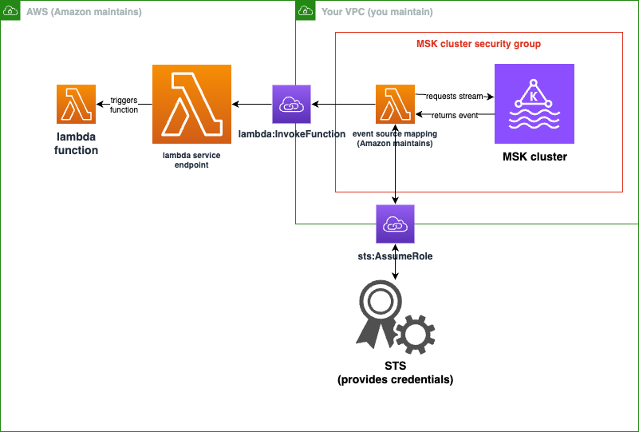
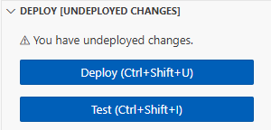
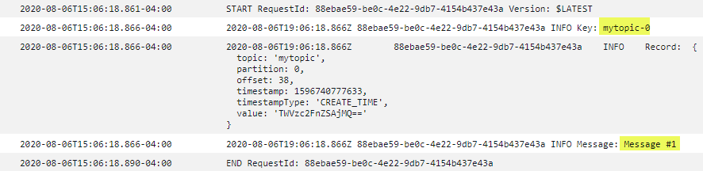

# Tutorial: Using an Amazon MSK event source mapping to invoke a Lambda function

In this tutorial, you will perform the following:

- Create a Lambda function in the same AWS account as an existing Amazon MSK cluster.
- Configure networking and authentication for Lambda to communicate with Amazon MSK.
- Set up a Lambda Amazon MSK event source mapping, which runs your Lambda function when events show up in the topic.
  After you are finished with these steps, when events are sent to Amazon MSK, you will be able to set up a Lambda
  function to process those events automatically with your own custom Lambda code.

  **What can you do with this feature?**

**Example solution: Use an MSK event source mapping to deliver live scores to your
customers.**

Consider the following scenario: Your company hosts a web application where
your customers can view information about live events, such as sports games. Information updates from the game
are provided to your team through a Kafka topic on Amazon MSK. You want to design a solution that consumes updates
from the MSK topic to provide an updated view of the live event to customers inside an application you develop.
You have decided on the following design approach: Your client applications will communicate with a serverless
backend hosted in AWS. Clients will connect over websocket sessions using the Amazon API Gateway WebSocket API.

In this solution, you need a component that reads MSK events, performs some custom logic to prepare those
events for the application layer and then forwards that information to the API Gateway API. You can implement this
component with AWS Lambda, by providing your custom logic in a Lambda function, then calling it with a
AWS Lambda Amazon MSK event source mapping.

For more information about implementing solutions using the Amazon API Gateway WebSocket API, see [WebSocket API
tutorials](../../../apigateway/latest/developerguide/websocket-api-chat-app.md "../../../apigateway/latest/developerguide/websocket-api-chat-app.md") in the API Gateway documentation.

## Prerequisites

An AWS account with the following preconfigured resources:

**To fulfill these prerequisites, we recommend following [Getting started using Amazon MSK](../../../msk/latest/developerguide/getting-started.md "../../../msk/latest/developerguide/getting-started.md") in the Amazon MSK
documentation.**

- An Amazon MSK cluster. See [Create an Amazon MSK cluster](../../../msk/latest/developerguide/create-cluster.md "../../../msk/latest/developerguide/create-cluster.md") in _Getting started using Amazon MSK_.
- The following configuration:
  - Ensure **IAM role-based authentication** is **Enabled**
    in your cluster security settings. This improves your security by limiting your Lambda
    function to only access the Amazon MSK resources needed. This is enabled by default on new Amazon MSK
    clusters.
  - Ensure **Public access** is off in your cluster networking settings.
    Restricting your Amazon MSK cluster's access to the internet improves your security by limiting
    how many intermediaries handle your data. This is enabled by default on new Amazon MSK
    clusters.

- A Kafka topic in your Amazon MSK cluster to use for this solution. See [Create a topic](../../../msk/latest/developerguide/create-topic.md "../../../msk/latest/developerguide/create-topic.md") in _Getting started using Amazon MSK_.
- A Kafka admin host set up to retrieve information from your Kafka cluster and send Kafka events to your topic
  for testing, such as an Amazon EC2 instance with the Kafka admin CLI and Amazon MSK IAM library
  installed. See [Create a client machine](../../../msk/latest/developerguide/create-client-machine.md "../../../msk/latest/developerguide/create-client-machine.md") in _Getting started using Amazon MSK_.

Once you have set up these resources, gather the following information from your AWS account to confirm that you are ready to continue.

- The name of your Amazon MSK cluster. You can find this information in the Amazon MSK console.
- The cluster UUID, part of the ARN for
  your Amazon MSK cluster, which you can find in the Amazon MSK console. Follow
  the procedures in [Listing clusters](../../../msk/latest/developerguide/msk-list-clusters.md "../../../msk/latest/developerguide/msk-list-clusters.md") in the Amazon MSK
  documentation to find this information.
- The security groups associated with your Amazon MSK cluster. You can find this information in the Amazon MSK
  console. In the following steps, refer to these as your `clusterSecurityGroups`.
- The id of the Amazon VPC containing your Amazon MSK cluster. You can find this
  information by identifying subnets associated with your Amazon MSK cluster in the Amazon MSK console,
  then identifying the Amazon VPC associated with the subnet in the Amazon VPC Console.
- The name of the Kafka topic used in your solution. You can find this information by calling your
  Amazon MSK cluster with the Kafka `topics` CLI from your Kafka admin host. For more
  information about the topics CLI, see [Adding and removing topics](https://kafka.apache.org/documentation/#basic_ops_add_topic "https://kafka.apache.org/documentation/#basic_ops_add_topic")
  in the Kafka documentation.
- The name of a consumer group for your Kafka topic, suitable for use by your Lambda
  function. This group can be created automatically by Lambda, so you don't need to create it with the
  Kafka CLI. If you do need to manage your consumer groups, to learn more about the consumer-groups
  CLI, see [Managing
  Consumer Groups](https://kafka.apache.org/documentation/#basic_ops_consumer_group "https://kafka.apache.org/documentation/#basic_ops_consumer_group") in the Kafka documentation.

The following permissions in your AWS account:

- Permission to create and manage a Lambda function.
- Permission to create IAM policies and associate them with your Lambda function.
- Permission to create Amazon VPC endpoints and alter networking configuration in the Amazon VPC hosting your Amazon MSK cluster.

If you have not yet installed the AWS Command Line Interface, follow the steps at [Installing or updating the latest version of the AWS CLI](../../../cli/latest/userguide/getting-started-install.md "../../../cli/latest/userguide/getting-started-install.md")
to install it.

The tutorial requires a command line terminal or shell to run commands. In Linux and macOS, use your preferred shell and package manager.

###### Note

In Windows, some Bash CLI commands that you commonly use with Lambda (such as `zip`) are not supported by the operating system's built-in terminals.
To get a Windows-integrated version of Ubuntu and Bash, [install the Windows Subsystem for Linux](https://docs.microsoft.com/en-us/windows/wsl/install-win10 "https://docs.microsoft.com/en-us/windows/wsl/install-win10").

## Configure network connectivity for Lambda to communicate with Amazon MSK

Use AWS PrivateLink to connect Lambda and Amazon MSK. You can do so by creating interface
Amazon VPC endpoints in the Amazon VPC console. For more information about networking configuration, see [Configuring your Amazon MSK cluster and Amazon VPC network for Lambda](with-msk-cluster-network.md "with-msk-cluster-network.md").

When a Amazon MSK event source mapping runs on the behalf of a Lambda function, it assumes the Lambda function’s execution role. This IAM role
authorizes the mapping to access resources secured by IAM, such as your Amazon MSK cluster. Although the
components share an execution role, the Amazon MSK mapping and your Lambda function have separate connectivity
requirements for their respective tasks, as shown in the following diagram.



Your event source mapping belongs to your Amazon MSK cluster security group. In this networking step, create
Amazon VPC endpoints from your Amazon MSK cluster VPC to connect the event source mapping to the Lambda and STS
services. Secure these endpoints to accept traffic from your Amazon MSK cluster security group. Then, adjust the
Amazon MSK cluster security groups to allow the event source mapping to communicate with the Amazon MSK
cluster.

You can configure the following steps using the AWS Management Console.

###### To configure interface Amazon VPC endpoints to connect Lambda and Amazon MSK

1. Create a security group for your interface Amazon VPC endpoints, `endpointSecurityGroup`, that allows
   inbound TCP traffic on 443 from `clusterSecurityGroups`. Follow the procedure in [Create a
   security group](../../../AWSEC2/latest/UserGuide/working-with-security-groups.md#creating-security-group "../../../AWSEC2/latest/UserGuide/working-with-security-groups.md#creating-security-group") in the Amazon EC2 documentation to create a security group. Then, follow the
   procedure in [Add
   rules to a security group](../../../AWSEC2/latest/UserGuide/working-with-security-groups.md#adding-security-group-rule "../../../AWSEC2/latest/UserGuide/working-with-security-groups.md#adding-security-group-rule") in the Amazon EC2 documentation to add appropriate rules.

**Create a security group with the following information:**

When adding your inbound rules, create a rule for each security group in
`clusterSecurityGroups`. For each rule:

    * For **Type**,
     select **HTTPS**.
    * For **Source**, select one of
     `clusterSecurityGroups`.

2. Create an endpoint connecting the Lambda service to the Amazon VPC containing your Amazon MSK cluster.
   Follow the procedure in [Create an interface endpoint](../../../vpc/latest/privatelink/create-interface-endpoint.md "../../../vpc/latest/privatelink/create-interface-endpoint.md").

**Create an interface endpoint with the following information:**

    * For **Service name**, select `com.amazonaws.`regionName`.lambda`, where `regionName`
     hosts your Lambda function.
    * For **VPC**, select
     the Amazon VPC containing your Amazon MSK cluster.
    * For **Security groups**, select
     `endpointSecurityGroup`, which you created earlier.
    * For **Subnets**, select the subnets that host your Amazon MSK cluster.
    * For **Policy**, provide the following policy document, which secures the endpoint for use by the Lambda service principal for the
     `lambda:InvokeFunction` action.


    ```
    {
        "Statement": [
            {
                "Action": "lambda:InvokeFunction",
                "Effect": "Allow",
                "Principal": {
                    "Service": [
                        "lambda.amazonaws.com"
                    ]
                },
                "Resource": "*"
            }
        ]
    }
    ```
    * Ensure **Enable DNS name** remains set.

3. Create an endpoint connecting the AWS STS service to the Amazon VPC containing your Amazon MSK cluster.
   Follow the procedure in [Create an interface endpoint](../../../vpc/latest/privatelink/create-interface-endpoint.md "../../../vpc/latest/privatelink/create-interface-endpoint.md").

**Create an interface endpoint with the following information:**

    * For **Service name**, select AWS STS.
    * For **VPC**, select
     the Amazon VPC containing your Amazon MSK cluster.
    * For **Security groups**, select
     `endpointSecurityGroup`.
    * For **Subnets**, select the subnets that host your Amazon MSK cluster.
    * For **Policy**, provide the following policy document,
     which secures the endpoint for use by
     the Lambda service principal for the `sts:AssumeRole` action.


    ```
    {
        "Statement": [
            {
                "Action": "sts:AssumeRole",
                "Effect": "Allow",
                "Principal": {
                    "Service": [
                        "lambda.amazonaws.com"
                    ]
                },
                "Resource": "*"
            }
        ]
    }
    ```
    * Ensure **Enable DNS name** remains set.

4.  For each security group associated with your Amazon MSK cluster, that is, in
    `clusterSecurityGroups`, allow the following:

        * Allow all inbound and outbound TCP traffic on 9098
         to all of `clusterSecurityGroups`, including within itself.
        * Allow all outbound TCP traffic on 443.

    Some of this traffic is allowed by default security group
    rules, so if your cluster is attached to a single security group, and that group has default rules, additional rules
    are not necessary. To adjust security group rules, follow the procedures in [Add
    rules to a security group](../../../AWSEC2/latest/UserGuide/working-with-security-groups.md#adding-security-group-rule "../../../AWSEC2/latest/UserGuide/working-with-security-groups.md#adding-security-group-rule") in the Amazon EC2 documentation.

**Add rules to your security groups with the following information:**

    * For each inbound rule or outbound rule for port 9098, provide


    	+ For **Type**, select **Custom TCP**.
    	+ For **Port range**, provide 9098.
    	+ For **Source**, provide one of `clusterSecurityGroups`.
    * For each inbound rule for port 443, for **Type**,
     select **HTTPS**.

## Create an IAM role for Lambda to read from your Amazon MSK topic

Identify the auth requirements for Lambda to read from your Amazon MSK topic, then define them in a policy.
Create a role, `lambdaAuthRole`, that authorizes Lambda to use those
permissions. Authorize actions on your Amazon MSK cluster using `kafka-cluster`
IAM actions. Then, authorize Lambda to perform Amazon MSK `kafka` and Amazon EC2 actions
needed to discover and connect to your Amazon MSK cluster, as well as CloudWatch actions so Lambda can log what it has
done.

###### To describe the auth requirements for Lambda to read from Amazon MSK

1. Write an IAM policy document (a JSON document), `clusterAuthPolicy`, that allows Lambda to read from your Kafka topic in
   your Amazon MSK cluster using your Kafka consumer group. Lambda
   requires a Kafka consumer group to be set when reading.

Alter the following template to align with your prerequisites:

JSON

```
`{
 "Version":"2012-10-17",
 "Statement": [
 {
 "Effect": "Allow",
 "Action": [
 "kafka-cluster:Connect",
 "kafka-cluster:DescribeGroup",
 "kafka-cluster:AlterGroup",
 "kafka-cluster:DescribeTopic",
 "kafka-cluster:ReadData",
 "kafka-cluster:DescribeClusterDynamicConfiguration"
 ],
 "Resource": [
 "arn:aws:kafka:`us-east-1`:`111122223333`:cluster/`mskClusterName`/`cluster-uuid`",
 "arn:aws:kafka:`us-east-1`:`111122223333`:topic/`mskClusterName`/`cluster-uuid`/`mskTopicName`",
 "arn:aws:kafka:`us-east-1`:`111122223333`:group/`mskClusterName`/`cluster-uuid`/`mskGroupName`"
 ]
 }
 ]
}`

```

For more information, consult [Configuring Lambda permissions for Amazon MSK event source mappings](with-msk-permissions.md "with-msk-permissions.md"). When writing your
policy:

    * Replace `us-east-1` and
     `111122223333` with the AWS Region and AWS account of your Amazon MSK cluster.
    * For `mskClusterName`, provide the name of your Amazon MSK cluster.
    * For `cluster-uuid`, provide the UUID in the ARN for
     your Amazon MSK cluster.
    * For `mskTopicName`, provide the name of your Kafka topic.
    * For `mskGroupName`, provide the name of your Kafka consumer
     group.

2. Identify the Amazon MSK, Amazon EC2 and CloudWatch permissions required for Lambda to discover and connect your Amazon MSK cluster, and log those events.

The `AWSLambdaMSKExecutionRole` managed policy permissively defines the required permissions. Use it in the following steps.

In a production environment, assess `AWSLambdaMSKExecutionRole` to restrict your execution role policy based on the principle of least privilege, then
write a policy for your role that replaces this managed policy.

For details about the IAM policy language, see
the [IAM documentation](../../../iam.md "../../../iam.md").

Now that you have written your policy document, create an IAM policy so you can attach it to your role. You can do this using the console with the following procedure.

###### To create an IAM policy from your policy document

1. Sign in to the AWS Management Console and open the IAM console at [https://console.aws.amazon.com/iam/](https://console.aws.amazon.com/iam/ "https://console.aws.amazon.com/iam/").
2. In the navigation pane on the left, choose **Policies**.
3. Choose **Create policy**.
4. In the **Policy editor** section, choose the
   **JSON** option.
5. Paste `clusterAuthPolicy`.
6. When you are finished adding permissions to the policy, choose
   **Next**.
7. On the **Review and create** page, type a **Policy
   Name** and a **Description** (optional) for the policy that
   you are creating. Review **Permissions defined in this policy** to see
   the permissions that are granted by your policy.
8. Choose **Create policy** to save your new policy.

For more information, see [Creating IAM policies](../../../IAM/latest/UserGuide/access_policies_create.md "../../../IAM/latest/UserGuide/access_policies_create.md") in the IAM documentation.

Now that you have appropriate IAM policies, create a role and attach them to it. You can do this using the console with the following procedure.

###### To create an execution role in the IAM console

1. Open the [Roles page](https://console.aws.amazon.com/iam/home#/roles "https://console.aws.amazon.com/iam/home#/roles") in the IAM console.
2. Choose **Create role**.
3. Under **Trusted entity type**, choose **AWS service**.
4. Under **Use case**, choose **Lambda**.
5. Choose **Next**.
6. Select the following policies:
   - `clusterAuthPolicy`
   - `AWSLambdaMSKExecutionRole`

7. Choose **Next**.
8. For **Role name**, enter `lambdaAuthRole` and then choose **Create role**.

For more information, see [Defining Lambda function permissions with an execution role](lambda-intro-execution-role.md "lambda-intro-execution-role.md").

## Create a Lambda function to read from your Amazon MSK topic

Create a Lambda function configured to use your
IAM role. You can create your Lambda function using the console.

###### To create a Lambda function using your auth configuration

1. Open the Lambda console and select **Create function** from the header.
2. Select **Author from scratch**.
3. For **Function name**, provide an appropriate name of your choice.
4. For **Runtime**, choose the **Latest supported** version of `Node.js` to use the code provided in this tutorial.
5. Choose **Change default execution role**.
6. Select **Use an existing role**.
7. For **Existing role**, select `lambdaAuthRole`.

In a production environment, you usually need to add further policies to the execution role for your Lambda function to
meaningfully process your Amazon MSK events. For more information on adding policies to your role, see [Add or
remove identity permissions](../../../IAM/latest/UserGuide/access_policies_manage-attach-detach.md#add-policies-console "../../../IAM/latest/UserGuide/access_policies_manage-attach-detach.md#add-policies-console") in the IAM documentation.

## Create an event source mapping to your Lambda function

Your Amazon MSK event source mapping provides the Lambda service the information necessary to invoke your
Lambda when appropriate Amazon MSK events occur. You can create a Amazon MSK mapping using the console. Create a Lambda
trigger, then the event source mapping is automatically set up.

###### To create a Lambda trigger (and event source mapping)

1. Navigate to your Lambda function's overview page.
2. In the function overview section, choose **Add trigger** on the bottom left.
3. In the **Select a source** dropdown, select **Amazon MSK**.
4. Don't set **authentication**.
5. For **MSK cluster**, select your cluster's name.
6. For **Batch size**, enter 1. This step makes this feature easier to test, and is not an ideal value in production.
7. For **Topic name**, provide the name of your Kafka topic.
8. For **Consumer group ID**, provide the id of your Kafka consumer group.

## Update your Lambda function to read your streaming data

Lambda provides information about Kafka events through the event method parameter. For an example structure of a Amazon MSK event, see [Example event](with-msk.md#msk-sample-event "with-msk.md#msk-sample-event").
After you understand how to interpret Lambda forwarded Amazon MSK events, you can alter your Lambda function code to use the information they provide.

Provide the following code to your Lambda function to log the contents of a Lambda Amazon MSK event for testing purposes:

.NET

**SDK for .NET**

###### Note

There's more on GitHub. Find the complete example and learn how to set up and run in the
[Serverless examples](https://github.com/aws-samples/serverless-snippets/tree/main/integration-msk-to-lambda "https://github.com/aws-samples/serverless-snippets/tree/main/integration-msk-to-lambda")
repository.

Consuming an Amazon MSK event with Lambda using .NET.

```
using System.Text;
using Amazon.Lambda.Core;
using Amazon.Lambda.KafkaEvents;


// Assembly attribute to enable the Lambda function's JSON input to be converted into a .NET class.
[assembly: LambdaSerializer(typeof(Amazon.Lambda.Serialization.SystemTextJson.DefaultLambdaJsonSerializer))]

namespace MSKLambda;

public class Function
{


    /// <param name="input">The event for the Lambda function handler to process.</param>
    /// <param name="context">The ILambdaContext that provides methods for logging and describing the Lambda environment.</param>
    /// <returns></returns>
    public void FunctionHandler(KafkaEvent evnt, ILambdaContext context)
    {

        foreach (var record in evnt.Records)
        {
            Console.WriteLine("Key:" + record.Key);
            foreach (var eventRecord in record.Value)
            {
                var valueBytes = eventRecord.Value.ToArray();
                var valueText = Encoding.UTF8.GetString(valueBytes);

                Console.WriteLine("Message:" + valueText);
            }
        }
    }


}


```

Go

**SDK for Go V2**

###### Note

There's more on GitHub. Find the complete example and learn how to set up and run in the
[Serverless examples](https://github.com/aws-samples/serverless-snippets/tree/main/integration-msk-to-lambda "https://github.com/aws-samples/serverless-snippets/tree/main/integration-msk-to-lambda")
repository.

Consuming an Amazon MSK event with Lambda using Go.

```

package main

import (
	"encoding/base64"
	"fmt"

	"github.com/aws/aws-lambda-go/events"
	"github.com/aws/aws-lambda-go/lambda"
)

func handler(event events.KafkaEvent) {
	for key, records := range event.Records {
		fmt.Println("Key:", key)

		for _, record := range records {
			fmt.Println("Record:", record)

			decodedValue, _ := base64.StdEncoding.DecodeString(record.Value)
			message := string(decodedValue)
			fmt.Println("Message:", message)
		}
	}
}

func main() {
	lambda.Start(handler)
}

```

Java

**SDK for Java 2.x**

###### Note

There's more on GitHub. Find the complete example and learn how to set up and run in the
[Serverless examples](https://github.com/aws-samples/serverless-snippets/tree/main/integration-msk-to-lambda "https://github.com/aws-samples/serverless-snippets/tree/main/integration-msk-to-lambda")
repository.

Consuming an Amazon MSK event with Lambda using Java.

```

import com.amazonaws.services.lambda.runtime.Context;
import com.amazonaws.services.lambda.runtime.RequestHandler;
import com.amazonaws.services.lambda.runtime.events.KafkaEvent;
import com.amazonaws.services.lambda.runtime.events.KafkaEvent.KafkaEventRecord;

import java.util.Base64;
import java.util.Map;

public class Example implements RequestHandler<KafkaEvent, Void> {

    @Override
    public Void handleRequest(KafkaEvent event, Context context) {
        for (Map.Entry<String, java.util.List<KafkaEventRecord>> entry : event.getRecords().entrySet()) {
            String key = entry.getKey();
            System.out.println("Key: " + key);

            for (KafkaEventRecord record : entry.getValue()) {
                System.out.println("Record: " + record);

                byte[] value = Base64.getDecoder().decode(record.getValue());
                String message = new String(value);
                System.out.println("Message: " + message);
            }
        }

        return null;
    }
}


```

JavaScript

**SDK for JavaScript (v3)**

###### Note

There's more on GitHub. Find the complete example and learn how to set up and run in the
[Serverless examples](https://github.com/aws-samples/serverless-snippets/tree/main/integration-msk-to-lambda "https://github.com/aws-samples/serverless-snippets/tree/main/integration-msk-to-lambda")
repository.

Consuming an Amazon MSK event with Lambda using JavaScript.

```

exports.handler = async (event) => {
    // Iterate through keys
    for (let key in event.records) {
      console.log('Key: ', key)
      // Iterate through records
      event.records[key].map((record) => {
        console.log('Record: ', record)
        // Decode base64
        const msg = Buffer.from(record.value, 'base64').toString()
        console.log('Message:', msg)
      })
    }
}

```

Consuming an Amazon MSK event with Lambda using TypeScript.

```
import { MSKEvent, Context } from "aws-lambda";
import { Buffer } from "buffer";
import { Logger } from "@aws-lambda-powertools/logger";

const logger = new Logger({
  logLevel: "INFO",
  serviceName: "msk-handler-sample",
});

export const handler = async (
  event: MSKEvent,
  context: Context
): Promise<void> => {
  for (const [topic, topicRecords] of Object.entries(event.records)) {
    logger.info(`Processing key: ${topic}`);

    // Process each record in the partition
    for (const record of topicRecords) {
      try {
        // Decode the message value from base64
        const decodedMessage = Buffer.from(record.value, 'base64').toString();

        logger.info({
          message: decodedMessage
        });
      }
      catch (error) {
        logger.error('Error processing event', { error });
        throw error;
      }
    };
  }
}


```

PHP

**SDK for PHP**

###### Note

There's more on GitHub. Find the complete example and learn how to set up and run in the
[Serverless examples](https://github.com/aws-samples/serverless-snippets/tree/main/integration-msk-to-lambda "https://github.com/aws-samples/serverless-snippets/tree/main/integration-msk-to-lambda")
repository.

Consuming an Amazon MSK event with Lambda using PHP.

```
<?php
// Copyright Amazon.com, Inc. or its affiliates. All Rights Reserved.
// SPDX-License-Identifier: Apache-2.0

// using bref/bref and bref/logger for simplicity

use Bref\Context\Context;
use Bref\Event\Kafka\KafkaEvent;
use Bref\Event\Handler as StdHandler;
use Bref\Logger\StderrLogger;

require __DIR__ . '/vendor/autoload.php';

class Handler implements StdHandler
{
    private StderrLogger $logger;
    public function __construct(StderrLogger $logger)
    {
        $this->logger = $logger;
    }

    /**
     * @throws JsonException
     * @throws \Bref\Event\InvalidLambdaEvent
     */
    public function handle(mixed $event, Context $context): void
    {
        $kafkaEvent = new KafkaEvent($event);
        $this->logger->info("Processing records");
        $records = $kafkaEvent->getRecords();

        foreach ($records as $record) {
            try {
                $key = $record->getKey();
                $this->logger->info("Key: $key");

                $values = $record->getValue();
                $this->logger->info(json_encode($values));

                foreach ($values as $value) {
                    $this->logger->info("Value: $value");
                }

            } catch (Exception $e) {
                $this->logger->error($e->getMessage());
            }
        }
        $totalRecords = count($records);
        $this->logger->info("Successfully processed $totalRecords records");
    }
}

$logger = new StderrLogger();
return new Handler($logger);


```

Python

**SDK for Python (Boto3)**

###### Note

There's more on GitHub. Find the complete example and learn how to set up and run in the
[Serverless examples](https://github.com/aws-samples/serverless-snippets/tree/main/integration-msk-to-lambda "https://github.com/aws-samples/serverless-snippets/tree/main/integration-msk-to-lambda")
repository.

Consuming an Amazon MSK event with Lambda using Python.

```

import base64

def lambda_handler(event, context):
    # Iterate through keys
    for key in event['records']:
        print('Key:', key)
        # Iterate through records
        for record in event['records'][key]:
            print('Record:', record)
            # Decode base64
            msg = base64.b64decode(record['value']).decode('utf-8')
            print('Message:', msg)

```

Ruby

**SDK for Ruby**

###### Note

There's more on GitHub. Find the complete example and learn how to set up and run in the
[Serverless examples](https://github.com/aws-samples/serverless-snippets/tree/main/integration-msk-to-lambda "https://github.com/aws-samples/serverless-snippets/tree/main/integration-msk-to-lambda")
repository.

Consuming an Amazon MSK event with Lambda using Ruby.

```

require 'base64'

def lambda_handler(event:, context:)
  # Iterate through keys
  event['records'].each do |key, records|
    puts "Key: #{key}"

    # Iterate through records
    records.each do |record|
      puts "Record: #{record}"

      # Decode base64
      msg = Base64.decode64(record['value'])
      puts "Message: #{msg}"
    end
  end
end

```

Rust

**SDK for Rust**

###### Note

There's more on GitHub. Find the complete example and learn how to set up and run in the
[Serverless examples](https://github.com/aws-samples/serverless-snippets/tree/main/integration-msk-to-lambda "https://github.com/aws-samples/serverless-snippets/tree/main/integration-msk-to-lambda")
repository.

Consuming an Amazon MSK event with Lambda using Rust.

```
use aws_lambda_events::event::kafka::KafkaEvent;
use lambda_runtime::{run, service_fn, tracing, Error, LambdaEvent};
use base64::prelude::*;
use serde_json::{Value};
use tracing::{info};

/// Pre-Requisites:
/// 1. Install Cargo Lambda - see https://www.cargo-lambda.info/guide/getting-started.html
/// 2. Add packages tracing, tracing-subscriber, serde_json, base64
///
/// This is the main body for the function.
/// Write your code inside it.
/// There are some code example in the following URLs:
/// - https://github.com/awslabs/aws-lambda-rust-runtime/tree/main/examples
/// - https://github.com/aws-samples/serverless-rust-demo/

async fn function_handler(event: LambdaEvent<KafkaEvent>) -> Result<Value, Error> {

    let payload = event.payload.records;

    for (_name, records) in payload.iter() {

        for record in records {

         let record_text = record.value.as_ref().ok_or("Value is None")?;
         info!("Record: {}", &record_text);

         // perform Base64 decoding
         let record_bytes = BASE64_STANDARD.decode(record_text)?;
         let message = std::str::from_utf8(&record_bytes)?;

         info!("Message: {}", message);
        }

    }

    Ok(().into())
}

#[tokio::main]
async fn main() -> Result<(), Error> {

    // required to enable CloudWatch error logging by the runtime
    tracing::init_default_subscriber();
    info!("Setup CW subscriber!");

    run(service_fn(function_handler)).await
}

```

You can provide function code to your Lambda using the console.

###### To update function code using the console code editor

1. Open the [Functions page](https://console.aws.amazon.com/lambda/home#/functions "https://console.aws.amazon.com/lambda/home#/functions") of the Lambda console and select your function.
2. Select the **Code** tab.
3. In the **Code source** pane, select your source code file and edit it in the integrated code editor.
4. In the **DEPLOY** section, choose **Deploy** to update your function's code:



## Test your Lambda function to verify it is connected to your Amazon MSK topic

You can now verify whether or not your Lambda is being invoked by the event source by inspecting CloudWatch event logs.

###### To verify whether your Lambda function is being invoked

1. Use your Kafka admin host to generate Kafka events using the
   `kafka-console-producer` CLI. For more information, see [Write some events into the topic](https://kafka.apache.org/documentation/#quickstart_send "https://kafka.apache.org/documentation/#quickstart_send") in the Kafka
   documentation. Send enough events to fill up the batch defined by batch size for your event source mapping
   defined in the previous step, or Lambda will wait for more information to invoke.
2. If your function runs, Lambda writes what happened to CloudWatch. In the console, navigate to your
   Lambda function's detail page.
3. Select the **Configuration** tab.
4. From the sidebar, select **Monitoring
   and operations tools**.
5. Identify the **CloudWatch log group** under
   **Logging configuration**. The log group should start with
   `/aws/lambda`. Choose the link to the log group.
6. In the CloudWatch console, inspect the **Log events** for the log events Lambda has sent to the log stream.
   Identify if there are log events containing the message from your Kafka event, as in the following image. If there are, you
   have successfully connected a Lambda function to Amazon MSK with a Lambda event source mapping.


