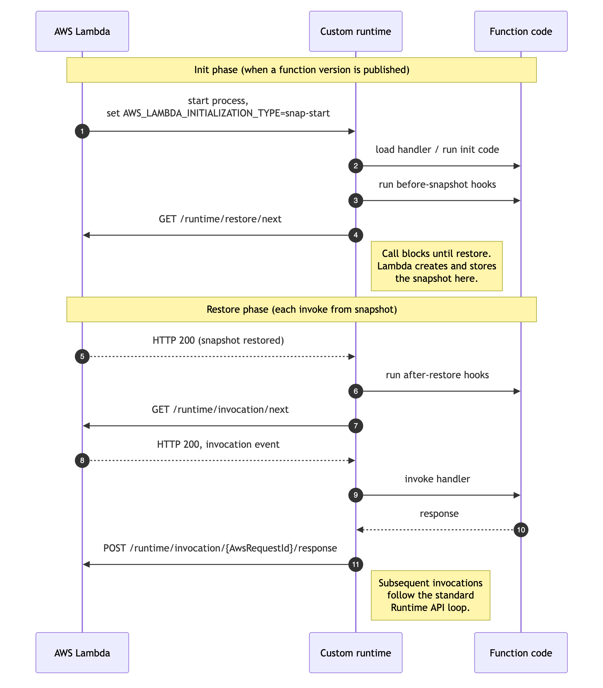

# Implementing SnapStart hooks for container images

## Overview

When using SnapStart with a [container image](images-create.md "images-create.md") function, the runtime
needs to coordinate the function's lifecycle and invoke the before-snapshot and after-restore hooks during the
appropriate lifecycle phases. These hooks let you run custom logic (such as refreshing credentials or
re-seeding random number generators) at points in the snapshot-and-restore lifecycle. If you use a managed
runtime where SnapStart is supported or the corresponding base images for those runtimes (Java version 11+,
Python version 3.12+, and .NET version 8+) Lambda coordinates the lifecycle for you. Register your hooks
through the API described in
[Implement code before or after Lambda function snapshots](snapstart-runtime-hooks.md "snapstart-runtime-hooks.md").

If you use your own base container images, Runtime Interface Clients (RICs), or Lambda's base images for
provided.al2023, Node.js, or Ruby, follow the steps on this page to use SnapStart.

## Prerequisites

When Lambda restores a function from a snapshot, any state defined during initialization, such as random
number generators, unique IDs, and cached credentials, is shared across all execution environments restored
from that snapshot. Before using SnapStart with your container-image based Lambda function, review
[Handling uniqueness with Lambda SnapStart](snapstart-uniqueness.md "snapstart-uniqueness.md") and ensure that the requirements
outlined in
[Use cryptographically secure pseudorandom number generators (CSPRNGs)](snapstart-uniqueness.md#snapstart-csprng "snapstart-uniqueness.md#snapstart-csprng")
are met.

After validating that the requirements are met, choose one of the following two options:

1. **Option 1:** If you need before-snapshot and after-restore hooks to run
   custom logic when your function's snapshot is resumed, follow the instructions in the section
   [Implementing SnapStart lifecycle hooks](#snapstart-custom-implement "#snapstart-custom-implement").
2. **Option 2:** If you don't need these hooks, enable SnapStart for this
   container image by specifying the following label within your Dockerfile:

```
LABEL com.amazonaws.lambda.feature.snapstart="Allow"
```

If your container image neither implements the `/restore/next` API nor includes the label,
version publish will fail.

###### Note

These pre-requisites are not required if you use Lambda managed base images for Java (version 11+),
Python (version 3.12+), and .NET (version 8+) as they already coordinate the SnapStart lifecycle and
provide the uniqueness requirements.

## Lifecycle overview

The following diagram shows the order of Runtime API calls that a SnapStart custom runtime is expected to
make. All calls are part of the Runtime API contract; while calls #3, #4, #5, and #6 are specific to
SnapStart.



## Implementing SnapStart lifecycle hooks

To use SnapStart with your container image functions, follow the steps below:

1. **Run before-snapshot hooks and trigger the snapshotting process:** As
   the last step of your function's initialization code, execute the before-snapshot hooks if required and
   trigger the snapshotting process. Perform these steps only if SnapStart is enabled, by checking that
   the value of the `AWS_LAMBDA_INITIALIZATION_TYPE` environment variable is set to
   `snap-start`. Run your registered before-snapshot hooks, then call
   `GET /runtime/restore/next` to trigger the snapshotting process. If a before-snapshot hook
   throws or returns an error, the runtime posts the error to the `/runtime/init/error`
   endpoint. See the pseudo-code samples below:

```
# After all initialization code has finished:

    READ initialization_type FROM environment variable "AWS_LAMBDA_INITIALIZATION_TYPE"

    IF initialization_type IS "snap-start" THEN

        TRY
            EXECUTE registered before-snapshot hooks
        ON ERROR
            POST error to /runtime/init/error
                SET header  Lambda-Runtime-Function-Error-Type  TO  <Category>.<Reason>
                SET body    TO  { errorMessage, errorType, stackTrace }
            EXIT process with non-zero code

        # Signal readiness for snapshot
        SEND GET request to /runtime/restore/next
        # The request blocks until Lambda restores the execution environment from the snapshot, then returns HTTP 200.

    END IF
```

###### Note

The init phase and before-snapshot hooks share a combined timeout of
`max(function_timeout, 130 seconds)`. If this limit is exceeded, Lambda fails the
PublishVersion request. Additionally, like `/runtime/invocation/next`,
`/runtime/restore/next` call is a blocking call. It blocks until Lambda restores the
execution environment from the snapshot. 2. **Run after-restore hooks, then enter the invoke loop.** When
`GET /runtime/restore/next` returns 200, your runtime must execute any registered
after-restore hooks before proceeding to the invoke loop. If an after-restore hook fails, report
the error to `/runtime/restore/error`.
After the after-restore hooks complete, enter the standard invoke loop by calling
`GET /runtime/invocation/next`. From this point on, the behavior is identical to a function
that doesn't use SnapStart. See the pseudo-code samples below:

```
# After the snapshot has been restored
# (i.e., GET /runtime/restore/next has returned HTTP 200):

    TRY
        EXECUTE registered after-restore hooks
    ON ERROR
        POST error to /runtime/restore/error
            SET header  Lambda-Runtime-Function-Error-Type  TO  <Category>.<Reason>
            SET body    TO  { errorMessage, errorType, stackTrace }

# Proceed to the invoke loop
```

## Error handling

If a hook fails, the runtime must report the error to the appropriate API endpoint and exit the process. The
table below summarizes the behavior for each phase:

| Phase                  | Error API endpoint            | What happens on failure                                                                              |
| ---------------------- | ----------------------------- | ---------------------------------------------------------------------------------------------------- |
| Init / before-snapshot | `POST /runtime/init/error`    | Lambda fails the PublishVersion request. Exit the process.                                           |
| After-restore          | `POST /runtime/restore/error` | Lambda fails the in-flight invocation and tears down the execution environment. Exit the<br>process. |

For both API endpoints, set the `Lambda-Runtime-Function-Error-Type` header to a value in the
format `<Category.Reason>` (for example, `Runtime.BeforeSnapshotError` or
`Runtime.AfterRestoreError`). Include an error body with `errorMessage`,
`errorType`, and an optional `stackTrace`.

For the complete API endpoint specification and response codes, see
[Initialization error](runtimes-api.md#runtimes-api-initerror "runtimes-api.md#runtimes-api-initerror") and
[Restore error (only applicable for SnapStart)](runtimes-api.md#runtimes-api-restore-error "runtimes-api.md#runtimes-api-restore-error") in the Runtime API
reference.
