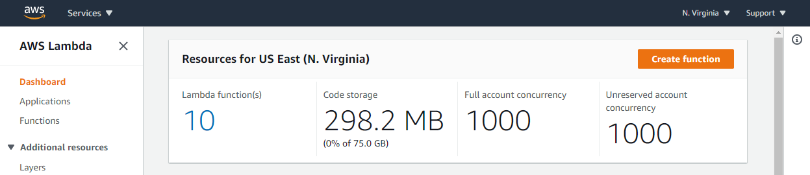

# Troubleshoot deployment issues in Lambda

When you update your function, Lambda deploys the change by launching new instances of the
function with the updated code or settings. Deployment errors prevent the new version from being
used and can arise from issues with your deployment package, code, permissions, or tools.

When you deploy updates to your function directly with the Lambda API or with a client such
as the AWS CLI, you can see errors from Lambda directly in the output. If you use services like
AWS CloudFormation, AWS CodeDeploy, or AWS CodePipeline, look for the response from Lambda in the logs or event
stream for that service.

The following topics provide troubleshooting advice for errors and issues that you might
encounter when using the Lambda API, console, or tools. If you find an issue that is not listed
here, you can use the **Feedback** button on this page to report it.

For more troubleshooting advice and answers to common support questions, visit the [AWS Knowledge
Center](https://aws.amazon.com/premiumsupport/knowledge-center/#AWS_Lambda "https://aws.amazon.com/premiumsupport/knowledge-center/#AWS_Lambda").

For more information about debugging and troubleshooting Lambda applications, see [Debugging](https://serverlessland.com/content/service/lambda/guides/aws-lambda-operator-guide/debugging-ops "https://serverlessland.com/content/service/lambda/guides/aws-lambda-operator-guide/debugging-ops") in Serverless Land.

###### Topics

- [General: Permission is denied / Cannot
  load such file](#troubleshooting-deployment-denied "#troubleshooting-deployment-denied")
- [General: Error occurs when
  calling the UpdateFunctionCode](#troubleshooting-deployment-updatefunctioncode "#troubleshooting-deployment-updatefunctioncode")
- [Amazon S3: Error Code
  PermanentRedirect.](#troubleshooting-deployment-PermanentRedirect "#troubleshooting-deployment-PermanentRedirect")
- [General: Cannot find, cannot
  load, unable to import, class not found, no such file or directory](#troubleshooting-deployment-functionHandler1 "#troubleshooting-deployment-functionHandler1")
- [General: Undefined method
  handler](#troubleshooting-deployment-functionHandler2 "#troubleshooting-deployment-functionHandler2")
- [General: Lambda code storage
  limit exceeded](#troubleshooting-deployment-CodeStorageExceeded "#troubleshooting-deployment-CodeStorageExceeded")
- [Lambda: Layer conversion
  failed](#troubleshooting-deployment-LayerConversionFailed "#troubleshooting-deployment-LayerConversionFailed")
- [Lambda:
  InvalidParameterValueException or RequestEntityTooLargeException](#troubleshooting-deployment-InvalidParameterValueException1 "#troubleshooting-deployment-InvalidParameterValueException1")
- [Lambda:
  InvalidParameterValueException](#troubleshooting-deployment-InvalidParameterValueException2 "#troubleshooting-deployment-InvalidParameterValueException2")
- [Lambda: Concurrency and memory
  quotas](#troubleshooting-deployment-quotas "#troubleshooting-deployment-quotas")
- [Lambda: Invalid alias
  configuration for provisioned concurrency](#troubleshooting-deployment-provisioned-concurrency "#troubleshooting-deployment-provisioned-concurrency")

## General: Permission is denied / Cannot

load such file

**Error:**
_EACCES: permission denied, open '/var/task/index.js'_

**Error:**
_cannot load such file -- function_

**Error:**
_[Errno 13] Permission denied: '/var/task/function.py'_

The Lambda runtime needs permission to read the files in your deployment package. In Linux permissions octal notation, Lambda needs 644 permissions
for non-executable files (rw-r--r--) and 755 permissions (rwxr-xr-x) for directories and executable files.

In Linux and MacOS, use the `chmod` command to change file permissions on files and directories in your deployment package. For
example, to give a non-executable file the correct permissions, run the following command.

```
`chmod 644 <filepath>`
```

To change file permissions in Windows, see [Set, View, Change, or Remove Permissions on an Object](<https://learn.microsoft.com/en-us/previous-versions/windows/it-pro/windows-server-2008-R2-and-2008/cc731667(v=ws.10)> "https://learn.microsoft.com/en-us/previous-versions/windows/it-pro/windows-server-2008-R2-and-2008/cc731667(v=ws.10)")
in the Microsoft Windows documentation.

###### Note

If you don't grant Lambda the permissions it needs to access directories in your deployment package, Lambda sets the permissions for those directories to 755 (rwxr-xr-x).

## General: Error occurs when

calling the UpdateFunctionCode

**Error:**
_An error occurred (RequestEntityTooLargeException) when calling the
UpdateFunctionCode operation_

When you upload a deployment package or layer archive directly to Lambda, the size of the
ZIP file is limited to 50 MB. To upload a larger file, store it in Amazon S3 and use the S3Bucket
and S3Key parameters.

###### Note

When you upload a file directly with the AWS CLI, AWS SDK, or otherwise, the binary ZIP
file is converted to base64, which increases its size by about 30%. To allow for this, and
the size of other parameters in the request, the actual request size limit that Lambda
applies is larger. Due to this, the 50 MB limit is approximate.

## Amazon S3: Error Code

PermanentRedirect.

**Error:**
_Error occurred while GetObject. S3 Error Code: PermanentRedirect. S3 Error Message:
The bucket is in this region: us-east-2. Please use this region to retry the
request_

When you upload a function's deployment package from an Amazon S3 bucket, the bucket must be in
the same Region as the function. This issue can occur when you specify an Amazon S3 object in a
call to [UpdateFunctionCode](../api/API_UpdateFunctionCode.md "../api/API_UpdateFunctionCode.md"), or use the package and deploy commands in the AWS CLI or AWS SAM
CLI. Create a deployment artifact bucket for each Region where you develop
applications.

## General: Cannot find, cannot

load, unable to import, class not found, no such file or directory

**Error:**
_Cannot find module 'function'_

**Error:**
_cannot load such file -- function_

**Error:**
_Unable to import module 'function'_

**Error:**
_Class not found: function.Handler_

**Error:**
_fork/exec /var/task/function: no such file or directory_

**Error:**
_Unable to load type 'Function.Handler' from assembly 'Function'._

The name of the file or class in your function's handler configuration doesn't match your
code. See the following section for more information.

## General: Undefined method

handler

**Error:**
_index.handler is undefined or not exported_

**Error:**
_Handler 'handler' missing on module 'function'_

**Error:**
_undefined method `handler' for
#<LambdaHandler:0x000055b76ccebf98>_

**Error:**
_No public method named handleRequest with appropriate method signature found on
class function.Handler_

**Error:**
_Unable to find method 'handleRequest' in type 'Function.Handler' from assembly
'Function'_

The name of the handler method in your function's handler configuration doesn't match your
code. Each runtime defines a naming convention for handlers, such as
`filename`.`methodname`. The handler is
the method in your function's code that the runtime runs when your function is invoked.

For some languages, Lambda provides a library with an interface that expects a handler
method to have a specific name. For details about handler naming for each language, see the
following topics.

- [Building Lambda functions with Node.js](lambda-nodejs.md "lambda-nodejs.md")
- [Building Lambda functions with Python](lambda-python.md "lambda-python.md")
- [Building Lambda functions with Ruby](lambda-ruby.md "lambda-ruby.md")
- [Building Lambda functions with Java](lambda-java.md "lambda-java.md")
- [Building Lambda functions with Go](lambda-golang.md "lambda-golang.md")
- [Building Lambda functions with C#](lambda-csharp.md "lambda-csharp.md")
- [Building Lambda functions with PowerShell](lambda-powershell.md "lambda-powershell.md")

## General: Lambda code storage

limit exceeded

**Error:**
_Code storage limit exceeded._

Lambda stores your function code in an internal S3 bucket that's private to your account.
Each AWS account is allocated 75 GB of storage in each Region. Code storage includes the
total storage used by both Lambda functions and layers. If you reach the quota, you receive a
_CodeStorageExceededException_ when you attempt to deploy new
functions.

Manage the storage space available by cleaning up old versions of functions, removing
unused code, or using Lambda layers. In addition, it's good practice to [use separate AWS accounts for separate workloads](concepts-application-design.md#multiple-accounts "concepts-application-design.md#multiple-accounts") to
help manage storage quotas.

You can view your total storage usage in the Lambda console, under the
**Dashboard** submenu:



## Lambda: Layer conversion

failed

**Error:**
_Lambda layer conversion failed. For advice on resolving this issue, see the
Troubleshoot deployment issues in Lambda page in the Lambda User Guide._

When you configure a Lambda function with a layer, Lambda merges the layer with your
function code. If this process fails to complete, Lambda returns this error. If you encounter
this error, take the following steps:

- Delete any unused files from your layer
- Delete any symbolic links in your layer
- Rename any files that have the same name as a directory in any of your function's
  layers

## Lambda:

InvalidParameterValueException or RequestEntityTooLargeException

**Error:**
_InvalidParameterValueException: Lambda was unable to configure your environment
variables because the environment variables you have provided exceeded the 4KB limit. String
measured: {"A1":"uSFeY5cyPiPn7AtnX5BsM..._

**Error:**
_RequestEntityTooLargeException: Request must be smaller than 5120 bytes for the
UpdateFunctionConfiguration operation_

The maximum size of the variables object that is stored in the function's configuration
must not exceed 4096 bytes. This includes key names, values, quotes, commas, and brackets. The
total size of the HTTP request body is also limited.

```
{
    "FunctionName": "my-function",
    "FunctionArn": "arn:aws:lambda:us-east-2:123456789012:function:my-function",
    "Runtime": "nodejs22.x",
    "Role": "arn:aws:iam::123456789012:role/lambda-role",
    "Environment": {
        "Variables": `{
 "BUCKET": "amzn-s3-demo-bucket",
 "KEY": "file.txt"
 }`
    },
    ...
}
```

In this example, the object is 39 characters and takes up 39 bytes when it's stored
(without white space) as the string
`{"BUCKET":"amzn-s3-demo-bucket","KEY":"file.txt"}`. Standard ASCII characters in
environment variable values use one byte each. Extended ASCII and Unicode characters can use
between 2 bytes and 4 bytes per character.

## Lambda:

InvalidParameterValueException

**Error:**
_InvalidParameterValueException: Lambda was unable to configure your environment
variables because the environment variables you have provided contains reserved keys that
are currently not supported for modification._

Lambda reserves some environment variable keys for internal use. For example,
`AWS_REGION` is used by the runtime to determine the current Region and cannot be
overridden. Other variables, like `PATH`, are used by the runtime but can be
extended in your function configuration. For a full list, see [Defined runtime environment variables](configuration-envvars.md#configuration-envvars-runtime "configuration-envvars.md#configuration-envvars-runtime").

## Lambda: Concurrency and memory

quotas

**Error:** _Specified ConcurrentExecutions for
function decreases account's UnreservedConcurrentExecution below its minimum
value_

**Error:** _'MemorySize' value failed to satisfy
constraint: Member must have value less than or equal to 3008_

These errors occur when you exceed the concurrency or memory [quotas](gettingstarted-limits.md "gettingstarted-limits.md") for your account. New AWS accounts have
reduced concurrency and memory quotas. To resolve errors related to concurrency, you can
[request a quota increase](../../../servicequotas/latest/userguide/request-quota-increase.md "../../../servicequotas/latest/userguide/request-quota-increase.md"). You
cannot request memory quota increases.

- **Concurrency:** You might get an error if you try to
  create a function using reserved or provisioned concurrency, or if your per-function
  concurrency request ([PutFunctionConcurrency](../api/API_PutFunctionConcurrency.md "../api/API_PutFunctionConcurrency.md")) exceeds your account's concurrency
  quota.
- **Memory:** Errors occur if the amount of memory
  allocated to the function exceeds your account's memory quota.

## Lambda: Invalid alias

configuration for provisioned concurrency

**Error:** _Invalid alias configuration for
provisioned concurrency_

This error occurs when you try to update a Lambda function's code or configuration while
an alias with provisioned concurrency is pointing to a version that has issues. Lambda
pre-initializes execution environments for provisioned concurrency, and if these environments
can't be properly initialized due to code errors, resource constraints, or affected stack and
alias, the deployment fails. If you encounter this issue, take the following steps:

1. **Roll back the alias:** Temporarily update the alias to
   point to the previously working version.

```
 `aws lambda update-alias \
 --function-name <function-name> \
 --name <alias-name> \
 --function-version <known-good-version>`
```

2. **Fix Lambda initialization code:** Ensure the
   initialization code that runs outside the handler doesn't have any uncaught exceptions
   and initialize the clients and connections.
3. **Redeploy safety:** Deploy fixed code and publish a new
   version. Then, update alias to point to the fixed version. Optionally, re-enable [provisioned concurrency](provisioned-concurrency.md "provisioned-concurrency.md"), if necessary.

If using AWS CloudFormation, update stack definition `FunctionVersion:!GetAtt
 version.Version` so that the alias points to the working version:

```
alias:
 Type: AWS::Lambda::Alias
 Properties:
 `FunctionName: !Ref function
FunctionVersion: !GetAtt version.Version
 Name: BLUE
 ProvisionedConcurrencyConfig:
 ProvisionedConcurrentExecutions: 1`
```
