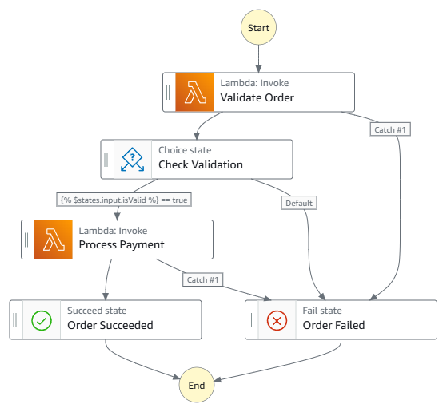
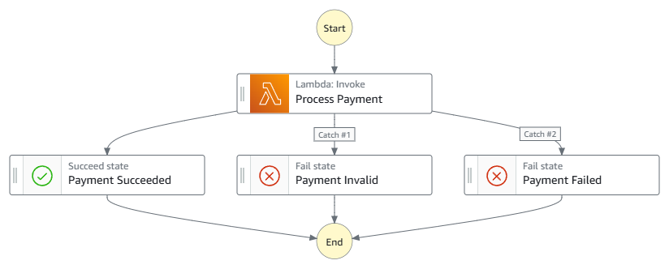
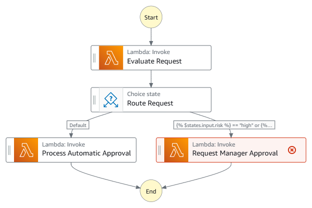
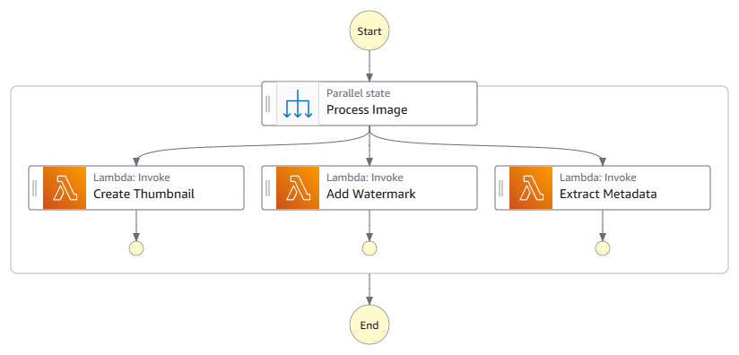

# Orchestrating Lambda functions with Step Functions

Lambda functions that manage multiple tasks, implement retry logic, or contain branching logic are anti-patterns. Instead, we recommend writing Lambda functions that perform single tasks and using AWS Step Functions to orchestrate your application workflows.

For example, processing an order might require validating the order details, checking inventory levels, processing payment, and generating an invoice. Write separate Lambda functions for each task and use Step Functions to manage the workflow. Step Functions coordinates the flow of data between your functions and handles errors at each step. This separation makes your workflows easier to visualize, modify, and maintain as they grow more complex.

## When to use Step Functions with Lambda

The following scenarios are good examples of when to use Step Functions to orchestrate Lambda-based applications.

- [Sequential processing](#sequential-processing "#sequential-processing")
- [Complex error handling](#complex-error-handling "#complex-error-handling")
- [Conditional workflows and human approvals](#conditional-workflows-human-approvals "#conditional-workflows-human-approvals")
- [Parallel processing](#parallel-processing "#parallel-processing")

### Sequential processing

Sequential processing is when one task must complete before the next task can begin. For example, in an order processing system, payment processing can't begin until order validation is complete, and invoice generation must wait for payment confirmation. Write separate Lambda functions for each task and use Step Functions to manage the sequence and handle data flow between functions.

A single Lambda function manages the entire order processing workflow by:

- Invoking other Lambda functions in sequence
- Parsing and validating responses from each function
- Implementing error handling and recovery logic
- Managing the flow of data between functions
  Use two Lambda functions: one to validate the order and one to process the payment. Step Functions coordinates these functions by:

- Running tasks in the correct sequence
- Passing data between functions
- Implementing error handling at each step
- Using [Choice](../../../step-functions/latest/dg/state-choice.md "../../../step-functions/latest/dg/state-choice.md") states to ensure only valid orders proceed to payment

###### Example workflow graph

### Complex error handling

While Lambda provides [retry capabilities for asynchronous invocations and event source mappings](invocation-retries.md "invocation-retries.md"), Step Functions offers more sophisticated error handling for complex workflows. You can [configure automatic retries](../../../step-functions/latest/dg/concepts-error-handling.md#error-handling-retrying-after-an-error "../../../step-functions/latest/dg/concepts-error-handling.md#error-handling-retrying-after-an-error") with exponential backoff and set different retry policies for different types of errors. When retries are exhausted, use `Catch` to route errors to a [fallback state](../../../step-functions/latest/dg/concepts-error-handling.md#error-handling-fallback-states "../../../step-functions/latest/dg/concepts-error-handling.md#error-handling-fallback-states"). This is particularly useful when you need workflow-level error handling that coordinates multiple functions and services.

To learn more about handling Lambda function errors in a state machine, see [Handling errors](https://catalog.workshops.aws/stepfunctions/handling-errors "https://catalog.workshops.aws/stepfunctions/handling-errors") in _The AWS Step Functions Workshop_.

A single Lambda function handles all of the following:

- Attempts to call a payment processing service
- If the payment service is unavailable, the function waits and tries again later.
- Implements a custom exponential backoff for the wait time
- After all attempts fail, catch the error and choose another flow
  Use a single Lambda function focused solely on payment processing. Step Functions manages error handling by:

- Automatically [retrying failed tasks with configurable backoff periods](../../../step-functions/latest/dg/concepts-error-handling.md#error-handling-retrying-after-an-error "../../../step-functions/latest/dg/concepts-error-handling.md#error-handling-retrying-after-an-error")
- Applying different retry policies based on error types
- Routing different types of errors to appropriate fallback states
- Maintaining error handling state and history

###### Example workflow graph

### Conditional workflows and human approvals

Use the Step Functions [Choice state](../../../step-functions/latest/dg/state-choice.md "../../../step-functions/latest/dg/state-choice.md") to route workflows based on function output and the [waitForTaskToken suffix](../../../step-functions/latest/dg/connect-to-resource.md#connect-wait-token "../../../step-functions/latest/dg/connect-to-resource.md#connect-wait-token") to pause workflows for human decisions. For example, to process a credit limit increase request, use a Lambda function to evaluate risk factors. Then, use Step Functions to route high-risk requests to manual approval and low-risk requests to automatic approval.

To deploy an example workflow that uses a callback task token integration pattern, see [Callback with Task Token](https://catalog.workshops.aws/stepfunctions/integrating-services/3-callback-token "https://catalog.workshops.aws/stepfunctions/integrating-services/3-callback-token") in _The AWS Step Functions Workshop_.

A single Lambda function manages a complex approval workflow by:

- Implementing nested conditional logic to evaluate credit requests
- Invoking different approval functions based on request amounts
- Managing multiple approval paths and decision points
- Tracking the state of pending approvals
- Implementing timeout and notification logic for approvals
  Use three Lambda functions: one to evaluate the risk of each request, one to approve low-risk requests, and one to route high-risk requests to a manager for review. Step Functions manages the workflow by:

- Using [Choice](../../../step-functions/latest/dg/state-choice.md "../../../step-functions/latest/dg/state-choice.md") states to route requests based on amount and risk level
- Pausing execution while waiting for human approval
- Managing timeouts for pending approvals
- Providing visibility into the current state of each request

###### Example workflow graph

### Parallel processing

Step Functions provides three ways to handle parallel processing:

- The [Parallel state](../../../step-functions/latest/dg/state-parallel.md "../../../step-functions/latest/dg/state-parallel.md") executes multiple branches of your workflow simultaneously. Use this when you need to run different functions in parallel, such as generating thumbnails while extracting image metadata.
- The [Inline Map state](../../../step-functions/latest/dg/state-map-inline.md "../../../step-functions/latest/dg/state-map-inline.md") processes arrays of data with up to 40 concurrent iterations. Use this for small to medium datasets where you need to perform the same operation on each item.
- The [Distributed Map state](../../../step-functions/latest/dg/state-map-distributed.md "../../../step-functions/latest/dg/state-map-distributed.md") handles large-scale parallel processing with up to 10,000 concurrent executions, supporting both JSON arrays and Amazon Simple Storage Service (Amazon S3) data sources. Use this when processing large datasets or when you need higher concurrency.

A single Lambda function attempts to manage parallel processing by:

- Simultaneously invoking multiple image processing functions
- Implementing custom parallel execution logic
- Managing timeouts and error handling for each parallel task
- Collecting and aggregating results from all functions
  Use three Lambda functions: one to create a thumbnail image, one to add a watermark, and one to extract the metadata. Step Functions manages these functions by:

- Running all functions simultaneously using the [Parallel](../../../step-functions/latest/dg/state-parallel.md "../../../step-functions/latest/dg/state-parallel.md") state
- Collecting results from each function into an ordered array
- Managing timeouts and error handling across all parallel executions
- Proceeding only when all parallel branches complete

###### Example workflow graph

## When not to use Step Functions with Lambda

Not all Lambda-based applications benefit from using Step Functions. Consider these scenarios when choosing your application architecture.

- [Simple applications](#simple-applications "#simple-applications")
- [Complex data processing](#complex-data-processing "#complex-data-processing")
- [CPU-intensive workloads](#cpu-intensive "#cpu-intensive")

### Simple applications

For applications that don't require complex orchestration, using Step Functions might add unnecessary complexity. For example, if you're simply processing messages from an Amazon SQS queue or responding to Amazon EventBridge events, you can configure these services to invoke your Lambda functions directly. Similarly, if your application consists of only one or two Lambda functions with straightforward error handling, direct Lambda invocation or event-driven architectures might be simpler to deploy and maintain.

### Complex data processing

You can use the Step Functions [Distributed Map](../../../step-functions/latest/dg/state-map-distributed.md "../../../step-functions/latest/dg/state-map-distributed.md") state to concurrently process large Amazon S3 datasets with Lambda functions. This is effective for many large-scale parallel workloads, including processing semi-structured data like JSON or CSV files. However, for more complex data transformations or advanced analytics, consider these alternatives:

- **Data transformation pipelines**: Use AWS Glue for ETL jobs that process structured or semi-structured data from multiple sources. AWS Glue is particularly useful when you need built-in data catalog and schema management capabilities.
- **Data analytics:** Use Amazon EMR for petabyte-scale data analytics, especially when you need Apache Hadoop ecosystem tools or for machine learning workloads that exceed Lambda's [memory](configuration-memory.md "configuration-memory.md") limits.

### CPU-intensive workloads

While Step Functions can orchestrate CPU-intensive tasks, Lambda functions may not be suitable for these workloads due to their limited CPU resources. For computationally intensive operations within your workflows, consider these alternatives:

- **Container orchestration:** Use Step Functions to manage Amazon Elastic Container Service (Amazon ECS) tasks for more consistent and scalable compute resources.
- **Batch processing:** Integrate AWS Batch with Step Functions for managing compute-intensive batch jobs that require sustained CPU usage.
