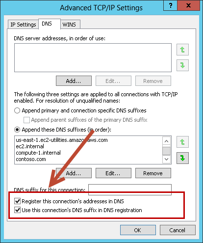

# How AWS Launch Wizard Active Directory works

AWS Launch Wizard provides a complete solution to provision self-managed domain controllers on
Amazon EC2 instances, or AWS Directory Service for Microsoft Active Directory, in the AWS Cloud. You select **Microsoft
Active Directory** in the wizard and provide the specifications, such as the
required number of vCPUs or memory. Based on the infrastructure requirements that you enter,
Launch Wizard automatically provisions the appropriate AWS resources in the cloud. For example,
Launch Wizard recommends an appropriate instance type from the amount of vCPUs that you specify, then
deploys and configures the instances.

Launch Wizard provides an estimated cost of deployment. You can modify your resources and instantly
view an updated cost assessment. Once you approve, Launch Wizard validates the inputs and flags
inconsistencies. After you resolve the inconsistencies, Launch Wizard provisions the resources and
configures them. The result is a ready-to-use Active Directory infrastructure and domain
controllers.

AWS Launch Wizard performs the following tasks to provision Active Directory domain
controllers.

- Sets up the VPC, including private and public subnets in two Availability
  Zones.\*
- Configures two NAT gateways in the public subnets.\*
- Configures private and public routes.\*
- Enables ingress traffic into the VPC for administrative access to Remote Desktop
  Gateway, if specified.
- Uses Secrets Manager to store Domain Administrator credentials.
- Configures security groups and rules for traffic between instances.
- Sets up and configures Active Directory sites and subnets.
- Sets up and deploys Active Directory Certificate Services with a new Active
  Directory infrastructure. \* If you deploy Launch Wizard into an existing VPC, the tasks in this list marked by asterisks are
  skipped.

###### Topics

- [Deployment path](#launch-wizard-ad-deployment-options "#launch-wizard-ad-deployment-options")
- [Implementation details](#launch-wizard-ad-implementation "#launch-wizard-ad-implementation")
- [Domain controller launch limits](#launch-wizard-ad-limits "#launch-wizard-ad-limits")
- [AWS Regions](#launch-wizard-ad-regions "#launch-wizard-ad-regions")

## Deployment path

Launch Wizard supports the following deployment path for provisioning self-managed domain
controllers or AWS Managed Microsoft AD.

### Deploy and manage your

own domain controllers on Amazon EC2 instances

Launch Wizard builds the AWS Cloud infrastructure, and sets up and configures Active
Directory Domain Services (AD DS) and Active Directory-integrated DNS on the AWS
Cloud. For self-managed domain controllers, you handle all AD DS maintenance and
monitoring tasks. You can deploy the domain controllers or AWS Managed Microsoft AD into a new
or existing VPC infrastructure.

## Implementation details

This section describes how Launch Wizard implements an Active Directory Domain Services (AD DS)
deployment in the AWS Cloud. It includes details about how to use Amazon Virtual Private Cloud (Amazon VPC) to
define your networks in the cloud, and information about domain controller placement,
Active Directory Sites and Services configuration, and how DNS and DHCP work in a
VPC.

###### Topics

- [VPC](#launch-wizard-ad-implementation-vpc "#launch-wizard-ad-implementation-vpc")
- [Security groups](#launch-wizard-ad-implementation-sg "#launch-wizard-ad-implementation-sg")
- [Remote Desktop Gateway](#launch-wizard-ad-implementation-rdg "#launch-wizard-ad-implementation-rdg")
- [Active Directory](#launch-wizard-ad-implementation-ad "#launch-wizard-ad-implementation-ad")
- [Self-managed domain controller
  architecture](#launch-wizard-ad-architecture "#launch-wizard-ad-architecture")

### VPC

You can define a virtual network topology that closely resembles a traditional
on-premises network using Amazon VPC. A VPC can span multiple Availability Zones place
independent infrastructure in physically separate locations. A multi-Availability
Zone deployment results in high availability and fault tolerance. Launch Wizard provisions
domain controllers in two Availability Zones to provide highly available, low
latency access to AD DS services in the AWS Cloud.

Launch Wizard can build a new VPC for the deployment, or deploy into an existing VPC. To
accommodate highly available AD DS in the AWS Cloud, Launch Wizard builds (or requires, in
the case of existing VPCs) a base Amazon VPC configuration that complies with the
following AWS best practices:

- Domain controllers must be placed in a minimum of two Availability Zones
  to provide high availability.
- Domain controllers and other non-internet facing servers must be placed in
  private subnets.
- Launched instances require internet access to connect to the AWS CloudFormation
  endpoint during the bootstrapping process. To support this configuration,
  public subnets are used to host NAT gateways for outbound internet access.
  Remote Desktop Gateways are also deployed into the public subnets for remote
  administration. Other components such as reverse proxy servers can be placed
  into these public subnets, if needed.

This VPC architecture uses two Availability Zones, each with its own distinct
public and private subnets. We recommend that you leave plenty of unallocated
address space to support the growth of your environment over time and to reduce the
complexity of your VPC subnet design. Launch Wizard uses a default VPC configuration that
provides plenty of address space by using the minimum number of private and public
subnets. By default, Launch Wizard uses the following CIDR ranges.

| VPC                 | 10.0.0.0/16         |               |
| ------------------- | ------------------- | ------------- | --------------------------------------------------------------------------------------------------------------------------------------------------------------------------------------------------------------------------------------------------------------------------------------------------------------------------------------------------------------------------------------------------------------------------------------------------------------------------------------------------------------------------------------------------------------------------------------------------------------------------------------------------------------------------------------------------------------------------------------------------------------------------------------------------------------------------------------------------------------------------------------------------------------------------------------------------------------------------------------------------------------------------------------------------------------------------------------------------------------------------------------------------------------------------------------------------------------------------------------------------------------------------------------------------------------------------------------------------------------------------------------------------------------------------------------------------------------------------------------------------------------------------------------------------------------------------------------------------------------------------------------------------------------------------------------------------------------------------------------------------------------------------------------------------------------------------------------------------------------------------------------------------------------------------------------------------------------------------------------------------------------------------------------------------------------------------------------------------------------------------------------------------------------------------------------------------------------------------------------------------------------------------------------------------------------------------------------------------------------------------------------------------------------------------------------------------------------------------------------------------------------------------------------------------------------------------------------------------------------------------------------------------------------------------------------------------------------------------------------------------------------------------------------------------------------------------------------------------------------------------------------------------------------------------------------------------------------------------------------------------------------------------------------------------------------------------------------------------------------------------------------------------------------------------------------------------------------------------------------------------------------------------------------------------------------------------------------------------------------------------------------------------------------------------------------------------------------------------------------------------------------------------------------------------------------------------------------------------------------------------------------------------------------------------------------------------------------------------------------------------------------------------------------------------------------------------------------------------------------------------------------------------------------------------------------------------------------------------------------------------------------------------------------------------------------------------------------------------------------------------------------------------------------------------------------------------------------------------------------------------------------------------------------------------------------------------------------------------------------------------------------------------------------------------------------------------------------------------------------------------------------------------------------------------------------------------------------------------------------------------------------------------------------------------------------------------------------------------------------------------------------------------------------------------------------------------------------------------------------------------------------------------------------------------------------------------------------------------------------------------------------------------------------------------------------------------------------------------------------------------------------------------------------------------------------------------------------------------------------------------------------------------------------------------------------------------------------------------------------------------------------------------------------------------------------------------------------------------------------------------------------------------------------------------------------------------------------------------------------------------------------------------------------------------------------------------------------------------------------------------------------------------------------------------------------------------------------------------------------------------------------------------------------------------------------------------------------------------------------------------------------------------------------------------------------------------------------------------------------------------------------------------------------------------------------------------------------------------------------------------------------------------------------------------------------------------------------------------------------------------------------------------------------------------------------------------------------------------------------------------------------------------------------------------------------------------------------------------------------------------------------------------------------------------------------------------------------------------------------------------------------------------------------------------------------------------------------------------------------------------------------------------------------------------------------------------------------------------------------------------------------------------------------------------------------------------------------------------------------------------------------------------------------------------------------------------------------------------------------------------------------------------------------------------------------------------------------------------------------------------------------------------------------------------------------------------------------------------------------------------------------------------------------------------------------------------------------------------------------------------------------------------------------------------------------------------------------------------------------------------------------------------------------------------------------------------------------------------------------------------------------------------------------------------------------------------------------------------------------------------------------------------------------------------------------------------------------------------------------------------------------------------------------------------------------------------------------------------------------------------------------------------------------------------------------------------------------------------------------------------------------------------------------------------------------------------------------------------------------------------------------------------------------------------------------------------------------------------------------------------------------------------------------------------------------------------------------------------------------------------------------------------------------------------------------------------------------------------------------------------------------------------------------------------------------------------------------------------------------------------------------------------------------------------------------------------------------------------------------------------------------------------------------------------------------------------------------------------------------------------------------------------------------------------------------------------------------------------------------------------------------------------------------------------------------------------------------------------------------------------------------------------------------------------------------------------------------------------------------------------------------------------------------------------------------------------------------------------------------------------------------------------------------------------------------------------------------------------------------------------------------------------------------------------------------------------------------------------------------------------------------------------------------------------------------------------------------------------------------------------------------------------------------------------------------------------------------------------------------------------------------------------------------------------------------------------------------------------------------------------------------------------------------------------------------------------------------------------------------------------------------------------------------------------------------------------------------------------------------------------------------------------------------------------------------------------------------------------------------------------------------------------------------------------------------------------------------------------------------------------------------------------------------------------------------------------------------------------------------------------------------------------------------------------------------------------------------------------------------------------------------------------------------------------------------------------------------------------------------------------------------------------------------------------------------------------------------------------------------------------------------------------------------------------------------------------------------------------------------------------------------------------------------------------------------------------------------------------------------------------------------------------------------------------------------------------------------------------------------------------------------------------------------------------------------------------------------------------------------------------------------------------------------------------------------------------------------------------------------------------------------------------------------------------------------------------------------------------------------------------------------------------------------------------------------------------------------------------------------------------------------------------------------------------------------------------------------------------------------------------------------------------------------------------------------------------------- | ------------ |
| Private subnets A   | 10.0.0.0/20         |               |
| Availability Zone 1 | 10.0.0.0/20         |               | Availability Zone 2                                                                                                                                                                                                                                                                                                                                                                                                                                                                                                                                                                                                                                                                                                                                                                                                                                                                                                                                                                                                                                                                                                                                                                                                                                                                                                                                                                                                                                                                                                                                                                                                                                                                                                                                                                                                                                                                                                                                                                                                                                                                                                                                                                                                                                                                                                                                                                                                                                                                                                                                                                                                                                                                                                                                                                                                                                                                                                                                                                                                                                                                                                                                                                                                                                                                                                                                                                                                                                                                                                                                                                                                                                                                                                                                                                                                                                                                                                                                                                                                                                                                                                                                                                                                                                                                                                                                                                                                                                                                                                                                                                                                                                                                                                                                                                                                                                                                                                                                                                                                                                                                                                                                                                                                                                                                                                                                                                                                                                                                                                                                                                                                                                                                                                                                                                                                                                                                                                                                                                                                                                                                                                                                                                                                                                                                                                                                                                                                                                                                                                                                                                                                                                                                                                                                                                                                                                                                                                                                                                                                                                                                                                                                                                                                                                                                                                                                                                                                                                                                                                                                                                                                                                                                                                                                                                                                                                                                                                                                                                                                                                                                                                                                                                                                                                                                                                                                                                                                                                                                                                                                                                                                                                                                                                                                                                                                                                                                                                                                                                                                                                                                                                                                                                                                                                                                                                                                                                                                                                                                                                                                                                                                                                                                                                                                                                                                                                                                                                                                                                                                                                                                                                                                                                                                                                                                                                                                                                                                                                                                                                                                                                                                                                                                                                                                                                                                                                                                                                                                                                                                                                                                                                                                                                                                                                                                                                                                                                                                                                                                                                                                                                                                                                                                                                                                                                                                                                                                                                                                                                                                                                                                                                                                                                                                                                                                                                                                                                                                                                       | 10.0.16.0/20 |
| Availability Zone 3 | 10.0.32.0/20        |
| Public subnets      | Availability Zone 1 | 10.0.128.0/20 | In addition, Launch Wizard provisions spare capacity for additional subnets to support your environment as it grows or changes over time. If you have sensitive workloads that must be completely isolated from the internet, you can create new VPC subnets using these optional address spaces. ### Security groups Amazon EC2 instances must be associated with a security group, which acts as a stateful firewall. You control the network traffic entering or leaving the security group, and you can create rules that are defined by protocol, port number, and source/destination IP address, or other security groups. By default, all egress traffic from a security group is permitted. However, ingress traffic must be configured to allow the desired traffic to reach your instances. The [Securing the Microsoft Platform on Amazon Web Services whitepaper](https://d1.awsstatic.com/whitepapers/aws-microsoft-platform-security.pdf?trk=wp_card "https://d1.awsstatic.com/whitepapers/aws-microsoft-platform-security.pdf?trk=wp_card") explains the different methods for securing your AWS infrastructure. Recommendations include providing isolation between application tiers by using security groups. We recommend that you tightly control ingress traffic in order to reduce the attack surface of your Amazon EC2 instances. If you are deploying and managing your own AD DS installation, domain controllers and member servers will require several security group rules to allow traffic for services. These rules include AD DS replication, user authentication, Windows Time services, and Distributed File System (DFS). You should also consider restricting these rules to specific IP subnets that are used within your VPC. For a detailed list of port mappings used by AWS CloudFormation, see the [Security best practices](launch-wizard-ad-best-practices.md#launch-wizard-ad-security "launch-wizard-ad-best-practices.md#launch-wizard-ad-security") in this guide. For a complete list of ports, see [Active Directory and Active Directory Domain Services Port Requirements](<http://technet.microsoft.com/library/dd772723(v=ws.10).aspx> "http://technet.microsoft.com/library/dd772723(v=ws.10).aspx") in the Microsoft TechNet Library and [How to configure a firewall for Active Directory domains and trusts](https://docs.microsoft.com/en-us/troubleshoot/windows-server/identity/config-firewall-for-ad-domains-and-trusts "https://docs.microsoft.com/en-us/troubleshoot/windows-server/identity/config-firewall-for-ad-domains-and-trusts") for forest trusts. For guidance on implementing rules, see [Adding Rules to a Security Group](../../../AWSEC2/latest/UserGuide/using-network-security.md#adding-security-group-rule "../../../AWSEC2/latest/UserGuide/using-network-security.md#adding-security-group-rule") in the _Amazon EC2 User Guide_. ### Remote Desktop Gateway When you design your architecture for highly available AD DS, you should also design for highly available and secure remote access. Launch Wizard optionally allows for deployment of a Remote Desktop (RD) Gateway server to manage your AD DS instances. RD Gateway uses the Remote Desktop Protocol (RDP) over HTTPS to establish a secure, encrypted connection between remote administrators on the internet and Windows-based Amazon EC2 instances, without the need for a virtual private network (VPN) connection. This configuration reduces the attack surface of your Windows-based Amazon EC2 instances, while providing a remote administration solution for administrators. ###### Important Never open up RDP to the entire internet even temporarily or for testing purposes. Always restrict ports and source traffic to the minimum necessary to support the functionality of the application. ### Active Directory This section provides information about key design considerations specific to a Launch Wizard deployment of Active Directory Domain Services (AD DS) domain controllers on AWS. ###### Active Directory deployment topics  • [Highly available directory domain services](#launch-wizard-ad-implementation-domain-controllers "#launch-wizard-ad-implementation-domain-controllers")  • [Active Directory DNS and DHCP inside the VPC](#launch-wizard-ad-implementation-dns-dhcp "#launch-wizard-ad-implementation-dns-dhcp")  • [DNS settings on Windows Servers instances](#launch-wizard-ad-dns-settings "#launch-wizard-ad-dns-settings")  • [Active Directory Certificate Services](#launch-wizard-ad-adcs "#launch-wizard-ad-adcs") #### Highly available directory domain services Launch Wizard deploys two domain controllers in your AWS environment in two Availability Zones. This design provides fault tolerance and prevents a single domain controller failure from affecting the availability of the AD DS. To strengthen the high availability of your architecture and help mitigate the impact of a possible disaster, each domain controller deployed by Launch Wizard is a global catalog server and an Active Directory DNS server. When you choose to deploy self-managed domain controllers to the AWS Cloud, Launch Wizard automatically builds out an Active Directory Sites and Services configuration that supports a highly available AD DS architecture. For information about creating sites, adding global catalog servers, and creating and managing site links, see the [Microsoft Active Directory Sites and Services](http://technet.microsoft.com/library/cc730868.aspx "http://technet.microsoft.com/library/cc730868.aspx") documentation. #### Active Directory DNS and DHCP inside the VPC Dynamic Host Configuration Protocol (DHCP) services are provided by default for your instances within a VPC. DHCP scopes do not need to be managed; they are created for the VPC subnets you define when you deploy your solution. These DHCP services cannot be disabled, so you must use them rather than deploying your own DHCP server. The VPC also provides an internal DNS server. This DNS provides instances with basic name resolution services for internet access and is crucial for access to AWS service endpoints, such as AWS CloudFormation and Amazon S3 during bootstrapping. Amazon-provided DNS server settings will be assigned to instances launched into the VPC based on a DHCP options set. DHCP options sets are used within an Amazon VPC to define scope options, such as the domain name or the name servers that should be handed to your instances via DHCP. Amazon-provided DNS is used only for public DNS resolution. Because Amazon-provided DNS cannot be used to provide name resolution services for Active Directory, you must ensure that domain-joined Windows instances are configured to use Active Directory DNS. Launch Wizard statically assigns Active Directory DNS server addresses on Windows instances. You can alternatively specify them using a custom DHCP options set. This allows you to assign your Active Directory DNS suffix and DNS server IP addresses as the name servers within the VPC through DHCP. ###### Note The IP addresses in the `domain-name-servers` field are always returned in the same order. If the first DNS server in the list fails, instances should fall back to the second IP and continue to resolve host names successfully. However, during normal operations, the first DNS server listed will always handle DNS requests. If you want to ensure that DNS queries are distributed evenly across multiple servers, you should consider statically configuring DNS server settings on your instances. For more information about creating a custom DHCP options set and associating it with your VPC, see [Working with DHCP Options Sets](../../../vpc/latest/userguide/VPC_DHCP_Options.md#DHCPOptionSet "../../../vpc/latest/userguide/VPC_DHCP_Options.md#DHCPOptionSet") in the _Amazon VPC User Guide_. ###### Note If you choose to deploy self-managed domain controllers in the AWS Cloud, Launch Wizard adds the DNS suffix for your domain to the DNS suffixes list. The DNS settings on the local server point to the IP address of the first domain controller for all of the domain controllers in the infrastructure. #### DNS settings on Windows Servers instances To ensure that domain-joined Windows instances automatically register host (A) and reverse lookup (PTR) records with Active Directory-integrated DNS, set the properties of the network connection as shown in the following image.  The default configuration for a network connection is set to automatically register the connections address in DNS. In other words, the **Register this connection's addresses in DNS** option is selected for you automatically. This takes care of host (A) record dynamic registration. However, if you do not also select the second option, **Use this connection's DNS suffix in DNS registration**, dynamic registration of PTR records will not occur. If you have a small number of instances in the VPC, you may choose to manually configure the network connection. For larger fleets, you can push this setting out to all of your Windows instances by using Active Directory Group Policy. For instructions about how to do this, see [IPv4 and IPv6 Advanced DNS Tab](http://technet.microsoft.com/library/cc754143.aspx "http://technet.microsoft.com/library/cc754143.aspx") in the Microsoft TechNet Library. #### Active Directory Certificate Services Launch Wizard sets up and deploys Active Directory Certificate Services (AD CS) with a new Active Directory infrastructure to issue and manage digital certificates in systems that use public key technologies. For more information about AD CS, see the [Microsoft documentation](<https://docs.microsoft.com/en-us/previous-versions/windows/it-pro/windows-server-2012-R2-and-2012/hh831740(v=ws.11)#role-description> "https://docs.microsoft.com/en-us/previous-versions/windows/it-pro/windows-server-2012-R2-and-2012/hh831740(v=ws.11)#role-description"). ### Self-managed domain controller architecture The Launch Wizard self-managed domain controller deployment sets up the following architecture.  • Domain controllers are deployed into two private VPC subnets in separate Availability Zones, which makes AD DS highly available.  • NAT gateways are deployed to public subnets, providing outbound internet access for instances in private subnets.  • Remote Desktop gateways are deployed in an Auto Scaling group in one Availability Zone to allow access to the domain controllers. Launch Wizard deploys AWS resources, including a Systems Manager Automation document. When the second node is deployed, it initiates running the Automation document through Amazon EC2 user data. The automation workflow deploys the required components, finalizes the configuration to create a new AD forest, and promotes instances in two Availability Zones to Active Directory domain controllers. To view architectural diagrams showing best practices for setting up an AD DS environment, see [Active Directory Domain Services on AWS](https://aws.amazon.com/quickstart/architecture/active-directory-ds/ "https://aws.amazon.com/quickstart/architecture/active-directory-ds/"). ## Domain controller launch limits A single Launch Wizard deployment for Active Directory launches two domain controllers per each AWS Region. If you want to add more domain controllers, you can create additional Launch Wizard for Active Directory deployments to add them to the same Active Directory infrastructure. For more information, see [Extend on-premises Active Directory to an existing VPC](launch-wizard-ad-deploying-existing-vpc-extend.md "launch-wizard-ad-deploying-existing-vpc-extend.md"). ## AWS Regions Launch Wizard uses various AWS services during the provisioning of the application's environment. Not every workload is supported in all AWS Regions. For a current list of Regions where the workload can be provisioned, see [AWS Launch Wizard workload availability](launch-wizard-workload-availability.md "launch-wizard-workload-availability.md"). |
