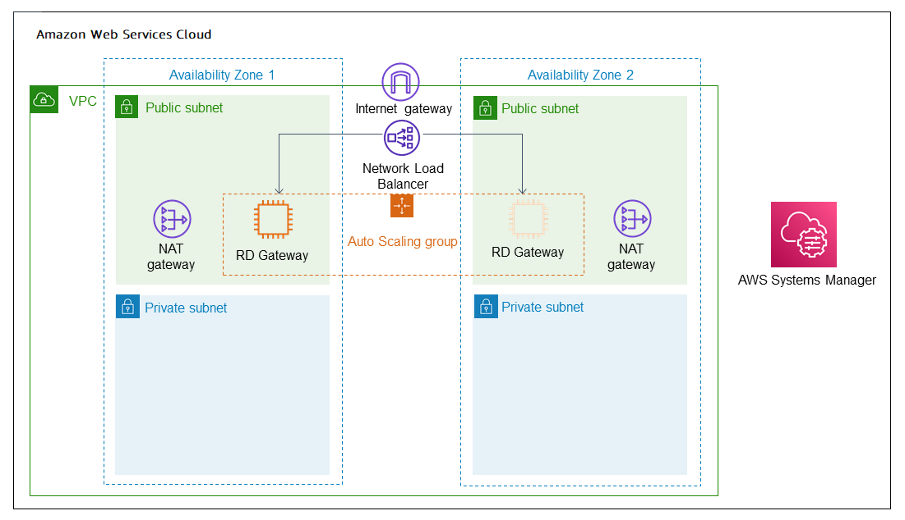

# AWS Launch Wizard for Remote Desktop Gateway

AWS Launch Wizard for Remote Desktop Gateway (RD Gateway) guides you through the sizing,
configuration, and deployment of RD Gateway on the AWS Cloud. RD Gateway uses the Remote Desktop
Protocol (RDP) over HTTPS to establish a secure, encrypted connection between remote users and
Amazon Elastic Compute Cloud instances running Windows, without needing to configure a virtual private network (VPN).
This helps reduce the attack surface on your Windows instances while providing a remote
administration solution for administrators.

## Deployment

options

This Launch Wizard application provides two deployment options:

- **Deploy RD Gateway into a new VPC (end-to-end deployment).**
  Builds a new AWS environment consisting of a VPC, subnets, NAT gateways, security groups, and
  other infrastructure components, and then deploys RD Gateway into this new VPC.
- **Deploy RD Gateway into an existing VPC.** Provisions
  standalone RD Gateway instances in your existing AWS infrastructure.

AWS Launch Wizard provides separate templates for these two deployment types. You can also configure
CIDR blocks, instance types, and RD Gateway settings.

## AWS Regions

Launch Wizard uses various AWS services during the provisioning of the application's environment.
Not every workload is supported in all AWS Regions. For a current list of Regions where the
workload can be provisioned, see [AWS Launch Wizard workload availability](launch-wizard-workload-availability.md "launch-wizard-workload-availability.md").

## Features

###### AWS Launch Wizard provides the following features:

- [Simple
  application deployment](#launch-wizard-remote-desktop-gateway-features-app-deployment "#launch-wizard-remote-desktop-gateway-features-app-deployment")
- [Application Resource Groups for
  discoverability](#launch-wizard-remote-desktop-gateway-resource-groups "#launch-wizard-remote-desktop-gateway-resource-groups")
- [AWS
  resource selection](#launch-wizard-remote-desktop-gateway-features-resource-selection "#launch-wizard-remote-desktop-gateway-features-resource-selection")
- [Cost estimation](#launch-wizard-remote-desktop-gateway-features-cost "#launch-wizard-remote-desktop-gateway-features-cost")
- [SNS notification](#launch-wizard-remote-desktop-gateway-features-sns "#launch-wizard-remote-desktop-gateway-features-sns")
- [Early input
  validation](#launch-wizard-remote-desktop-gateway-input-validation "#launch-wizard-remote-desktop-gateway-input-validation")

### Simple

application deployment

AWS Launch Wizard makes it more efficient for you to deploy third-party applications on AWS, such
as Remote Desktop Gateway. When you input the application requirements, AWS Launch Wizard deploys the
necessary AWS resources for a production-ready application. This means that you do not have to
manage separate infrastructure pieces or spend as much time provisioning and configuring your
Remote Desktop Gateway application.

### Application Resource Groups for

discoverability

Launch Wizard creates a Resource Group for all of the AWS resources created for your Remote
Desktop Gateway application. You can manage the resources through the Amazon EC2 console or with
AWS Systems Manager. When you access Systems Manager through Launch Wizard, the resources are automatically filtered for you
based on your Resource Group. You can manage, patch, and maintain your Remote Desktop Gateway
applications in Systems Manager.

### AWS

resource selection

Launch Wizard considers performance, memory, bandwidth, and other application features to determine
the most appropriate instance type for your Remote Desktop Gateway application. You can modify
the recommended defaults.

### Cost estimation

Launch Wizard provides a cost estimate for a complete deployment. The cost estimate is itemized for
each individual resource to deploy. The estimated cost automatically updates each time you
change a resource type configuration in the wizard. The provided estimates are for general
comparisons only. The estimates are based on On-Demand costs and actual costs may be
lower.

### SNS notification

You can provide an [Amazon SNS
topic](../../../sns/latest/dg/welcome.md "../../../sns/latest/dg/welcome.md") so that Launch Wizard will send you notifications and alerts about the status of a
deployment.

### Early input

validation

###### Launch Wizard performs the following resource limit validations at the AWS account

level:

- VPC
- Internet gateway
- Number of AWS CloudFormation stacks

## Components

An RD Gateway application deployed with Launch Wizard includes the following components:

- A highly available architecture that spans two Availability Zones.
- In each public subnet, up to four RD Gateway instances in an Amazon EC2 Auto Scaling group to provide secure
  remote access to instances in the private subnets. Each instance is assigned an Elastic IP
  address so it’s reachable directly from the internet.
- A Network Load Balancer to provide RDP access to the RD Gateway instances.
- A security group for Windows instances that will host the RD Gateway role, with an ingress
  rule permitting TCP port 3389 from your administrator IP address. After deployment, you’ll
  modify the security group ingress rules to configure administrative access through TCP port 443
  instead.
- An empty application tier for instances in private subnets. If more tiers are required,
  you can create additional private subnets with unique CIDR ranges.
- AWS Systems Manager Parameter Store to securely store credentials used for accessing the RD
  Gateway instances.
- AWS Systems Manager to automate the deployment of the RD Gateway Amazon EC2 Auto Scaling group.
- Self-signed SSL certificate and configuration of Remote Desktop Connection Authorization
  Policies (RD CAPs) and RD Gateway.
- Resource Groups that contain all the resources created with Launch Wizard.

Additionally, a new VPC deployment includes the following components:

- A VPC configured with public and private subnets according to AWS best practices, to
  provide you with your own virtual network on AWS.
- An internet gateway to allow access to the internet. This gateway is used by the RD
  Gateway instances to send and receive traffic.
- Managed network address translation (NAT) gateways to allow outbound internet access for
  resources in the private subnets.

