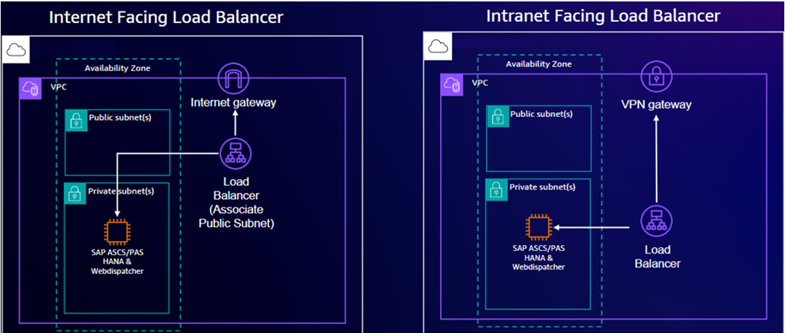
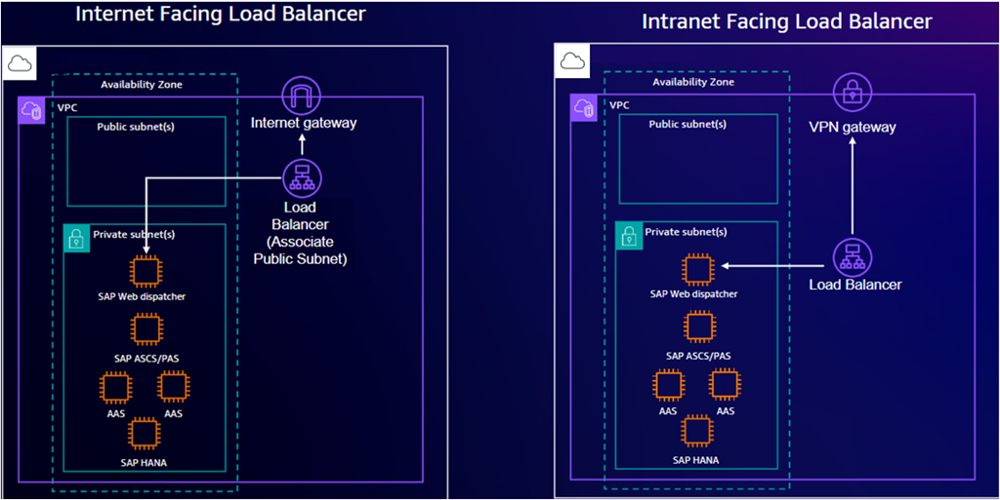
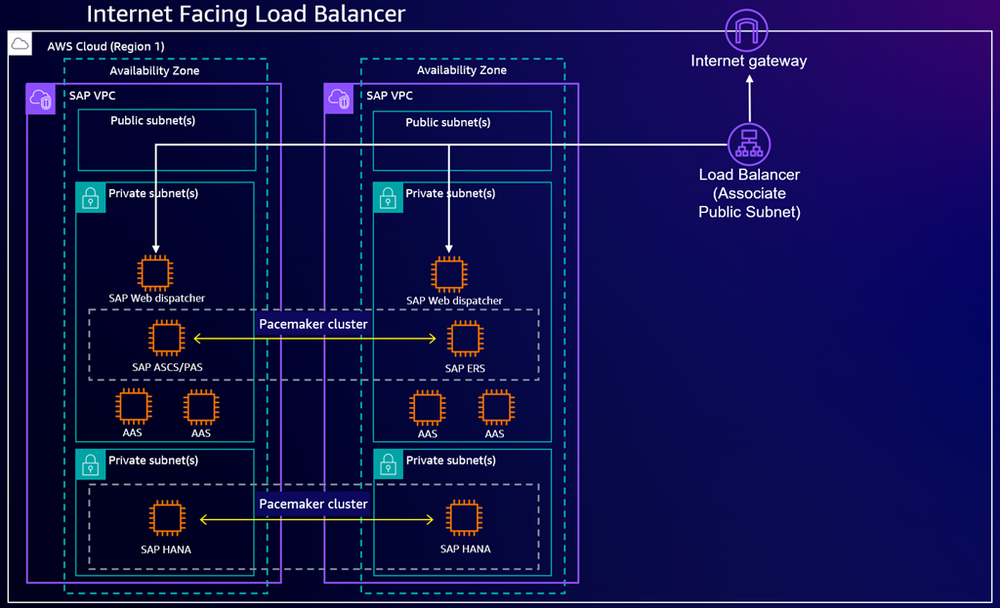
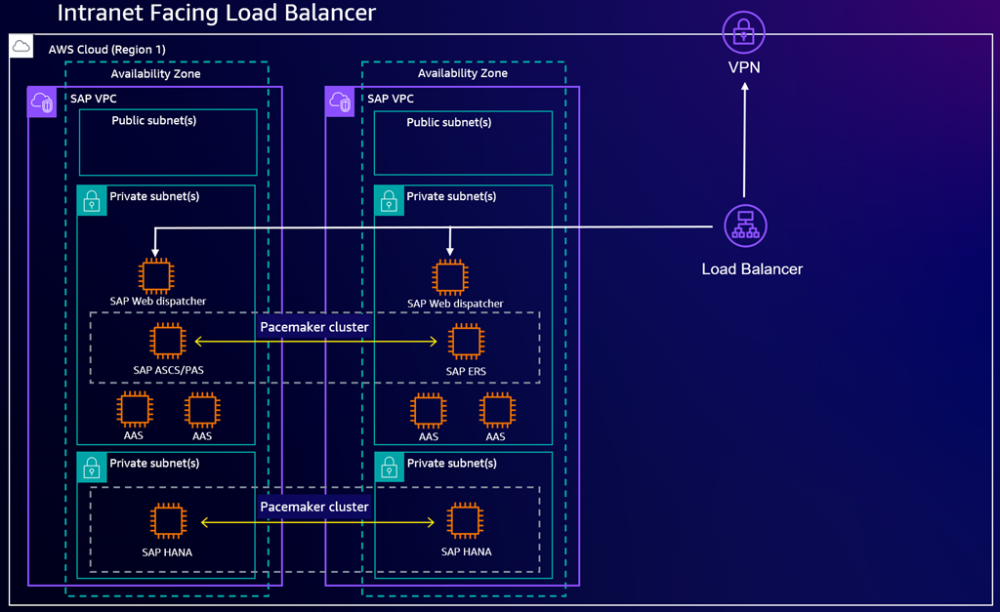

# Deploying

SAP Web Dispatcher

AWS Launch Wizard supports the deployment of SAP Web Dispatcher as an optional component for
Netweaver stack on HANA deployments. SAP Web Dispatcher is deployed in front of your SAP
Application Servers to act as the entry point for HTTP(S) request traffic destined for your
SAP Application Servers. SAP Web Dispatcher accepts or rejects the request traffic that
arrives. Accepted traffic is load balanced among your Application Servers. You can use
SAP Web Dispatcher in systems with the following application stacks:

- Advanced Business Application Programming (ABAP) only
- Java only
- ABAP and Java (dual-stack)

###### Topics

- [Architectures
  for SAP Web Dispatcher](#launch-wizard-sap-deploy-web-dispatcher-architectures "#launch-wizard-sap-deploy-web-dispatcher-architectures")
- [Post-deployment configuration activities](#launch-wizard-sap-deploy-web-dispatcher-post-deployment "#launch-wizard-sap-deploy-web-dispatcher-post-deployment")

## Architectures

for SAP Web Dispatcher

SAP Web Dispatcher is available for singe instance, multiple instance, and high
availability deployments of Netweaver stack on HANA. The deployment type you specify
affects the placement of the component in your architecture.

Launch Wizard deploys the component as a standalone component on the same instance
where the SAP application and database are deployed.

The following diagram depicts an SAP Web Dispatcher deployment using a
single instance.


Launch Wizard deploys the component on a separate instance in the same Availability
Zone (AZ) where the SAP application and database components are deployed.

The following diagram depicts an SAP Web Dispatcher deployment using a
multiple instances.


Launch Wizard deploys the component on two Amazon EC2 instances, each in a different
Availability Zone (AZ). Each AZ also the SAP application and database
components. For more information, see [High Availability of the SAP Web Dispatcher](https://help.sap.com/doc/saphelp_nw74/7.4.16/en-us/48/9a9a6b48c673e8e10000000a42189b/content.htm?no_cache=true "https://help.sap.com/doc/saphelp_nw74/7.4.16/en-us/48/9a9a6b48c673e8e10000000a42189b/content.htm?no_cache=true") in the SAP
documentation.

The following diagram depicts a highly available SAP Web Dispatcher
deployment using multiple instances behind an internet-facing load
balancer.


The following diagrams depicts a highly available SAP Web Dispatcher
deployment using multiple instances behind an intranet-facing load
balancer.



### Load

balancers for SAP Web Dispatcher

You can optionally deploy an Application Load Balancer or Network Load Balancer with all deployment patterns. The load
balancer can be used to accept internet or intranet traffic based on your
application requirements. For more information about Elastic Load Balancing, see [What is
Elastic Load Balancing?](../../../elasticloadbalancing/latest/userguide/what-is-load-balancing.md "../../../elasticloadbalancing/latest/userguide/what-is-load-balancing.md") in the _Elastic Load
Balancing User Guide_.

Network Load Balancer operate at the TCP layer and can handle traffic such as the RFC protocol for
system interfaces and File Transfer Protocol (FTP). If your applications need
additional context such as HTTP headers, or you plan to integrate other AWS
services in your architecture, consider using an Application Load Balancer. Deploying an Application Load Balancer allows
you to integrate various other services such as [AWS WAF](../../../waf/latest/developerguide/waf-chapter.md "../../../waf/latest/developerguide/waf-chapter.md"), [AWS Certificate Manager](../../../acm/latest/userguide/acm-overview.md "../../../acm/latest/userguide/acm-overview.md") (ACM), and [AWS CloudFormation](../../../AmazonCloudFront/latest/DeveloperGuide/Introduction.md "../../../AmazonCloudFront/latest/DeveloperGuide/Introduction.md").

In Launch Wizard, you will have the option to implement the SSL/TLS termination at load
balancer. You must first [request a public SSL in
ACM](../../../acm/latest/userguide/gs-acm-request-public.md "../../../acm/latest/userguide/gs-acm-request-public.md") or [import your own SSL
Certificate into ACM](../../../acm/latest/userguide/import-certificate.md "../../../acm/latest/userguide/import-certificate.md") to use this option. If you need to do end-to-end
HTTPS encryption, you can follow the post-deployment configuration activities. For
more information on configuring your deployed resources to support HTTS traffic, see
[Post-deployment configuration activities](#launch-wizard-sap-deploy-web-dispatcher-post-deployment "#launch-wizard-sap-deploy-web-dispatcher-post-deployment").

## Post-deployment configuration activities

After your Launch Wizard for SAP deployment with the SAP Web Dispatcher component completes,
you must perform several manual configurations to finalize the deployment. These
additional configurations are in the customer portion of the [AWS Shared Responsibility
Model](https://aws.amazon.com/compliance/shared-responsibility-model/ "https://aws.amazon.com/compliance/shared-responsibility-model/"). You should ensure that the changes you make meet your specific
security requirements.

###### Topics

- [Validate HTTP(S) listeners are set up](#launch-wizard-sap-deploy-web-dispatcher-post-deployment-https-listeners "#launch-wizard-sap-deploy-web-dispatcher-post-deployment-https-listeners")
- [Activate HTTP(S) services](#launch-wizard-sap-deploy-web-dispatcher-post-deployment-activate "#launch-wizard-sap-deploy-web-dispatcher-post-deployment-activate")
- [Validate target group checks are set up](#launch-wizard-sap-deploy-web-dispatcher-post-deployment-checks "#launch-wizard-sap-deploy-web-dispatcher-post-deployment-checks")
- [Validate SAP Web Dispatcher functionality](#launch-wizard-sap-deploy-web-dispatcher-post-deployment-validate "#launch-wizard-sap-deploy-web-dispatcher-post-deployment-validate")
- [Enable HTTPS communication](#launch-wizard-sap-deploy-web-dispatcher-post-deployment-enable-https "#launch-wizard-sap-deploy-web-dispatcher-post-deployment-enable-https")

### Validate HTTP(S) listeners are set up

HTTP(S) listeners must be set up in the SAP System. You can check whether the
Internet Communication Framework (ICF) is configured according to your requirements
(transaction SMICM for ABAP). All HTTP(S) listeners must use the correct port
settings and be in the **Active** status. For more
information, see [Displaying and Changing Services](https://help.sap.com/doc/saphelp_nw73ehp1/7.31.19/en-US/48/89f3ee33b11b5ae10000000a42189c/content.htm?no_cache=true "https://help.sap.com/doc/saphelp_nw73ehp1/7.31.19/en-US/48/89f3ee33b11b5ae10000000a42189c/content.htm?no_cache=true") in the SAP documentation.

### Activate HTTP(S) services

For SAP Web Dispatcher and load balancing to function properly, you must
activate the following services in the HTTP service tree (transaction SICF for
ABAP):

- /sap/public/icman
- /sap/public/icf_info/\*
- /sap/public/ping

For ABAP installations, you must activate **/sap/public/ping** to allow load balancers to perform health checks
through SAP Web Dispatcher. This prevents the routing of traffic to unhealthy
application servers.

For Java installations, you must use **/startPage**
as the starting point for the health check endpoint. Once you have full installed
and configured the Portal Usage Type, you can adjust this value to **/irj/portal**.

For more information, see [Operating SAP Web Dispatcher](https://help.sap.com/docs/ABAP_PLATFORM_NEW/683d6a1797a34730a6e005d1e8de6f22/4899d231ee2b73e7e10000000a42189b.html "https://help.sap.com/docs/ABAP_PLATFORM_NEW/683d6a1797a34730a6e005d1e8de6f22/4899d231ee2b73e7e10000000a42189b.html") in the SAP documentation.

### Validate target group checks are set up

After you configure load balancing, the target group for your load balancer might
end up with unhealthy SAP Web Dispatcher endpoints. You can reregister your SAP Web
Dispatcher instances with the correct ports to ensure the load balancer is properly
routing traffic. For more information, see [Register or deregister targets](../../../elasticloadbalancing/latest/application/target-group-register-targets.md#register-deregister-targets "../../../elasticloadbalancing/latest/application/target-group-register-targets.md#register-deregister-targets") in the _Elastic Load Balancing User Guide_.

### Validate SAP Web Dispatcher functionality

After you configure and validate the related SICF services and validate that the
load balancer target groups are healthy, you can validate SAP Web Dispatcher with
a web browser.

###### To access SAP Web Dispatcher

1. Open a web browser on a device that can access the instance running
   SAP Web Dispatcher.
2. Access your SAP Web Dispatcher web console, replacing values as
   necessary:

```
http://`load-balancer-dns-endpoint`:`listener-port`/sap/wdisp/admin/public/default.html
```

3. For **user**, enter **webadm**.
4. For **password**, enter the password you specified in the
   Launch Wizard deployment.
5. Login to the web console.
6. Choose **Monitor Application Servers** and ensure that
   you can see all of your Application Servers and that they are using port
7.
8. Choose **Monitor Server Groups** and ensure that you can
   see all of your server groups.

For more information, see [Area Menu](https://help.sap.com/saphelp_snc700_ehp01/helpdata/en/48/7f579f7df935e1e10000000a42189c/frameset.htm "https://help.sap.com/saphelp_snc700_ehp01/helpdata/en/48/7f579f7df935e1e10000000a42189c/frameset.htm") in the SAP documentation.

### Enable HTTPS communication

To provide you with the most flexibility to meet your own requirements,
SAP Web Dispatcher is deployed behind an Application Load Balancer with only the HTTP protocol enabled
by default. Launch Wizard can implement SSL/TLS termination at the load balancer during
deployment, or you can implement end-to-end encryption after the deployment
completes.

With SSL/TLS termination, HTTPS traffic from the end user is decrypted at
the load balancer. This traffic is then forwarded to SAP Web Dispatcher
and your application servers using the HTTP protocol. Launch Wizard can configure
SSL/TLS termination at the load balancer during deployment. To use this
option, you will need to specify a load balancer and ACM certificate while
configuring the deployment. For more information, see [Deploy an SAP application
with AWS Launch Wizard](launch-wizard-sap-deploying-console.md#deploy-console-launch-wizard-sap "launch-wizard-sap-deploying-console.md#deploy-console-launch-wizard-sap").

With end-to-end HTTPS encryption, traffic is encrypted to the load
balancer and then traffic is re-encrypted at the SAP Web Dispatcher and
Application Server instances. You must obtain a certificate from a 3rd party
provider before following this procedure.

###### To configure end-to-end encryption

1. Apply your own certificate to your application servers.
   1. If you have a SAP ABAP application server, apply your
      certificate to it. For more information, see [Configuring the ABAP Platform to Support TLS](https://help.sap.com/docs/ABAP_PLATFORM_NEW/e73bba71770e4c0ca5fb2a3c17e8e229/4923501ebf5a1902e10000000a42189c.html "https://help.sap.com/docs/ABAP_PLATFORM_NEW/e73bba71770e4c0ca5fb2a3c17e8e229/4923501ebf5a1902e10000000a42189c.html") in
      the SAP documentation.
   2. If you have a SAP NetWeaver Java application server, apply
      your certificate to it. For more information, see [Configuring Transport Layer Security on SAP NetWeaver
      AS for Java](https://help.sap.com/docs/SAP_NETWEAVER_750/a42446bded624585958a36a71903a4a7/4a015cc68d863132e10000000a421937.html?version=7.5.27 "https://help.sap.com/docs/SAP_NETWEAVER_750/a42446bded624585958a36a71903a4a7/4a015cc68d863132e10000000a421937.html?version=7.5.27") in the SAP documentation.

2. Apply your own certificate to the SAP Web Dispatcher instance. For
   more information, see [Configure SAP Web Dispatcher to Support SSL](https://help.sap.com/docs/ABAP_PLATFORM_NEW/683d6a1797a34730a6e005d1e8de6f22/493db10a19341067e10000000a42189c.html "https://help.sap.com/docs/ABAP_PLATFORM_NEW/683d6a1797a34730a6e005d1e8de6f22/493db10a19341067e10000000a42189c.html") in the SAP
   documentation.
3. Import the certificate that you used in the previous steps into
   ACM. For more information, see [Importing a certificate](../../../acm/latest/userguide/import-certificate-api-cli.md "../../../acm/latest/userguide/import-certificate-api-cli.md") in the _AWS Certificate Manager User Guide_.
4. Create a listener for your Load Balancer.
   1. If you use Application Load Balancer, you create a HTTPS listener with your
      certificate imported into ACM as the default certificate.
      For more information, see [Create an HTTPS listener for your Application Load Balancer](../../../elasticloadbalancing/latest/application/create-https-listener.md "../../../elasticloadbalancing/latest/application/create-https-listener.md") in the
      _User Guide for Application Load Balancers_.
   2. If you use Network Load Balancer, you create a TLS Listener. For more
      information, see [TLS listeners for your Network Load Balancer](../../../elasticloadbalancing/latest/network/create-tls-listener.md "../../../elasticloadbalancing/latest/network/create-tls-listener.md") in _User Guide for Network Load Balancers_.

5. Configure an alias or CNAME DNS record for your load balancer
   using your preferred domain name. For example, your domain name
   might resemble the following:

```
example.yourdomain.com
```

    1. If you use Amazon Route 53, create an Alias record. For
     more information, see [Creating records by using the Amazon Route 53
     console](../../../Route53/latest/DeveloperGuide/resource-record-sets-creating.md "../../../Route53/latest/DeveloperGuide/resource-record-sets-creating.md") in the *Amazon Route 53 Developer Guide*.
    2. If you use a different DNS provider, create a CNAME record
     with the provider. For more information, refer to your DNS
     provider’s documentation.

6. Confirm the configuration is working by accessing your endpoint by
   the DNS name over HTTPS.
   1. For ABAP systems, your URL with the custom DNS name might
      resemble the following:

   ```
   https://`example.yourdomain.com`/sap/public/ping
   ```

   2. For Java systems, your URL with the custom DNS name might
      resemble the following:

   ```
   https://`example.yourdomain.com`/startPage
   ```
