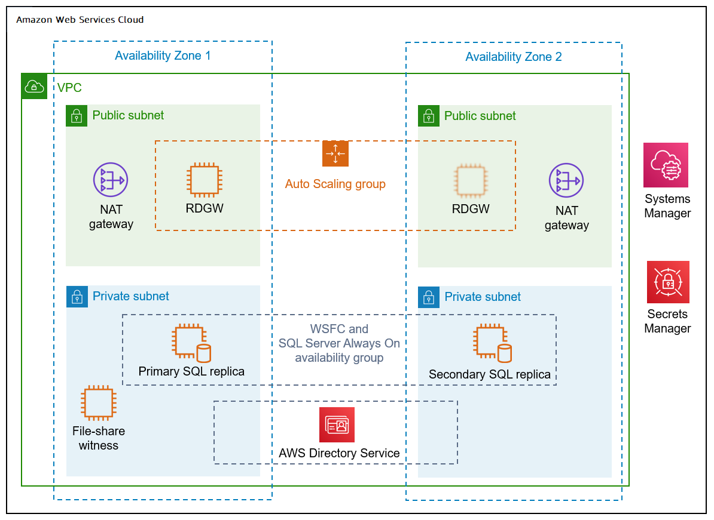
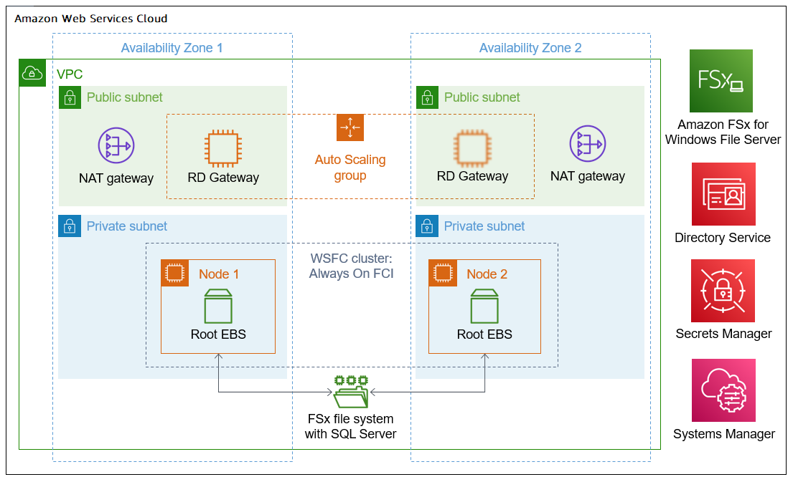
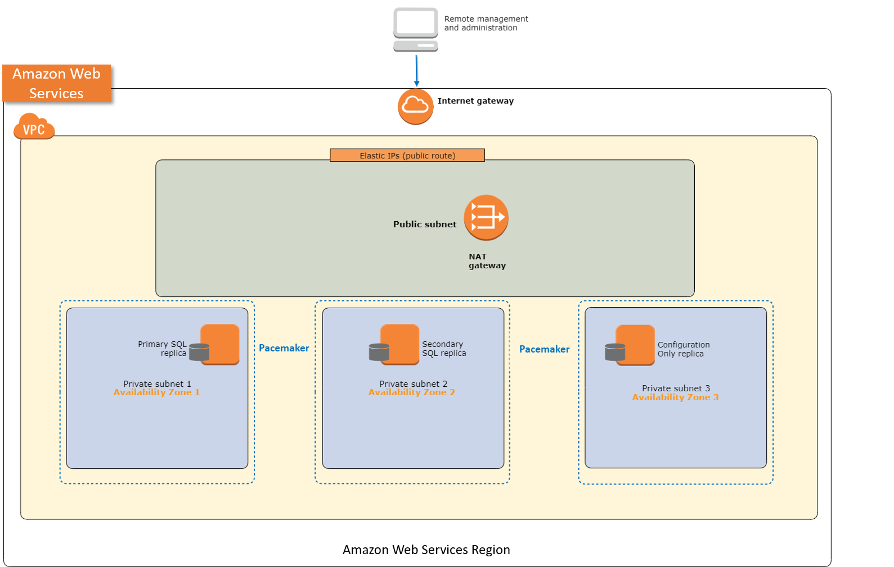

# AWS Launch Wizard for SQL Server

AWS Launch Wizard is a service that guides you through the sizing, configuration, and deployment of
Microsoft SQL Server applications on AWS, following the [AWS Well-Architected
Framework](../../../wellarchitected/latest/framework/welcome.md "../../../wellarchitected/latest/framework/welcome.md"). AWS Launch Wizard supports both single instance and high availability (HA)
application deployments.

AWS Launch Wizard reduces the time it takes to deploy SQL Server solutions to the cloud. You input
your application requirements, including performance, number of nodes, and connectivity, on
the service console. AWS Launch Wizard identifies the right AWS resources to deploy and run your
SQL Server application. AWS Launch Wizard provides an estimated cost of deployment, and you can
modify your resources and instantly view the updated cost assessment. When you approve,
AWS Launch Wizard provisions and configures the selected resources in a few hours to create a
fully-functioning production-ready SQL Server application. It also creates custom AWS CloudFormation
templates, which can be reused and customized for subsequent deployments.

Once deployed, your SQL Server application is ready to use and can be accessed on the EC2
console. You can manage your SQL Server application with [AWS
SSM](../../../systems-manager/latest/userguide/what-is-systems-manager.md "../../../systems-manager/latest/userguide/what-is-systems-manager.md").

## Supported operating systems and SQL versions

AWS Launch Wizard supports the following operating systems and SQL Server versions:

###### Deployments on Windows

- Windows Server 2022/2019
- Enterprise and Standard Editions of Microsoft SQL Server
  2022/2019

###### Amazon FSx for Failover Clustering (FCI) deployments on Windows

- Windows Server 2022/2019
- Enterprise and Standard Editions of Microsoft SQL Server 2022/2019

CUs are installed at the same time as public AMIs for SQL license-included
AMIs. CUs and service packs are not installed for license-included Windows AMIs
and BYOL AMIs.

###### Deployments on Ubuntu

- Ubuntu 18.04
- Enterprise and Standard Edition of Microsoft SQL Server 2019

## Features of AWS Launch Wizard

###### AWS Launch Wizard provides the following features:

- [Simple application
  deployment](#launch-wizard-features-app-deployment "#launch-wizard-features-app-deployment")
- [AWS resource
  selection](#launch-wizard-features-resource-selection "#launch-wizard-features-resource-selection")
- [Cost estimation](#launch-wizard-features-cost "#launch-wizard-features-cost")
- [Reusable code
  templates](#launch-wizard-features-code-templates "#launch-wizard-features-code-templates")
- [SNS notification](#launch-wizard-features-sns "#launch-wizard-features-sns")
- [Always On Availability Groups
  (SQL Server)](#launch-wizard-features-allways-on "#launch-wizard-features-allways-on")
- [Dedicated Hosts (deployment
  on Windows)](#launch-wizard-features-dedicated-hosts "#launch-wizard-features-dedicated-hosts")
- [Early input validation](#launch-wizard-features-input-validation "#launch-wizard-features-input-validation")
- [Application resource groups
  for easy discoverability](#launch-wizard-features-resource-groups "#launch-wizard-features-resource-groups")
- [One-click
  monitoring](#launch-wizard-features-application-insights "#launch-wizard-features-application-insights")
- [Amazon FSx for Failover Clustering
  (FCI)](#launch-wizard-features-fci "#launch-wizard-features-fci")

### Simple application

deployment

AWS Launch Wizard makes it easy for you to deploy third-party applications on AWS, such
as Microsoft SQL Server. When you input the application requirements, AWS Launch Wizard
deploys the necessary AWS resources for a production-ready application. This means
that you do not have to manage separate infrastructure pieces or spend time
provisioning and configuring your SQL Server application.

### AWS resource

selection

Launch Wizard considers performance, memory, bandwidth, and other application features to
determine the best instance type, EBS volumes, and other resources for your SQL
Server application. You can modify the recommended defaults.

### Cost estimation

Launch Wizard provides a cost estimate for a complete deployment. The cost estimate is
itemized for each individual resource to deploy. The estimated cost automatically
updates each time you change a resource type configuration in the wizard. The
provided estimates are for general comparisons only. The estimates are based on
On-Demand costs and actual costs may be lower.

### Reusable code

templates

Launch Wizard creates a CloudFormation stack that can be reused to customize and replicate
your infrastructure in multiple environments. Code in the template helps you
provision resources. You can access and use the templates created by your Launch
Wizard deployment from the CloudFormation console. For more information about
CloudFormation stacks, see [Working with
stacks](../../../AWSCloudFormation/latest/UserGuide/stacks.md "../../../AWSCloudFormation/latest/UserGuide/stacks.md").

### SNS notification

You can provide an [SNS topic](../../../sns/latest/dg/welcome.md "../../../sns/latest/dg/welcome.md") so that Launch Wizard will send you notifications and alerts about the
status of a deployment.

### Always On Availability Groups

(SQL Server)

Always On Availability Groups (AG) is a Microsoft SQL Server feature that is
supported by the AWS SQL Server installation. AG augments the availability of a
set of user databases. An availability group supports a failover environment for a
discrete set of user databases, known as availability databases. If one of these
databases fails, another database takes over its workload with no impact on
availability. Always On Availability improves database availability, enabling more
efficient resource usage. For more information about the concepts and benefits of
Always On Availability, see [Always On Availability Groups (SQL Server)](https://docs.microsoft.com/en-us/sql/database-engine/availability-groups/windows/always-on-availability-groups-sql-server?view=sql-server-2017 "https://docs.microsoft.com/en-us/sql/database-engine/availability-groups/windows/always-on-availability-groups-sql-server?view=sql-server-2017").

### Dedicated Hosts (deployment

on Windows)

You can deploy SQL Server Always On Availability Groups (AG) or basic availability
groups on your Dedicated Hosts to leverage your existing SQL Server Licenses (BYOL).
From the Launch Wizard console, select **Dedicated Host** tenancy, and then
select the Dedicated Hosts for your VPC. For more information about Amazon EC2 Dedicated
Hosts, see [Dedicated
Hosts](../../../AWSEC2/latest/UserGuide/dedicated-hosts-overview.md "../../../AWSEC2/latest/UserGuide/dedicated-hosts-overview.md").

### Early input validation

You can leverage your existing infrastructure (such as VPC or Active Directory)
with Launch Wizard. This may lead to deployment failures if your existing infrastructure does
not meet certain deployment prerequisites. For example, for a SQL Server Always On
deployment in your existing VPC, the VPC must have at least one public subnet and
two private subnets. It must also have outbound connectivity to Amazon S3, Systems
Manager, and AWS CloudFormation service endpoints. If these requirements are not met, the
deployment will fail. If you are in a later stage of a deployment, this failure can
take more than an hour to detect. To detect these types of issues early in the
application deployment process, Launch Wizard's validation framework verifies key application
and infrastructure specifications before provisioning. Verification takes
approximately 15 minutes. If necessary, you can take appropriate actions to adjust
your VPC configuration.

Launch Wizard performs the following infrastructure validations:

###### Resource limit validations at the AWS account level:

- VPC
- Internet gateway
- Number of CloudFormation stacks

###### Additionally, Launch Wizard performs the following application-specific

validations:

- Active Directory credentials (deployment on Windows)
- Public subnet outbound connectivity
- Private subnet outbound connectivity
- Custom Windows AMIs:
  - SQL Server installed and running on instance
  - Compliant versions of Windows and SQL Server

- Dedicated Hosts (deployment on Windows)
  - AMIs are filtered according to the billing code. When you select
    Dedicated Host tenancy in the application, the AMI selection
    dropdown list filters out AMIs for which the usage operation is set
    to include SQL Server Enterprise or SQL Server Standard, per the
    [details and usage operation values](../../../AWSEC2/latest/UserGuide/ami-billing-info.md#billing-info "../../../AWSEC2/latest/UserGuide/ami-billing-info.md#billing-info"). This filtering
    behavior is the result of restrictions described in the [Dedicated Host restrictions](../../../AWSEC2/latest/UserGuide/dedicated-hosts-overview.md#dedicated-hosts-limitations "../../../AWSEC2/latest/UserGuide/dedicated-hosts-overview.md#dedicated-hosts-limitations") page.
  - Supported instance type
  - Sufficient capacity to launch number of nodes and instances
  - Selected subnet and corresponding Dedicated Host are in the same
    Availability Zone for any additional nodes beyond the primary and
    first secondary nodes

###### Note

Some validations, for example for valid Active Directory credentials, require
Application Wizard to launch a `t2.large` EC2 instance in your
account for a few minutes. After it runs the necessary validations, Launch Wizard
terminates the instance.

### Application resource groups

for easy discoverability

Launch Wizard creates a resource group for all of the AWS resources created for your SQL
Server application. You can manage the resources through the EC2 console or with
Systems Manager. When you access Systems Manager through Launch Wizard, the resources are
automatically filtered for you based on your resource group. You can manage, patch,
and maintain your SQL Server applications in Systems Manager.

### One-click

monitoring

Launch Wizard integrates with [CloudWatch Application Insights](../../../AmazonCloudWatch/latest/monitoring/cloudwatch-application-insights.md "../../../AmazonCloudWatch/latest/monitoring/cloudwatch-application-insights.md") to provide a one-click monitoring setup
experience for deploying SQL Server HA workloads on AWS. When you select the
option to set up monitoring and insights with Application Insights on the Launch Wizard
console, Application Insights automatically sets up relevant metrics, logs, and
alarms on CloudWatch, and starts monitoring newly deployed workloads. You can view
automated insights and detected problems, along with the health of your SQL Server
HA workloads, on the CloudWatch console.

Counters that you can configure using Application Insights include:

- Mirrored Write Transaction/sec
- Recovery Queue Length
- Transaction delay
- Windows Event Logs on CloudWatch

You can also get automated insights when a failover event or problem, such as a
restricted access to query a target database, is detected on your workload.

### Amazon FSx for Failover Clustering

(FCI)

Launch Wizard uses Amazon FSx to provide Failover Clustering for SQL Server deployments.
Failover Clustering is a high availability solution for SQL that puts all database
and log files in shared storage (Amazon FSx). The Amazon FSx file share spans multiple
Availability Zones and is highly redundant, which allows for automatic failover
between SQL nodes in the event of failure.

Launch Wizard offers two storage options for your FCI deployments: Amazon FSx for Windows or
Amazon FSx for NetApp ONTAP. If you choose NetApp ONTAP as the storage type for FCI,
License Manager creates the user name `FSXAdmin` and a password during the
deployment. The user name and password are stored in AWS Secrets Manager to manage
ONTAP.

## Related services

###### The following services are used when you deploy a SQL Server

application with AWS Launch Wizard:

- [AWS CloudFormation](#launch-wizard-related-services-cloudformation "#launch-wizard-related-services-cloudformation")
- [Amazon Simple Notification
  Service (SNS)](#launch-wizard-related-services-sns "#launch-wizard-related-services-sns")
- [Amazon CloudWatch
  Application Insights](#launch-wizard-related-services-application-insights "#launch-wizard-related-services-application-insights")
- [Linux-only
  technologies](#launch-wizard-related-services-linux "#launch-wizard-related-services-linux")

### AWS CloudFormation

[AWS CloudFormation](../../../AWSCloudFormation/latest/UserGuide/Welcome.md "../../../AWSCloudFormation/latest/UserGuide/Welcome.md") is a service for modeling and setting up your AWS resources,
enabling you to spend more time focusing on your applications that run in AWS. You
create a template that describes all of the AWS resources that you want to use
(for example, Amazon EC2 instances or Amazon RDS DB instances), and AWS CloudFormation takes care of
provisioning and configuring those resources for you. With Launch Wizard, you don’t have to
sift through CloudFormation templates to deploy your application. Instead, Launch Wizard
combines infrastructure provisioning and configuration (with a CloudFormation
template) and application configuration (with code that runs on EC2 instances to
configure the application) into a unified SSM Automation document. The SSM document
is then invoked by Launch Wizard’s backend service to provision a SQL Server application in
your account. For more information, see the _[AWS CloudFormation User Guide](../../../AWSCloudFormation/latest/UserGuide.md "../../../AWSCloudFormation/latest/UserGuide.md")_.

### Amazon Simple Notification

Service (SNS)

[Amazon Simple
Notification Service (SNS)](../../../sns/latest/dg/welcome.md "../../../sns/latest/dg/welcome.md") is a highly available, durable, secure, fully
managed pub/sub messaging service that provides topics for high-throughput,
push-based, many-to-many messaging. Using Amazon SNS topics, your publisher systems
can fan out messages to a large number of subscriber endpoints and send
notifications to end users using mobile push, SMS, and email. You can use SNS topics
for your Launch Wizard deployments to stay up-to-date on deployment progress. For
more information, see the [_Amazon Simple Notification Service Developer Guide_](../../../sns/latest/dg/welcome.md "../../../sns/latest/dg/welcome.md").

### Amazon CloudWatch

Application Insights

[Amazon CloudWatch Application Insights](../../../AmazonCloudWatch/latest/monitoring/cloudwatch-application-insights.md "../../../AmazonCloudWatch/latest/monitoring/cloudwatch-application-insights.md") facilitates observability for
.NET and SQL Server applications. It can help you set up the best monitors for your
application resources to continuously analyze data for signs of problems with your
applications. Application Insights, which is powered by [Sagemaker](../../../sagemaker/latest/dg/whatis.md "../../../sagemaker/latest/dg/whatis.md") and other AWS
technologies, provides automated dashboards that show potential problems with
monitored applications, helping you to quickly isolate ongoing issues with your
applications and infrastructure. The enhanced visibility into the health of your
applications that Application Insights provides can help you reduce your mean time
to repair (MTTR) so that you don't have to pull in multiple teams and experts to
troubleshoot your application issues.

### Linux-only

technologies

The following key technologies are used when you deploy a SQL Server application
with Amazon Launch Wizard to the Linux platform.

- **[Pacemaker](http://manpages.ubuntu.com/manpages/lunar/man8/crm_node.8.html "http://manpages.ubuntu.com/manpages/lunar/man8/crm_node.8.html")** is an open source cluster resource
  manager (CRM), which is a system that coordinates managed resources and
  services made highly available by a cluster.
- **[Corosync](https://corosync.github.io/corosync/ "https://corosync.github.io/corosync/")** is an open source program that provides
  cluster membership and messaging capabilities, often referred to as the
  messaging layer, to client servers. In contrast to Pacemaker, which allows
  you to control cluster behavior, Corosync makes it possible for servers to
  communicate as a cluster.
- **[Transact-SQL](https://docs.microsoft.com/en-us/sql/t-sql/language-reference?view=sql-server-ver15 "https://docs.microsoft.com/en-us/sql/t-sql/language-reference?view=sql-server-ver15")** is an extension to the SQL
  language. It is used to interact with relational databases. Transact-SQL is
  platform-agnostic and can be used to configure the AlwaysOn Availability
  Group and listener.
- **[Fencing](https://ubuntu.com/server/docs/ubuntu-ha-introduction "https://ubuntu.com/server/docs/ubuntu-ha-introduction")** is used to isolate a malfunctioning
  server from the cluster in order to protect and secure the synced resources.
  The recommended solution to use in the case of a malfucntioning server is
  the "Shoot the other node in the head" (STONITH) method. STONITH is a
  fencing technique that isolates a failed node so that it does not disrupt a
  computer cluster. The STONITH method fences failed nodes by resetting or
  powering down the failed node. Fencing is also used when a clustered service
  cannot be stopped. In this case, the cluster uses fencing to force the whole
  node offline, which makes it safe to start the service from a different
  server. Fencing can be performed at two levels: the node or resource level.
  Launch Wizard only supports node-level fencing.

## Default quotas

Launch Wizard allows for a maximum of 50 active applications (with status `in
 progress` or `completed`) for any given application type. If you
want to increase this limit, contact [Support](https://aws.amazon.com/contact-us "https://aws.amazon.com/contact-us"). Launch Wizard supports three parallel, in-progress deployments per account.

## AWS Regions

Launch Wizard uses various AWS services during the provisioning of the application's
environment. Not every workload is supported in all AWS Regions. For a current list of
Regions where the workload can be provisioned, see [AWS Launch Wizard workload availability](launch-wizard-workload-availability.md "launch-wizard-workload-availability.md").

## Components

###### Topics

- [Windows](#windows "#windows")
- [Linux](#linux "#linux")

### Windows

A SQL Server application deployed on Windows with Launch Wizard includes the following
components:

- A **virtual private cloud (VPC)** configured with
  [public
  and private subnets](../../../vpc/latest/userguide/what-is-amazon-vpc.md#what-is-vpc-subnet "../../../vpc/latest/userguide/what-is-amazon-vpc.md#what-is-vpc-subnet") across two Availability Zones. A public subnet
  is a subnet whose traffic is routed to an internet gateway. If a subnet does not
  have a route to the internet gateway, then it is a private subnet. The VPC
  provides the network infrastructure for your SQL Server deployment. You can
  choose an optional third Availability Zone for additional SQL cluster nodes, as
  shown below.
- An **internet gateway** to provide access to the
  internet.
- In the public subnets, **Windows Server-based Remote
  Desktop Gateway (RDGW) instances and network address translation (NAT)
  gateways** for outbound internet access. If you are deploying in
  your preexisting VPC, Launch Wizard uses the existing NAT gateway in your VPC. For more
  information about NAT gateways, see [NAT Gateways](../../../vpc/latest/userguide/vpc-nat-gateway.md "../../../vpc/latest/userguide/vpc-nat-gateway.md").
- **Elastic IP addresses** associated with the NAT
  gateway and RDGW instances. For more information about Elastic IP addresses, see
  [Elastic IP
  addresses](../../../AWSEC2/latest/UserGuide/elastic-ip-addresses-eip.md "../../../AWSEC2/latest/UserGuide/elastic-ip-addresses-eip.md").
- In the private subnets, **Active Directory domain
  controllers**.
- In the private subnets, **Windows Server-based instances
  as Windows Server Failover Clustering (WSFC) nodes**. For more
  information, see [Windows Server Failover Clustering with SQL Server](https://docs.microsoft.com/en-us/sql/sql-server/failover-clusters/windows/windows-server-failover-clustering-wsfc-with-sql-server?view=sql-server-2017 "https://docs.microsoft.com/en-us/sql/sql-server/failover-clusters/windows/windows-server-failover-clustering-wsfc-with-sql-server?view=sql-server-2017").
- **SQL Server Enterprise edition with SQL Server Always On
  Availability Groups on each WSFC node**. This architecture provides
  redundant databases and a witness server to ensure that a quorum can vote for
  the node to be promoted to the controlling resource. The default architecture
  mirrors an on-premises architecture of two SQL Server instances spanning two
  subnets placed in two different Availability Zones. For more information about
  SQL Server Always On Availability Groups, see [Overview of Always On Availability Groups (SQL Server)](https://docs.microsoft.com/en-us/sql/database-engine/availability-groups/windows/overview-of-always-on-availability-groups-sql-server?view=sql-server-2017 "https://docs.microsoft.com/en-us/sql/database-engine/availability-groups/windows/overview-of-always-on-availability-groups-sql-server?view=sql-server-2017").
- **Security groups** to ensure the secure flow of
  traffic between the instances deployed in the VPC. For more information, see
  [Security Groups for Your
  VPC](../../../vpc/latest/userguide/VPC_SecurityGroups.md "../../../vpc/latest/userguide/VPC_SecurityGroups.md").

###### Note

If you choose to deploy SQL Server Always On through Launch Wizard into your
existing VPC, there is an additional mandatory check box on the console to
indicate whether VPC and public/private subnet requirements have been met.

- **Amazon FSx** to provide highly available and
  redundant storage across Availability Zones for clustering.

###### Note

Launch Wizard uses two Availability Zones.

You can build a SQL HA installation, as shown in the following diagram.

You can also choose to build an architecture with SQL Server Always On FCI, as shown
in the following diagram.

### Linux

A SQL Server application deployed on Linux with Launch Wizard includes the following
components:

- A **virtual private cloud (VPC)** configured with
  [public
  and private subnets](../../../vpc/latest/userguide/what-is-amazon-vpc.md#what-is-vpc-subnet "../../../vpc/latest/userguide/what-is-amazon-vpc.md#what-is-vpc-subnet") across three Availability Zones. A public subnet
  is a subnet whose traffic is routed to an internet gateway. If a subnet does not
  have a route to the internet gateway, then it is a private subnet. The VPC
  provides the network infrastructure for your SQL Server deployment.
- An **internet gateway** to provide access to the
  internet.
- In the public subnets, **network address translation
  (NAT)** for outbound internet access. If you are deploying in your
  preexisting VPC, Launch Wizard uses the existing NAT gateway in your VPC. For more
  information about NAT gateways, see [NAT Gateways](../../../vpc/latest/userguide/vpc-nat-gateway.md "../../../vpc/latest/userguide/vpc-nat-gateway.md").
- Two of the private subnets each run a SQL Server **replica
  node**. One acts as the primary node, and the other as secondary
  node. The third private subnet is used to run the configuration replica. Launch Wizard
  deployments on Linux use [Pacemaker](http://manpages.ubuntu.com/manpages/lunar/man8/crm_node.8.html "http://manpages.ubuntu.com/manpages/lunar/man8/crm_node.8.html") as the cluster resource manager. Pacemaker differs from
  Windows Server Failover Cluster (WSFC), which is used for Windows deployments,
  in terms of how it handles quorum. For Always On availability groups (AG) on
  Linux, arbitration happens in SQL Server where the metadata is stored. This is
  where the configuration-only replica is relevant. In order to maintain quorum
  and enable automatic failovers, Launch Wizard sets up a third node that acts as the
  configuration-only replica.
- **Security groups** to ensure the secure flow of
  traffic between the instances deployed in the VPC. For more information, see
  [Security Groups for Your
  VPC](../../../vpc/latest/userguide/VPC_SecurityGroups.md "../../../vpc/latest/userguide/VPC_SecurityGroups.md").

The high-level architecture of a SQL Server high availability solution on Linux is
similar to the architecture for deployment on Windows. The main differences are the
low-level components and technologies. The architecture for Linux deployments provides
redundant databases and a configuration-only replica node to verify that a quorum can
vote for the node to be promoted to the controlling resource. The default architecture
mirrors an on-premises architecture of two SQL Server instances spanning two subnets
placed in two different Availability Zones. For more information about SQL Server Always
On Availability Groups (AG), see [Overview of Always On Availability Groups (SQL Server)](https://docs.microsoft.com/en-us/sql/database-engine/availability-groups/windows/overview-of-always-on-availability-groups-sql-server?view=sql-server-2017 "https://docs.microsoft.com/en-us/sql/database-engine/availability-groups/windows/overview-of-always-on-availability-groups-sql-server?view=sql-server-2017") in the Microsoft
documentation.

