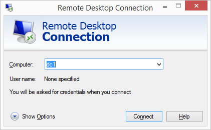
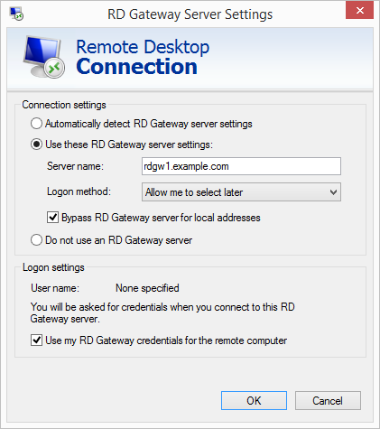
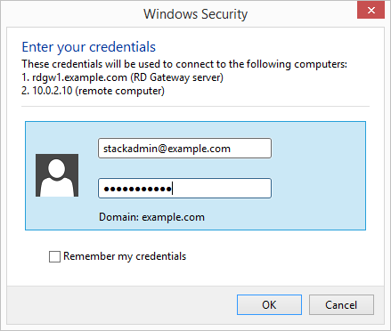

# Post-deployment steps

The following are the recommended post-deployment steps for Remote Desktop Gateway on
AWS.

###### Topics

- [Complete the configuration of your AWS environment](#complete-config "#complete-config")
- [Install the root certificate](#root-cert "#root-cert")
- [Configure the Remote Desktop Connection Client](#configure-client "#configure-client")
- [Run Windows Updates](#windows-updates "#windows-updates")

## Complete the configuration of your AWS environment

###### After AWS Launch Wizard finishes the application deployment, follow these steps:

1. Create security groups for your Windows instances that will be located in private VPC
   subnets. Create an ingress rule permitting TCP port 3389 from the RD Gateway security group,
   CIDR range, or IP address. Associate these groups with instances as they are launched into the
   private subnets.
2. Make sure that your administrative clients can resolve the name for the RD Gateway
   endpoint (for example, `win-1a2b3c4d5e6.example.com`). You can create an A (Host)
   record in DNS that maps the FQDN to the RD gateway’s Elastic IP or public IP address. For
   testing purposes, you can configure this mapping in the local host’s file on the
   machine.
3. Configure administrative clients with the proper configuration settings. This includes
   installing the root certificate from each RD Gateway server on the client machines (see the
   next section for instructions). When you use the CloudFormation templates, the default location for
   the root certificate will be `c:\servername.cer` on each RD Gateway server.
4. Modify the RD Gateway security group. Remove the ingress rule permitting TCP port 3389.
   Create a new ingress rule permitting TCP port 443 from your administrator’s IP address.
5. Make sure that instances in private subnets are associated with a security group
   containing ingress rules permitting the RD Gateway server IP address to connect through TCP
   port 3389.
6. Configure the Remote Desktop connection for administrative clients, as described later in
   this section.

## Install the root certificate

This Launch Wizard deployment implements a self-signed certificate on the RD gateway instances. After
deployment, you must install the root certificate on your administrative clients before you
configure the RDP client to connect to your RD gateway instances. The root certificate will
automatically be stored as `c:\servername.cer`.

###### To distribute this file to administrator workstations and install it, follow these

steps:

1. Open a Command Prompt window using administrative credentials.
2. Type `mmc` and press **Enter**.
3. In the Console Root window, on the **File** menu, choose
   **Add/Remove Snap In**.
4. In the **Add Standalone Snap-in** dialog box, choose
   **Certificates**, and then choose **Add**.
5. In the **Certificates snap-in** dialog box, choose **Computer
   account**, and then choose **Next**.
6. In the **Select Computer** dialog box, choose
   **Finish**.
7. In the **Add Standalone Snap-in** dialog box, choose
   **Close**.
8. On the **Add/Remove Snap-in** dialog box, choose
   **OK**.
9. In the Console Root window, expand **Certificates (Local
   Computer)**.
10. Under **Certificates (Local Computer)**, expand **Trusted Root
    Certification Authorities**.
11. Open the context (right-click) window for **Certificates**, and choose
    **All Tasks > Import**.
12. Navigate to the root certificate (e.g., `RDGW1.cer`) to complete the
    installation.

###### Note

The root certificate will be stored as `c:\servername.cer` on each RD gateway
when deploying servers using the CloudFormation templates.

## Configure the Remote Desktop Connection Client

1. Start the Remote Desktop Connection client.
2. In the computer name field, type the name or IP address of the Windows instance you want
   to connect to. Keep in mind that this instance needs to be reachable only from the RD gateway,
   not from the client machine.

 3. Choose Show Options. On the Advanced tab, choose Settings. 4. Choose Use these RD Gateway server settings. For server name, specify the FQDN of the RD
gateway. If the RD gateway and the server you want to connect to are in the same domain, choose
Use my RD Gateway credentials for the remote computer, and then choose OK.

###### Note

The FQDN server name of the RD Gateway host must match the certificate and the DNS record
(or local HOSTS file entry). Otherwise, the secure connection will generate warnings and might
fail. 5. Enter your credentials, and then choose OK to connect to the server. You can supply the
same set of credentials for the RD gateway and the destination server, as shown. If your
servers are not joined to the domain, you will need to authenticate twice: once for the RD
gateway and once for the destination server. If your servers aren’t joined to the domain, when
prompted for the RD Gateway server credentials, provide the Admin User Name and Admin Password
credentials you set in when you deployed with Launch Wizard. Check the Remember my credentials box.
(Otherwise, if you’re connecting from a Windows computer, you’ll get prompted for your
credentials repeatedly, and will be blocked from entering your remote computer
credentials.)

## Run Windows Updates

###### In order to ensure the deployed servers' operating systems and installed applications

have the latest Microsoft updates, run Windows Update on each server.

1. Create an RDP session to the Remote Desktop Gateway server(s).
2. Open the **Settings** application.
3. Open **Update & Security**.
4. Click **Check for updates**.
5. Install any updates and reboot if necessary.
