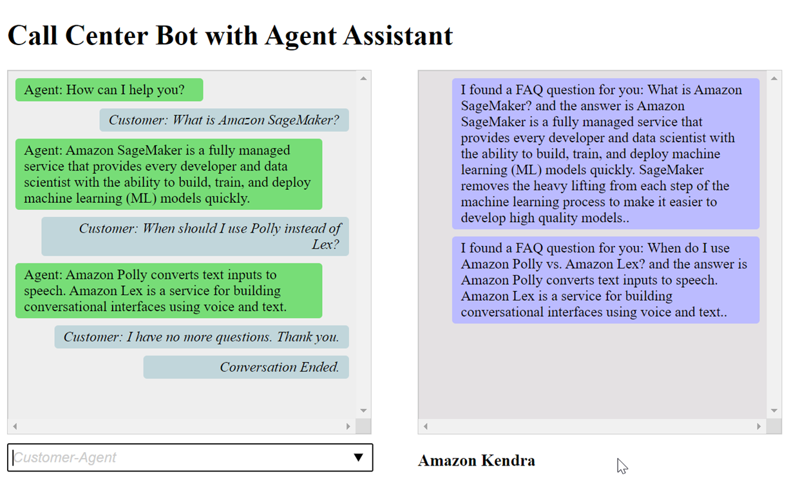

End of support notice: On September 15, 2025, AWS
will discontinue support for Amazon Lex V1. After September 15, 2025, you will
no longer be able to access the Amazon Lex V1 console or Amazon Lex V1 resources. If you are using Amazon Lex V2, refer to the [Amazon Lex V2 guide](../../../lexv2/latest/dg/what-is.md "../../../lexv2/latest/dg/what-is.md") instead.
.

# Step 6: Use the Bot

For demo purposes, you provide input to the bot as the customer and as the agent. To
differentiate between the two, questions asked by the customer begin with “Customer:”
and answers provided by the agent begin with “Agent:”. You can choose from a menu of
suggested inputs.

Run your web application by opening `index.html` to engage in a
conversation similar to the following image with your bot:


The `pushChat()` function in the index.html file is explained below.

```

            var endConversationStatement = "Customer: I have no more questions. Thank you."
            // If the agent has to send a message, start the message with 'Agent'
            var inputText = document.getElementById('input');
            if (inputText && inputText.value && inputText.value.trim().length > 0 && inputText.value[0]=='Agent') {
                showMessage(inputText.value, 'agentRequest','conversation');
                inputText.value = "";
            }
            // If the customer has to send a message, start the message with 'Customer'
            if(inputText && inputText.value && inputText.value.trim().length > 0 && inputText.value[0]=='Customer') {
                // disable input to show we're sending it
                var input = inputText.value.trim();
                inputText.value = '...';
                inputText.locked = true;
                customerInput = input.substring(2);

                // Send it to the Lex runtime
                var params = {
                    botAlias: '$LATEST',
                    botName: 'KendraTestBot',
                    inputText: customerInput,
                    userId: lexUserId,
                    sessionAttributes: sessionAttributes
                };

                showMessage(input, 'customerRequest', 'conversation');
                if(input== endConversationStatement){
                    showMessage('Conversation Ended.','conversationEndRequest','conversation');
                }
                lexruntime.postText(params, function(err, data) {
                    if (err) {
                        console.log(err, err.stack);
                        showMessage('Error:  ' + err.message + ' (see console for details)', 'lexError', 'conversation1')
                    }

                    if (data &&input!=endConversationStatement) {
                        // capture the sessionAttributes for the next cycle
                        sessionAttributes = data.sessionAttributes;

                            showMessage(data, 'lexResponse', 'conversation1');
                    }
                    // re-enable input
                    inputText.value = '';
                    inputText.locked = false;
                });
            }
            // we always cancel form submission
            return false;
```

When you provide input as a customer, the Amazon Lex runtime API sends it to Amazon Lex.

The `showMessage(daText, senderRequest, displayWindow)` fuction displays
the conversation between the agent and the customer in the chat window. Responses
suggested by Amazon Kendra are shown in an adjacent window. The conversation ends when customer
says `“I have no more questions. Thank you.”`

**Note:** Please delete your Amazon Kendra index when not in
use.
