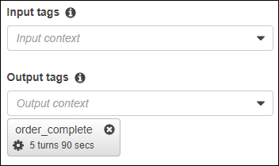
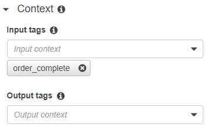

End of support notice: On September 15, 2025, AWS
will discontinue support for Amazon Lex V1. After September 15, 2025, you will
no longer be able to access the Amazon Lex V1 console or Amazon Lex V1 resources. If you are using Amazon Lex V2, refer to the [Amazon Lex V2 guide](../../../lexv2/latest/dg/what-is.md "../../../lexv2/latest/dg/what-is.md") instead.
.

# Setting Intent

Context

You can have Amazon Lex trigger intents based on
_context_. A _context_ is
a state variable that can be associated with an intent when you
define a bot.

You configure the contexts for an intent when you create the
intent using the console or using the [PutIntent](API_PutIntent.md "API_PutIntent.md") operation. You can only use
contexts in the English (US) (en-US) locale, and only if you
set the `enableModelImprovements` parameter to
`true` when you created the bot with the [PutBot](API_PutBot.md "API_PutBot.md") operation.

There are two types of relationships for contexts, output contexts
and input contexts. An _output context_ becomes
active when an associated intent is fulfilled. An output context is
returned to your application in the response from the [PostText](API_runtime_PostText.md "API_runtime_PostText.md") or [PostContent](API_runtime_PostContent.md "API_runtime_PostContent.md") operation, and it is
set for the current session. After a context is activated, it stays
active for the number of turns or time limit configured when the
context was defined.

An _input context_ specifies conditions under
which an intent can be recognized. An intent can only be recognized
during a conversation when all of its input contexts are active. An
intent with no input contexts is always eligible for recognition.

Amazon Lex automatically manages the lifecycle of contexts that are
activated by fulfilling intents with output contexts. You can also
set active contexts in a call to the `PostContent` or
`PostText` operation.

You can also set the context of a conversation using the Lambda
function for the intent. The output context from Amazon Lex is sent to
the Lambda function input event. The Lambda function can send contexts
in its response. For more information, see [Lambda Function Input
Event and Response Format](lambda-input-response-format.md "lambda-input-response-format.md").

For example, suppose you have an intent to book a rental car that
is configured to return an output context called
"book_car_fulfilled". When the intent is fulfilled, Amazon Lex sets the
output context variable "book_car_fulfilled". Since
"book_car_fulfilled" is an active context, an intent with the
"book_car_fulfilled" context set as an input context is now
considered for recognition, as long as a user utterance is
recognized as an attempt to elicit that intent. You can use this for
intents that only make sense after booking a car, such as emailing a
receipt or modifying a reservation.

## Output Context

Amazon Lex makes an intent's output contexts active when the intent
is fulfilled. You can use the output context to control the
intents eligible to follow up the current intent.

Each context has a list of parameters that are maintained in
the session. The parameters are the slot values for the
fulfilled intent. You can use these parameters to pre-populate
slot values for other intents. For more information,see [Using Default Slot
Values](context-mgmt-default.md "context-mgmt-default.md").

You configure the output context when you create an intent
with the console or with the [PutIntent](API_PutIntent.md "API_PutIntent.md") operation. You can configure
an intent with more than one output context. When the intent is
fulfilled, all of the output contexts are activated and returned
in the [PostText](API_runtime_PostText.md "API_runtime_PostText.md") or [PostContent](API_runtime_PostContent.md "API_runtime_PostContent.md") response.

The following shows assigning an output context to an intent
using the console.

When you define an output context you also define its
_time to live_, the length of time or
number of turns that the context is included in responses from
Amazon Lex. A _turn_ is one request from your
application to Amazon Lex. Once the number of turns or the time has
expired, the context is no longer active.

Your application can use the output context as needed. For
example, your application can use the output context to:

- Change the behavior of the application based on the
  context. For example, a travel application could have a
  different action for the context "book_car_fulfilled"
  than "rental_hotel_fulfilled."
- Return the output context to Amazon Lex as the input
  context for the next utterance. If Amazon Lex recognizes the
  utterance as an attempt to elicit an intent, it uses the
  context to limit the intents that can be returned to
  ones with the specified context.

## Input Context

You set an input context to limit the points in the
conversation where the intent is recognized. Intents without an
input context are always eligible to be recognized.

You set the input contexts that an intent responds to using
the console or the `PutIntent` operation. An intent
can have more than one input context. The following shows
assigning an input context to an intent using the
console.

For an intent with more than one input context, all contexts
must be active to trigger the intent. You can set an input
context when you call the [PostText](API_runtime_PostText.md "API_runtime_PostText.md"), [PostContent](API_runtime_PostContent.md "API_runtime_PostContent.md"), or [PutSession](API_runtime_PutSession.md "API_runtime_PutSession.md") operation.

You can configure the slots in an intent to take default values from the current
active context. Default values are used when Amazon Lex recognizes a new intent but
doesn't receive a slot value. You specify the context name and slot name in the form
`#context-name.parameter-name` when you define the slot. For more
information, see [Using Default Slot
Values](context-mgmt-default.md "context-mgmt-default.md").
