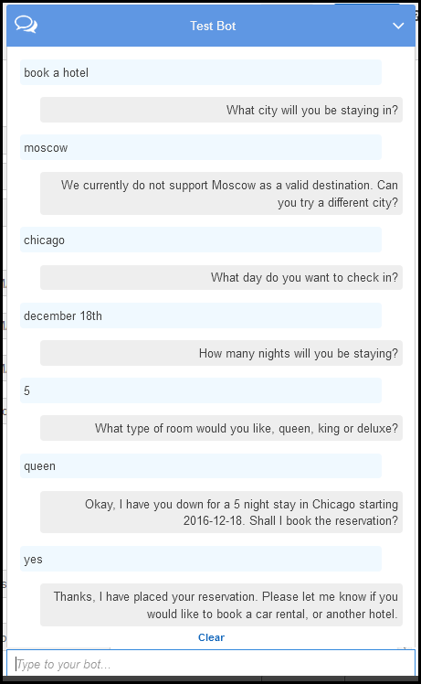
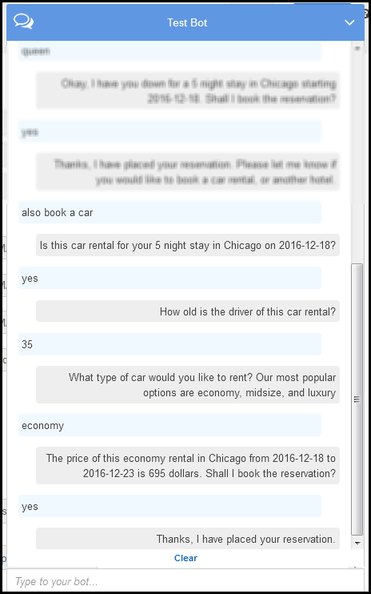

End of support notice: On September 15, 2025, AWS
will discontinue support for Amazon Lex V1. After September 15, 2025, you will
no longer be able to access the Amazon Lex V1 console or Amazon Lex V1 resources. If you are using Amazon Lex V2, refer to the [Amazon Lex V2 guide](../../../lexv2/latest/dg/what-is.md "../../../lexv2/latest/dg/what-is.md") instead.
.

# Step 4: Add the Lambda Function as a Code

Hook

In this section, you update the configurations of both the BookCar and BookHotel
intents by adding the Lambda function as a code hook for initialization/validation and
fulfillment activities. Make sure you choose the $LATEST version of the intents because
you can only update the $LATEST version of your Amazon Lex resources.

1. In the Amazon Lex console, choose the **BookTrip** bot.
2. On the **Editor** tab, choose the
   **BookHotel** intent. Update the intent configuration as
   follows:
   1. Make sure the intent version (next to the intent name) is $LATEST.
   2. Add the Lambda function as an initialization and validation code hook
      as follows:
      - In **Options**, choose
        **Initialization and validation code
        hook**.
      - Choose your Lambda function from the list.

   3. Add the Lambda function as a fulfillment code hook as follows:
      - In **Fulfillment**, choose **AWS
        Lambda function**.
      - Choose your Lambda function from the list.
      - Choose **Goodbye message** and type a
        message.

   4. Choose **Save**.

3. On the **Editor** tab, choose the BookCar intent. Follow the
   preceding step to add your Lambda function as validation and fulfillment code
   hook.
4. Choose **Build**. The console sends a series of requests to
   Amazon Lex to save the configurations.
5. Test the bot. Now that you a have a Lambda function performing the
   initialization, user data validation and fulfillment, you can see the difference
   in the user interaction in the following conversation:

For more information about the data flow from the client (console) to
Amazon Lex, and from Amazon Lex to the Lambda function, see [Data Flow: Book Hotel Intent](book-trip-detail-flow.md#data-flow-book-hotel "book-trip-detail-flow.md#data-flow-book-hotel"). 6. Continue the conversation and book a car as shown in the following image:

When you choose to book a car, the client (console) sends a request to
Amazon Lex that includes the session attributes (from the previous conversation,
BookHotel). Amazon Lex passes this information to the Lambda function, which then
initializes (that is, it prepopulates) some of the BookCar slot data (that is,
PickUpDate, ReturnDate, and PickUpCity).

###### Note

This illustrates how session attributes can be used to maintain context
across intents. The console client provides the **Clear**
link in the test window that a user can use to clear any prior session
attributes.

For more information about the data flow from the client (console) to
Amazon Lex, and from Amazon Lex to the Lambda function, see [Data Flow: Book Car Intent](book-trip-detail-flow.md#data-flow-book-car "book-trip-detail-flow.md#data-flow-book-car").
