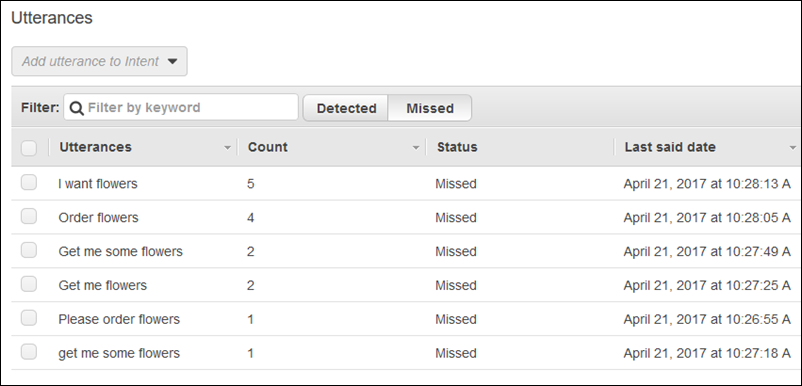

End of support notice: On September 15, 2025, AWS
will discontinue support for Amazon Lex V1. After September 15, 2025, you will
no longer be able to access the Amazon Lex V1 console or Amazon Lex V1 resources. If you are using Amazon Lex V2, refer to the [Amazon Lex V2 guide](../../../lexv2/latest/dg/what-is.md "../../../lexv2/latest/dg/what-is.md") instead.
.

# Updating Utterances

In this exercise, you add additional utterances to those you created in Getting Started
Exercise 1. You use the **Monitoring** tab in the Amazon Lex console to view
utterances that your bot did not recognize. To improve the experience for your users, you
add those utterances to the bot.

Utterance statistics are not generated under the following
conditions:

- The `childDirected` field was set to true
  when the bot was created.
- You are using slot obfuscation with one or more slots.
- You opted out of participating in improving Amazon Lex.

###### Note

Utterance statistics are generated once a day. You can see the utterance that was not
recognized, how many times it was heard, and the last date and time that the utterance
was heard. It can take up to 24 hours for missed utterances to appear in the
console.

You can see utterances for different versions of your bot. To change the version of your
bot that you are seeing utterances for, choose a different version from the drop-down next
to the bot name.

###### To view and add missed utterances to a bot:

1. Follow the first step of Getting Started Exercise 1 to create and test an
   `OrderFlowers` bot. For instructions, see [Exercise 1: Create an Amazon Lex Bot Using a
   Blueprint (Console)](gs-bp.md "gs-bp.md").
2. Test the bot by typing the following utterances in the **Test
   Bot** window. Type each utterance several times. The example bot
   doesn't recognize the following utterances:
   - Order flowers
   - Get me flowers
   - Please order flowers
   - Get me some flowers

3. Wait for Amazon Lex to gather usage data about the missed utterances. Utterance data is
   generated once per day, generally overnight.
4. Sign in to the AWS Management Console and open the Amazon Lex console at
   [https://console.aws.amazon.com/lex/](https://console.aws.amazon.com/lex/ "https://console.aws.amazon.com/lex/").
5. Choose the `OrderFlowers` bot.
6. Choose the **Monitoring** tab, and then choose
   **Utterances** from the left menu and then choose the
   **Missed** button. The following pane shows a maximum of
   100 missed utterances.

 7. To choose the missed utterances that you want to add to the bot, select the check
box next to them. To add the utterance to the `$LATEST` version of the
intent, choose the down arrow next to the **Add utterance to
intent** dropdown, and then choose the intent. 8. To rebuild your bot, choose **Build** and then
**Build** again to re-build your bot. 9. To verify that your bot recognizes the new utterances, use the **Test
Bot** pane.
