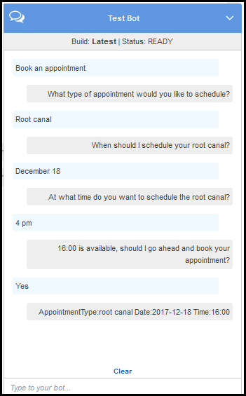

End of support notice: On September 15, 2025, AWS
will discontinue support for Amazon Lex V1. After September 15, 2025, you will
no longer be able to access the Amazon Lex V1 console or Amazon Lex V1 resources. If you are using Amazon Lex V2, refer to the [Amazon Lex V2 guide](../../../lexv2/latest/dg/what-is.md "../../../lexv2/latest/dg/what-is.md") instead.
.

# Step 1: Create an Amazon Lex Bot

In this section, you create an Amazon Lex bot using the ScheduleAppointment
blueprint, which is provided in the Amazon Lex console.

1. Sign in to the AWS Management Console and open the Amazon Lex console at
   [https://console.aws.amazon.com/lex/](https://console.aws.amazon.com/lex/ "https://console.aws.amazon.com/lex/").
2. On the **Bots** page, choose
   **Create**.
3. On the **Create your Lex bot** page, do the
   following:
   - Choose the **ScheduleAppointment**
     blueprint.
   - Leave the default bot name (ScheduleAppointment).

4. Choose **Create**.

This step saves and builds the bot. The console sends the following
requests to Amazon Lex during the build process:

    * Create a new version of the slot types (from the $LATEST version).
     For information about slot types defined in this bot blueprint, see
     [Overview of the Bot Blueprint
     (ScheduleAppointment)](ex1-sch-appt.md#ex1-sch-appt-bp-summary-bot "ex1-sch-appt.md#ex1-sch-appt-bp-summary-bot").
    * Create a version of the `MakeAppointment` intent (from
     the $LATEST version). In some cases, the console sends a request for
     the `update` API operation before creating a new version.
    * Update the $LATEST version of the bot.


    At this time, Amazon Lex builds a machine learning model for the bot.
     When you test the bot in the console, the console uses the runtime
     API to send user input back to Amazon Lex. Amazon Lex then uses the machine
     learning model to interpret the user input.

5. The console shows the ScheduleAppointment bot. On the
   **Editor** tab, review the preconfigured intent
   (`MakeAppointment`) details.
6. Test the bot in the test window. Use the following screen shot to engage
   in a test conversation with your bot:



Note the following:

    * From the initial user input ("Book an appointment"), the bot
     infers the intent (`MakeAppointment`).
    * The bot then uses the configured prompts to get slot data from the
     user.
    * The bot blueprint has the `MakeAppointment` intent
     configured with the following confirmation prompt:


    ```
    {Time} is available, should I go ahead and book your appointment?
    ```

    After the user provides all of the slot data, Amazon Lex returns a
     response to the client with a confirmation prompt as the message.
     The client displays the message for the user:


    ```
    16:00 is available, should I go ahead and book your appointment?
    ```

Notice that the bot accepts any appointment date and time values because
you don't have any code to initialize or validate the user data. In the next
section, you add a Lambda function to do this.

###### Next Step

[Step 2: Create a Lambda
Function](ex1-sch-appt-create-lambda-function.md "ex1-sch-appt-create-lambda-function.md")
