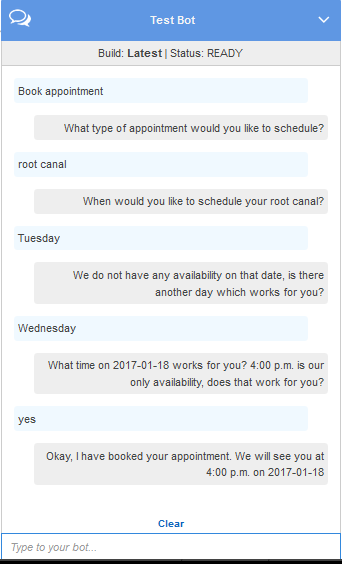

End of support notice: On September 15, 2025, AWS
will discontinue support for Amazon Lex V1. After September 15, 2025, you will
no longer be able to access the Amazon Lex V1 console or Amazon Lex V1 resources. If you are using Amazon Lex V2, refer to the [Amazon Lex V2 guide](../../../lexv2/latest/dg/what-is.md "../../../lexv2/latest/dg/what-is.md") instead.
.

# Step 3: Update the Intent: Configure

a Code Hook

In this section, you update the configuration of the `MakeAppointment`
intent to use the Lambda function as a code hook for the validation and fulfillment
activities.

1. In the Amazon Lex console, select the ScheduleAppointment bot. The console
   shows the **MakeAppointment** intent. Modify the intent
   configuration as follows.

###### Note

You can update only the $LATEST versions of any of the Amazon Lex
resources, including the intents. Make sure that the intent version is
set to $LATEST. You have not published a version of your bot yet, so it
should still be the $LATEST version in the console.

    1. In the **Options** section, choose
     **Initialization and validation code hook**,
     and then choose
     the
     Lambda function from the list.
    2. In the **Fulfillment** section, choose
     **AWS Lambda function**, and
     then
     choose the Lambda function from the list.
    3. Choose **Goodbye message**, and type a
     message.

2. Choose **Save**, and then choose
   **Build**.
3. Test the bot, as in the following image:

###### Next Step

[Step 4: Deploy the Bot on the Facebook
Messenger Platform](ex-sch-appt-fb-integration.md "ex-sch-appt-fb-integration.md")
