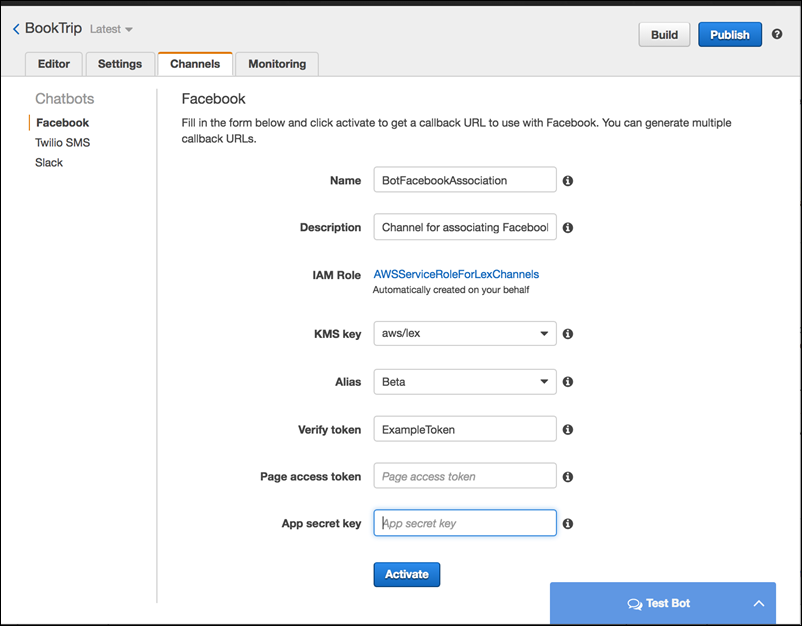

End of support notice: On September 15, 2025, AWS
will discontinue support for Amazon Lex V1. After September 15, 2025, you will
no longer be able to access the Amazon Lex V1 console or Amazon Lex V1 resources. If you are using Amazon Lex V2, refer to the [Amazon Lex V2 guide](../../../lexv2/latest/dg/what-is.md "../../../lexv2/latest/dg/what-is.md") instead.
.

# Integrating an Amazon Lex Bot with Facebook

Messenger

This exercise shows how to integrate Facebook Messenger with your Amazon Lex bot. You
perform the following steps:

1. Create an Amazon Lex bot
2. Create a Facebook application
3. Integrate Facebook Messenger with your Amazon Lex bot
4. Validate the integration

###### Topics

- [Step 1: Create an Amazon Lex Bot](#fb-bot-assoc-create-bot "#fb-bot-assoc-create-bot")
- [Step 2: Create a Facebook Application](#fb-bot-assoc-create-fb-app "#fb-bot-assoc-create-fb-app")
- [Step 3: Integrate Facebook Messenger with
  the Amazon Lex Bot](#fb-bot-assoc-create-assoc "#fb-bot-assoc-create-assoc")
- [Step 4: Test the Integration](#fb-bot-test "#fb-bot-test")

## Step 1: Create an Amazon Lex Bot

If you don't already have an Amazon Lex bot, create and deploy one. In this topic, we
assume that you are using the bot that you created in Getting Started Exercise 1.
However, you can use any of the example bots provided in this guide. For Getting Started
Exercise 1, see [Exercise 1: Create an Amazon Lex Bot Using a
Blueprint (Console)](gs-bp.md "gs-bp.md").

1. Create an Amazon Lex bot. For instructions, see [Exercise 1: Create an Amazon Lex Bot Using a
   Blueprint (Console)](gs-bp.md "gs-bp.md").
2. Deploy the bot and create an alias. For instructions, see [Exercise 3: Publish a Version and Create an Alias](gettingstarted-ex3.md "gettingstarted-ex3.md").

## Step 2: Create a Facebook Application

On the Facebook developer portal, create a Facebook application and a Facebook page.
For instructions, see [Quick Start](https://developers.facebook.com/docs/messenger-platform/guides/quick-start "https://developers.facebook.com/docs/messenger-platform/guides/quick-start") in the Facebook Messenger platform documentation. Write down
the following:

- The **App Secret** for the Facebook App
- The **Page Access Token** for the Facebook page

## Step 3: Integrate Facebook Messenger with

the Amazon Lex Bot

In this section, you integrate Facebook Messenger with your Amazon Lex bot.

After you complete this step, the console provides a callback URL. Write down this
URL.

**To integrate Facebook Messenger with your bot**

1. 1. Sign in to the AWS Management Console and open the Amazon Lex console at
      [https://console.aws.amazon.com/lex/](https://console.aws.amazon.com/lex/ "https://console.aws.amazon.com/lex/").
   2. Choose your Amazon Lex bot.
   3. Choose **Channels**.
   4. Choose **Facebook** under
      **Chatbots**. The console displays the Facebook
      integration page.
   5. On the Facebook integration page, do the following:
      - Type the following name:
        `BotFacebookAssociation`.
      - For **KMS key**, choose
        **aws/lex** .
      - For **Alias**, choose the bot alias.
      - For **Verify token**, type a token. This can
        be any string you choose (for example,
        `ExampleToken`). You use this token later in the
        Facebook developer portal when you set up the webhook.
      - For **Page access token**, type the token
        that you obtained from Facebook in Step 2.
      - For **App secret key**, type the key that you
        obtained from Facebook in Step 2.

    6. Choose **Activate**.

   The console creates the bot channel association and returns a callback
   URL. Write down this URL.

2. On the Facebook developer portal, choose your app.
3. Choose the **Messenger** product, and choose **Setup
   webhooks** in the **Webhooks** section of the
   page.

For instructions, see [Quick Start](https://developers.facebook.com/docs/messenger-platform/guides/quick-start "https://developers.facebook.com/docs/messenger-platform/guides/quick-start") in the Facebook Messenger platform documentation. 4. On the **webhook** page of the subscription wizard, do the
following:

    * For **Callback URL**, type the callback URL provided
     in the Amazon Lex console earlier in the procedure.
    * For **Verify Token**, type the same token that you
     used in Amazon Lex.
    * Choose **Subscription Fields**
     (**messages**,
     **messaging\_postbacks**, and
     **messaging\_optins**).
    * Choose **Verify and Save**. This initiates a
     handshake between Facebook and Amazon Lex.

5. Enable Webhooks integration. Choose the page that you created, and then choose
   **subscribe**.

###### Note

If you update or recreate a webhook, unsubscribe and then resubscribe to
the page.

## Step 4: Test the Integration

You can now start a conversation from Facebook Messenger with your Amazon Lex bot.

1. Open your Facebook page, and choose **Message**.
2. In the Messenger window, use the same test utterances provided in [Step 1: Create an Amazon Lex Bot
   (Console)](gs-bp-create-bot.md "gs-bp-create-bot.md").
