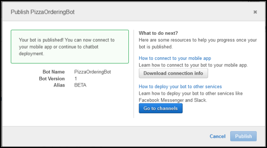

End of support notice: On September 15, 2025, AWS
will discontinue support for Amazon Lex V1. After September 15, 2025, you will
no longer be able to access the Amazon Lex V1 console or Amazon Lex V1 resources. If you are using Amazon Lex V2, refer to the [Amazon Lex V2 guide](../../../lexv2/latest/dg/what-is.md "../../../lexv2/latest/dg/what-is.md") instead.
.

# Exercise 3: Publish a Version and Create an Alias

In Getting Started Exercises 1 and 2, you created a bot and tested it. In this exercise,
you do the following:

- Publish a new version of the bot. Amazon Lex takes a snapshot copy of the
  `$LATEST` version to publish a new version.
- Create an alias that points to the new version.
  For more information about versioning and aliases, see [Versioning and Aliases](versioning-aliases.md "versioning-aliases.md").

Do the following to publish a version of a bot you created for this exercise:

1. In the Amazon Lex console, choose one of the bots you created.

Verify that the console shows the `$LATEST` as the bot version next to
the bot name. 2. Choose **Publish**. 3. On the **Publish `botname`** wizard,
specify the alias `BETA`, and then choose **Publish**. 4. Verify that the Amazon Lex console shows the new version next to the bot name,
as in the following image.

Now that you have a working bot with published version and an alias, you can deploy the
bot (in your mobile application or integrate the bot with Facebook Messenger). For an
example, see [Integrating an Amazon Lex Bot with Facebook
Messenger](fb-bot-association.md "fb-bot-association.md").
