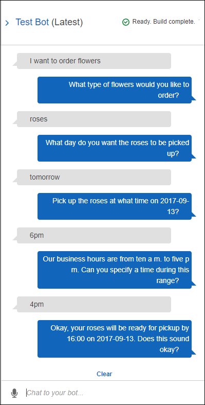

End of support notice: On September 15, 2025, AWS
will discontinue support for Amazon Lex V1. After September 15, 2025, you will
no longer be able to access the Amazon Lex V1 console or Amazon Lex V1 resources. If you are using Amazon Lex V2, refer to the [Amazon Lex V2 guide](../../../lexv2/latest/dg/what-is.md "../../../lexv2/latest/dg/what-is.md") instead.
.

# Step 4: Add the Lambda

Function as Code Hook (Console)

In this section, you update the configuration of the OrderFlowers
intent to use the Lambda function as follows:

- First use the Lambda function as a code hook to perform
  fulfillment of the `OrderFlowers` intent. You
  test the bot and verify that you received a fulfillment
  message from the Lambda function. Amazon Lex invokes the Lambda
  function only after you provide data for all the required
  slots for ordering flowers.
- Configure the same Lambda function as a code hook to
  perform initialization and validation. You test and verify
  that the Lambda function performs validation (as you provide
  slot data).

###### To add a Lambda function as a code hook (console)

1. In the Amazon Lex console, select the
   **OrderFlowers** bot. The console shows
   the **OrderFlowers** intent. Make sure that
   the intent version is set to `$LATEST` because
   this is the only version that we can modify.
2. Add the Lambda function as the fulfillment code hook and
   test it.
   1. In the Editor, choose **AWS Lambda
      function** as
      **Fulfillment**, and select the
      Lambda function that you created in the preceding
      step (`OrderFlowersCodeHook`). Choose
      **OK** to give Amazon Lex permission
      to invoke the Lambda function.

   You are configuring this Lambda function as a code
   hook to fulfill the intent. Amazon Lex invokes this
   function only after it has all the necessary slot
   data from the user to fulfill the intent. 2. Specify a **Goodbye
   message**. 3. Choose **Build**. 4. Test the bot using the previous
   conversation.The last statement "Thanks, your order for roses....." is
   a response from the Lambda function that you configured as a
   code hook. In the preceding section, there was no Lambda
   function. Now you are using a Lambda function to actually
   fulfill the `OrderFlowers` intent.

3. Add the Lambda function as an initialization and validation
   code hook, and test.

The sample Lambda function code that you are using can both
perform user input validation and fulfillment. The input
event the Lambda function receives has a field
(`invocationSource`) that the code uses to
determine what portion of the code to run. For more
information, see [Lambda Function Input
Event and Response Format](lambda-input-response-format.md "lambda-input-response-format.md").

    1. Select the $LATEST version of the
     `OrderFlowers` intent. That's is the
     only version that you can update.
    2. In the Editor, choose **Initialization and
     validation** in
     **Options**.
    3. Again, select the same Lambda function.
    4. Choose **Build**.
    5. Test the bot.

    You are now ready to converse with Amazon Lex as
     in the following image. To test the validation portion, choose time
     6 PM, and your Lambda function returns a response
     ("Our business hours are from 10 AM to 5 PM."), and
     prompts you again. After you provide all the valid
     slot data, the Lambda function fulfills the order.

    

###### Next Step

[Step 5 (Optional):
Review the Details of the Information Flow (Console)](gs-bp-details-after-lambda.md "gs-bp-details-after-lambda.md")
