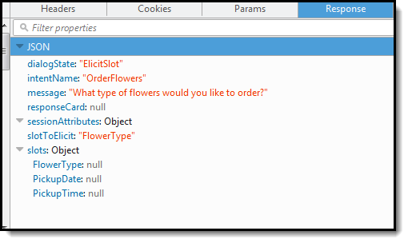
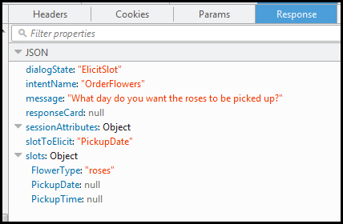
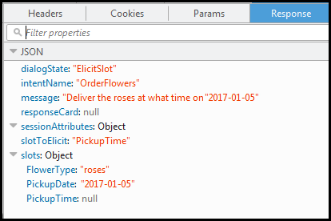
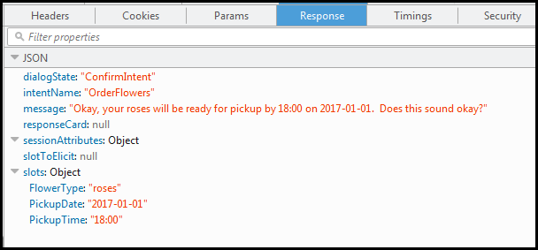
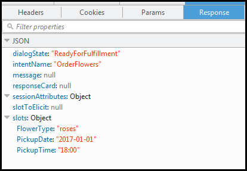

End of support notice: On September 15, 2025, AWS
will discontinue support for Amazon Lex V1. After September 15, 2025, you will
no longer be able to access the Amazon Lex V1 console or Amazon Lex V1 resources. If you are using Amazon Lex V2, refer to the [Amazon Lex V2 guide](../../../lexv2/latest/dg/what-is.md "../../../lexv2/latest/dg/what-is.md") instead.
.

# Step 2b (Optional): Review

the Details of the Typed Information Flow (Console)

This section explains flow of information between client and
Amazon Lex in which the client uses the `PostText`
API to send requests. For more information, see [PostText](API_runtime_PostText.md "API_runtime_PostText.md").

1.  User types: I would like to order some flowers
    1. The client (console) sends the following [PostText](API_runtime_PostText.md "API_runtime_PostText.md")
       request to Amazon Lex:

    ```
    POST /bot/`OrderFlowers`/alias/`$LATEST`/user/`4o9wwdhx6nlheferh6a73fujd3118f5w`/text
    "Content-Type":"application/json"
    "Content-Encoding":"amz-1.0"

    {
        "inputText": "I would like to order some flowers",
        "sessionAttributes": {}
    }
    ```

    Both the request URI and the body provide
    information to Amazon Lex:

        * Request URI – Provides bot name
         (`OrderFlowers`), bot alias
         (`$LATEST`), and user name (a
         random string identifying the user). The
         trailing `text` indicates
         that it is a `PostText` API
         request (and not
         `PostContent`).
        * Request body – Includes the user
         input (`inputText`) and empty
         `sessionAttributes`. When the
         client makes the first request, there
         are no session attributes. The Lambda
         function initiates them later.

    2. From the `inputText`, Amazon Lex
       detects the intent (`OrderFlowers`).
       This intent does not have any code hooks (that
       is, the Lambda functions) for initialization and
       validation of user input or fulfillment.

    Amazon Lex chooses one of the intent's slots
    (`FlowerType`) to elicit the
    value. It also selects one of the
    value-elicitation prompts for the slot (all part
    of the intent configuration), and then sends the
    following response back to the client. The
    console displays the message in the response to
    the user.

    

    The client displays the message in the
    response.

2.  User types: roses
    1. The client (console) sends the following [PostText](API_runtime_PostText.md "API_runtime_PostText.md")
       request to Amazon Lex:

    ```
    POST /bot/`OrderFlowers`/alias/`$LATEST`/user/`4o9wwdhx6nlheferh6a73fujd3118f5w`/text
    "Content-Type":"application/json"
    "Content-Encoding":"amz-1.0"

    {
        "inputText": "roses",
        "sessionAttributes": {}
    }
    ```

    The `inputText` in the request body
    provides user input. The
    `sessionAttributes` remains
    empty. 2. Amazon Lex first interprets the
    `inputText` in the context of the
    current intent—the service remembers that
    it had asked the specific user for information
    about the `FlowerType` slot.
    Amazon Lex first updates the slot value for the
    current intent and chooses another slot
    (`PickupDate`) along with one of
    its prompt messages—What day do you want
    the roses to be picked up?— for
    the slot.

    Then, Amazon Lex returns the following
    response:

    

    The client displays the message in the
    response.

3.  User types: tomorrow
    1. The client (console) sends the following [PostText](API_runtime_PostText.md "API_runtime_PostText.md")
       request to Amazon Lex:

    ```
    POST /bot/`OrderFlowers`/alias/`$LATEST`/user/`4o9wwdhx6nlheferh6a73fujd3118f5w`/text
    "Content-Type":"application/json"
    "Content-Encoding":"amz-1.0"

    {
        "inputText": "tomorrow",
        "sessionAttributes": {}
    }
    ```

    The `inputText` in the request body
    provides user input. The
    `sessionAttributes` remains
    empty. 2. Amazon Lex first interprets the
    `inputText` in the context of the
    current intent—the service remembers that
    it had asked the specific user for information
    about the `PickupDate` slot.
    Amazon Lex updates the slot
    (`PickupDate`) value for the
    current intent. It chooses another slot to
    elicit value for (`PickupTime`). It
    returns one of the value-elicitation
    prompts—Deliver the roses at what time on
    2017-01-05?—to the client.

    Amazon Lex then returns the following
    response:

    

    The client displays the message in the
    response.

4.  User types: 6 pm
    1. The client (console) sends the following [PostText](API_runtime_PostText.md "API_runtime_PostText.md")
       request to Amazon Lex:

    ```
    POST /bot/`OrderFlowers`/alias/`$LATEST`/user/`4o9wwdhx6nlheferh6a73fujd3118f5w`/text
    "Content-Type":"application/json"
    "Content-Encoding":"amz-1.0"

    {
        "inputText": "6 pm",
        "sessionAttributes": {}
    }
    ```

    The `inputText` in the request body
    provides user input. The
    `sessionAttributes` remains
    empty. 2. Amazon Lex first interprets the
    `inputText` in the context of the
    current intent—the service remembers that
    it had asked the specific user for information
    about the `PickupTime` slot.
    Amazon Lex first updates the slot value for the
    current intent. Now Amazon Lex detects that it
    has information for all the slots.

    The `OrderFlowers` intent is
    configured with a confirmation message.
    Therefore, Amazon Lex needs an explicit
    confirmation from the user before it can proceed
    to fulfill the intent. Amazon Lex sends the
    following message to the client requesting
    confirmation before ordering the flowers:

    

    The client displays the message in the
    response.

5.  User types: Yes
    1. The client (console) sends the following [PostText](API_runtime_PostText.md "API_runtime_PostText.md")
       request to Amazon Lex:

    ```
    POST /bot/`OrderFlowers`/alias/`$LATEST`/user/`4o9wwdhx6nlheferh6a73fujd3118f5w`/text
    "Content-Type":"application/json"
    "Content-Encoding":"amz-1.0"

    {
        "inputText": "Yes",
        "sessionAttributes": {}
    }
    ```

    The `inputText` in the request body
    provides user input. The
    `sessionAttributes` remains
    empty. 2. Amazon Lex interprets the
    `inputText` in the context of
    confirming the current intent. It understands
    that the user want to proceed with the order.
    The `OrderFlowers` intent is
    configured with `ReturnIntent` as the
    fulfillment activity (there is no Lambda function
    to fulfill the intent). Therefore, Amazon Lex
    returns the following slot data to the client.

    

    Amazon Lex set the `dialogState` to
    `ReadyForFulfillment`. The client
    can then fulfill the intent.

6.  Now test the bot again. To do that, you must choose
    the **Clear** link in the console to
    establish a new (user) context. Now as you provide data
    for the order flowers intent, try to provide invalid
    data. For example:

        * Jasmine as the flower type (it is not one of
         the supported flower types).
        * Yesterday as the day when you want to pick up
         the flowers.

    Notice that the bot accepts these values because you
    don't have any code to initialize/validate user data. In
    the next section, you add a Lambda function to do this.
    Note the following about the Lambda function:

        * The Lambda function validates slot data after
         every user input. It fulfills the intent at the
         end. That is, the bot processes the flowers
         order and returns a message to the user instead
         of simply returning slot data to the client. For
         more information, see [Using Lambda Functions](using-lambda.md "using-lambda.md").
        * The Lambda function also sets the session
         attributes. For more information about session
         attributes, see [PostText](API_runtime_PostText.md "API_runtime_PostText.md").


         After you complete the Getting Started
         section, you can do the additional exercises
         ([Additional Examples: Creating Amazon Lex Bots](additional-exercises.md "additional-exercises.md") ).
         [Book Trip](ex-book-trip.md "ex-book-trip.md") uses session
         attributes to share cross-intent information to
         engage in a dynamic conversation with the
         user.

###### Next Step

[Step 3: Create a
Lambda Function (Console)](gs-bp-create-lambda-function.md "gs-bp-create-lambda-function.md")
