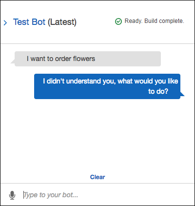
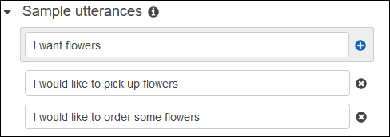
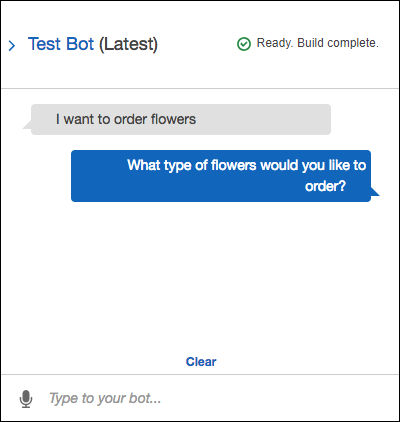

End of support notice: On September 15, 2025, AWS
will discontinue support for Amazon Lex V1. After September 15, 2025, you will
no longer be able to access the Amazon Lex V1 console or Amazon Lex V1 resources. If you are using Amazon Lex V2, refer to the [Amazon Lex V2 guide](../../../lexv2/latest/dg/what-is.md "../../../lexv2/latest/dg/what-is.md") instead.
.

# Step 6: Update the Intent

Configuration to Add an Utterance (Console)

The `OrderFlowers` bot is configured with only two
utterances. This provides limited information for Amazon Lex to build a
machine learning model that recognizes and responds to the user's
intent. Try typing "I want to order flowers", as in the following test window.
Amazon Lex doesn’t recognize the text, and responds with "I didn't
understand you, what would you like to do?" You can improve the
machine learning model by adding more utterances.

Each utterance that you add provides Amazon Lex with more information
about how to respond to your users. You don't need to add an exact
utterance, Amazon Lex generalizes from the samples that you provide to
recognize both exact matches and similar input.

###### To add an utterance (console)

1. Add the utterance "I want flowers" to the intent by typing
   it in the **Sample utterances** section of
   the intent editor, as in the following image, and then clicking
   the plus icon next to the new utterance.

 2. Build your bot to pick up the change. Choose
**Build**, and then choose
**Build** again. 3. Test your bot to confirm that it recognized the new
utterance. In the test window, as in the following image,
type "I want to order flowers." Amazon Lex recognizes the phrase
and responds with "What type of flowers would you like to order?".

###### Next Step

[Step 7 (Optional): Clean Up
(Console)](gs-bp-cleaning-up.md "gs-bp-cleaning-up.md")
