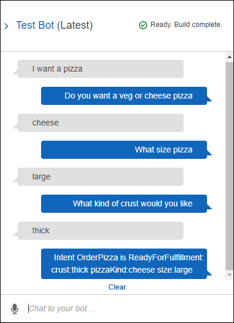
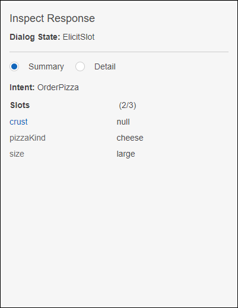
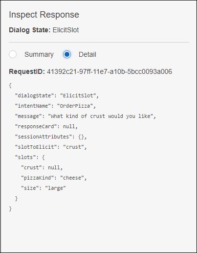

End of support notice: On September 15, 2025, AWS
will discontinue support for Amazon Lex V1. After September 15, 2025, you will
no longer be able to access the Amazon Lex V1 console or Amazon Lex V1 resources. If you are using Amazon Lex V2, refer to the [Amazon Lex V2 guide](../../../lexv2/latest/dg/what-is.md "../../../lexv2/latest/dg/what-is.md") instead.
.

# Step 3: Build and Test the Bot

Make sure the bot works, by building and testing it.

###### To build and test the bot

1. To build the `PizzaOrderingBot` bot, choose
   **Build**.

Amazon Lex builds a machine learning model for the bot. When you test the bot,
the console uses the runtime API to send the user input back to Amazon Lex. Amazon Lex
then uses the machine learning model to interpret the user input.

It can take some time to complete the build. 2. To test the bot, in the **Test Bot** window, start
communicating with your Amazon Lex bot.

    * For example, you might say or type the following:


    
    * Use the sample utterances that you configured in the
     `OrderPizza` intent to test the bot. For example, the
     following is one of the sample utterances that you configured for the
     `PizzaOrder` intent:


    ```
    I want a {size} {crust} crust {pizzaKind} pizza
    ```

    To test it, type the following:


    ```
    I want a large thin crust cheese pizza
    ```

When you type "I want to order a pizza," Amazon Lex detects the intent
(`OrderPizza`). Then, Amazon Lex asks for slot information.

After you provide all of the slot information, Amazon Lex invokes the Lambda
function that you configured for the intent.

The Lambda function returns a message ("Okay, I have ordered your ...") to
Amazon Lex, which Amazon Lex returns to you..

## Inspecting the Response

Underneath the chat window is a pane that enables you to inspect the response from
Amazon Lex. The pane provides comprehensive information about the state of your bot that
changes as you interact with your bot. The contents of the panes show you the
current state of the operation.

- **Dialog State** – The current state of
  the conversation with the user. It can be `ElicitIntent`,
  `ElicitSlot`, `ConfirmIntent` or
  `Fulfilled`.
- **Summary** – Shows a simplified view
  of the dialog that shows the slot values for the intent being fulfilled so
  that you can keep track of the information flow. It shows the intent name,
  the number of slots and the number of slots filled, and a list of all of the
  slots and their associated values. See the following image:



- **Detail** – Shows the raw JSON
  response from the chatbot to give you a deeper view into the bot interaction
  and the current state of the dialog as you test and debug your chatbot. If
  you type in the chat window, the inspection pane shows the JSON response
  from the [PostText](API_runtime_PostText.md "API_runtime_PostText.md") operation. If you speak to the
  chat window, the inspection pane shows the response headers from the [PostContent](API_runtime_PostContent.md "API_runtime_PostContent.md") operation. See the following image:



## Next Step

[Step 4 (Optional): Clean up](gs2-clean-up.md "gs2-clean-up.md")
