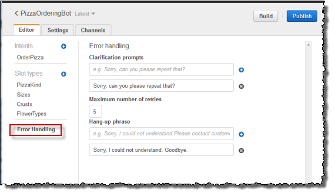

End of support notice: On September 15, 2025, AWS
will discontinue support for Amazon Lex V1. After September 15, 2025, you will
no longer be able to access the Amazon Lex V1 console or Amazon Lex V1 resources. If you are using Amazon Lex V2, refer to the [Amazon Lex V2 guide](../../../lexv2/latest/dg/what-is.md "../../../lexv2/latest/dg/what-is.md") instead.
.

# Configure the Bot

Configure
error
handling for the `PizzaOrderingBot` bot.

1. Navigate to the `PizzaOrderingBot` bot. Choose
   **Editor**. and then choose **Error
   Handling**, as in the following image:

 2. Use the **Editor** tab to configure bot error
handling.

    * Information you provide in **Clarification
     Prompts** maps to the bot's [clarificationPrompt](API_PutBot.md#lex-PutBot-request-clarificationPrompt "API_PutBot.md#lex-PutBot-request-clarificationPrompt") configuration.

    When Amazon Lex can't determine the user intent, the service
     returns a response with this message.
    * Information that you provide in the **Hang-up**
     phrase maps to the bot's [abortStatement](API_PutBot.md#lex-PutBot-request-abortStatement "API_PutBot.md#lex-PutBot-request-abortStatement") configuration.

    If the service can't determine the user's intent after a set
     number of consecutive requests, Amazon Lex returns a response with
     this message.

Leave the defaults.

## Next Step

[Step 3: Build and Test the Bot](gs2-build-and-test.md "gs2-build-and-test.md")
