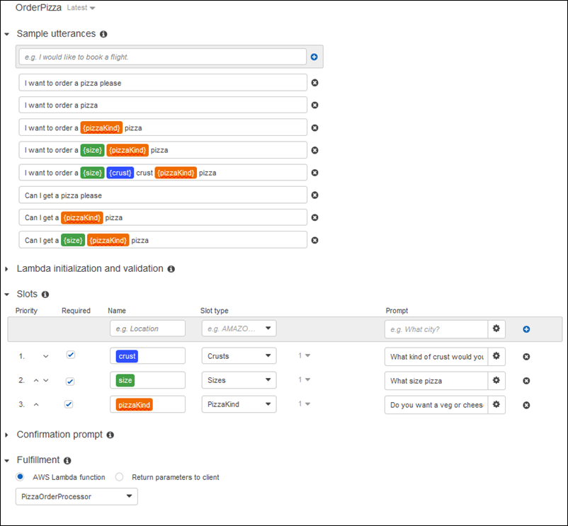

End of support notice: On September 15, 2025, AWS
will discontinue support for Amazon Lex V1. After September 15, 2025, you will
no longer be able to access the Amazon Lex V1 console or Amazon Lex V1 resources. If you are using Amazon Lex V2, refer to the [Amazon Lex V2 guide](../../../lexv2/latest/dg/what-is.md "../../../lexv2/latest/dg/what-is.md") instead.
.

# Configure the Intent

Configure the `OrderPizza` intent to fulfill a user's request to order
a pizza.

###### To configure an intent

- On the **OrderPizza** configuration page, configure the
  intent as follows:

      + **Sample utterances** – Type the following
       strings. The curly braces {} enclose slot names.

      	- I want to order pizza please
      	- I want to order a pizza
      	- I want to order a {pizzaKind} pizza
      	- I want to order a {size} {pizzaKind} pizza
      	- I want a {size} {crust} crust {pizzaKind} pizza
      	- Can I get a pizza please
      	- Can I get a {pizzaKind} pizza
      	- Can I get a {size} {pizzaKind} pizza
      + **Lambda initialization and validation** –
       Leave the default setting.
      + **Confirmation prompt** – Leave the default
       setting.
      + **Fulfillment** – Perform the following
       tasks:

      	- Choose **AWS Lambda function**.
      	- Choose `PizzaOrderProcessor`.
      	- If the **Add permission to Lambda
      	 function** dialog box is shown, choose
      	 **OK** to give the
      	 `OrderPizza` intent permission to call the
      	 `PizzaOrderProcessor` Lambda function.
      	- Leave **None** selected.

  The intent should look like the following:

## Next Step

[Configure the Bot](gs2-create-bot-configure-bot.md "gs2-create-bot-configure-bot.md")
