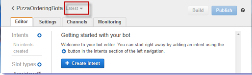

End of support notice: On September 15, 2025, AWS
will discontinue support for Amazon Lex V1. After September 15, 2025, you will
no longer be able to access the Amazon Lex V1 console or Amazon Lex V1 resources. If you are using Amazon Lex V2, refer to the [Amazon Lex V2 guide](../../../lexv2/latest/dg/what-is.md "../../../lexv2/latest/dg/what-is.md") instead.
.

# Create the Bot

Create the `PizzaOrderingBot` bot with the minimum information needed.
You add an intent, an action that the user wants to perform, for the bot
later.

###### To create the bot

1.  Sign in to the AWS Management Console and open the Amazon Lex console at
    [https://console.aws.amazon.com/lex/](https://console.aws.amazon.com/lex/ "https://console.aws.amazon.com/lex/").
2.  Create a bot.
    1. If you are creating your first bot, choose **Get
       Started**. Otherwise, choose **Bots**,
       and then choose **Create**.
    2. On the **Create your Lex bot** page, choose
       **Custom bot** and provide the following
       information:
       - **Bot name**: PizzaOrderingBot
       - **Language**: Choose the language and
         locale for your bot.
       - **Output voice**: Salli
       - **Session timeout** : 5 minutes.
       - **COPPA**: Choose the appropriate
         response.
       - **User utterance storage: Choose the appropriate
         response.**

    3. Choose **Create**.

    The console sends Amazon Lex a request to create a new bot.
    Amazon Lex sets the bot version to `$LATEST`. After
    creating the bot, Amazon Lex shows the bot **Editor**
    tab, as in the following image:

    

        * The bot version, **Latest**, appears next
         to the bot name in the console. New Amazon Lex resources have
         `$LATEST` as the version. For more
         information, see [Versioning and Aliases](versioning-aliases.md "versioning-aliases.md").
        * Because you haven't created any intents or slots types,
         none are listed.
        * **Build** and
         **Publish** are bot-level activities.
         After you configure the entire bot, you'll learn more about
         these activities.

## Next Step

[Create an Intent](gs2-create-bot-intent.md "gs2-create-bot-intent.md")
