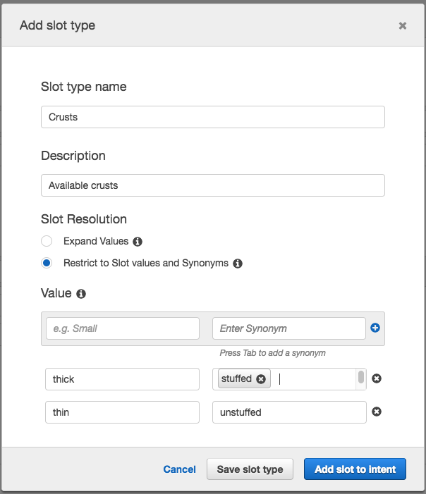

End of support notice: On September 15, 2025, AWS
will discontinue support for Amazon Lex V1. After September 15, 2025, you will
no longer be able to access the Amazon Lex V1 console or Amazon Lex V1 resources. If you are using Amazon Lex V2, refer to the [Amazon Lex V2 guide](../../../lexv2/latest/dg/what-is.md "../../../lexv2/latest/dg/what-is.md") instead.
.

# Create Slot Types

Create the slot types, or parameter values, that the `OrderPizza`
intent uses.

###### To create slot types

1.  In the left menu, choose the plus sign (+) next to **Slot
    types**.
2.  In the **Add slot type** dialog box, add the following:

        * **Slot type name** – Crusts
        * **Description** – Available crusts
        * Choose **Restrict to Slot values and
         Synonyms**
        * **Value** – Type
         `thick`. Press tab and in the
         **Synonym** field type
         `stuffed`. Choose the plus sign (+). Type
         `thin` and then choose the plus sign (+)
         again.

    The dialog should look like the following image:

 3. Choose **Add slot to intent**. 4. On the **Intent** page, choose
**Required**. Change the name of the slot from
`slotOne` to `crust`. Change
the prompt to `What kind of crust would you
 like?` 5. Repeat [Step 1](#slotTypeStart "#slotTypeStart")
through [Step 4](#slotTypeFinish "#slotTypeFinish") using
the values in the following table:

| Name      | Description      | Values               | Slot name | Prompt                             |
| --------- | ---------------- | -------------------- | --------- | ---------------------------------- |
| Sizes     | Available sizes  | small, medium, large | size      | What size pizza?                   |
| PizzaKind | Available pizzas | veg, cheese          | pizzaKind | Do you want a veg or cheese pizza? |

## Next Step

[Configure the Intent](gs2-create-bot-configure-intent.md "gs2-create-bot-configure-intent.md")
