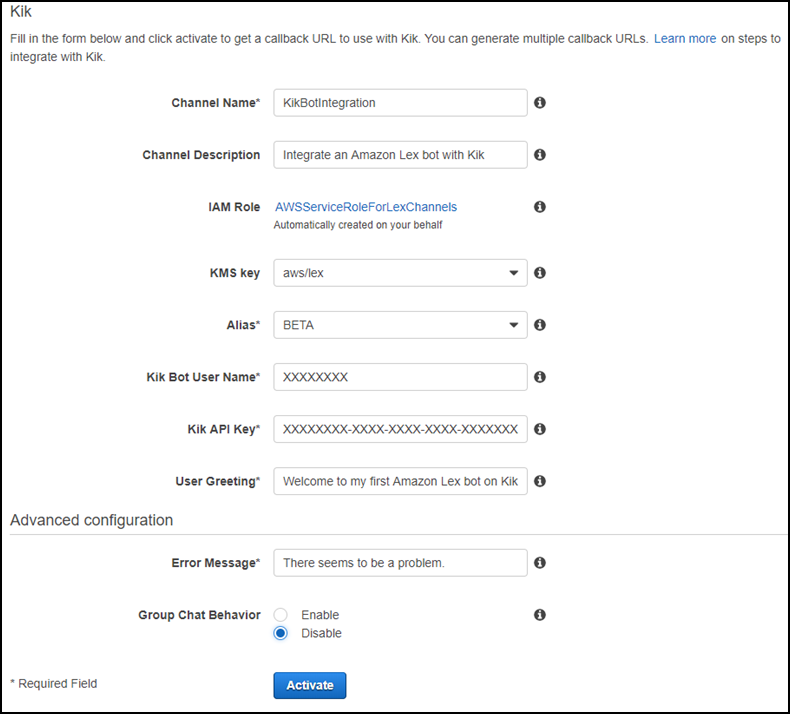

End of support notice: On September 15, 2025, AWS
will discontinue support for Amazon Lex V1. After September 15, 2025, you will
no longer be able to access the Amazon Lex V1 console or Amazon Lex V1 resources. If you are using Amazon Lex V2, refer to the [Amazon Lex V2 guide](../../../lexv2/latest/dg/what-is.md "../../../lexv2/latest/dg/what-is.md") instead.
.

# Step 3: Integrate the Kik Bot with the

Amazon Lex Bot

Now that you have created an Amazon Lex bot and a Kik bot, you are ready to create an
channel association between them in Amazon Lex. When the association is activated, Amazon Lex
automatically sets up a callback URL with Kik.

1. Sign in to the AWS Management Console, and open the Amazon Lex console at [https://console.aws.amazon.com/lex/](https://console.aws.amazon.com/lex/ "https://console.aws.amazon.com/lex/").
2. Choose the Amazon Lex bot that you created in Step 1.
3. Choose the **Channels** tab.
4. In the **Channels** section, choose **Kik**.
5. On the Kik page, provide the following:
   - Type a name. For example, `BotKikIntegration`.
   - Type a description.
   - Choose "aws/lex" from the **KMS key**
     drop-down.
   - For **Alias**, choose an alias from the
     drop-down.
   - For **Kik bot user name**, type the name that you
     gave the bot on Kik.
   - For **Kik API key**, type the API key that was
     assigned to the bot on Kik.
   - For **User greeting**, type the greeting that you
     would like your bot to send the first time that a user chats with
     it.
   - For **Error message**, enter an error message that is
     shown to the user when part of the conversation is not
     understood.
   - For **Group chat behavior**, choose one of the
     options:
     - **Enable** – Enables the entire chat
       group to interact with your bot in a single conversation.
     - **Disable** – Restricts the
       conversation to one user in the chat group.

   - Choose **Activate** to create the association and
     link it to the Kik bot.

###### Next Step

[Step 4: Test the Integration](kik-bot-assoc-test.md "kik-bot-assoc-test.md")
